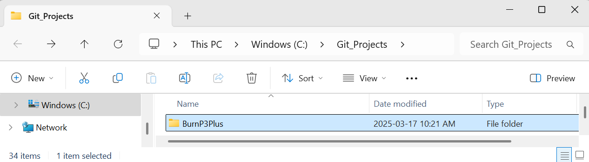
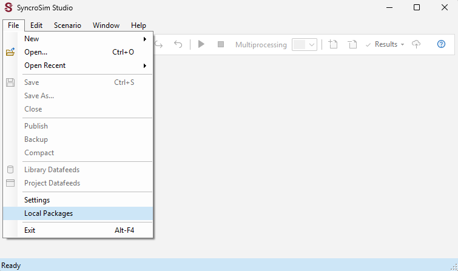
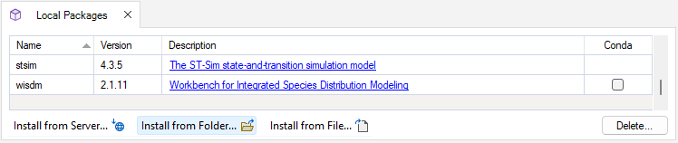
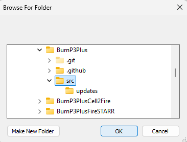
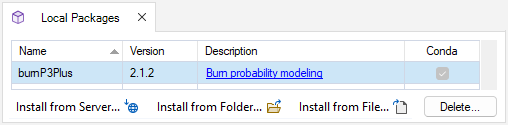

# **BurnP3+**

**BurnP3+** is an open-source [SyncroSim](http://www.syncrosim.com) package for running spatially-explicit fire growth models to explore fire risk and susceptibility across a landscape. 

* See the [Home page](https://burnp3.github.io/BurnP3Plus/) for an overview of **BurnP3+**
* See the [Getting Started](https://burnp3.github.io/BurnP3Plus/getting_started.html) page to get up and running quickly

**BurnP3+** is funded, developed and maintained by the [Canadian Forest Service](https://www.nrcan.gc.ca/our-natural-resources/forests-forestry/the-canadian-forest-service/about-canadian-forest-service/17545).

## Installing a BurnP3+ package from folder

Follow the instructions below to install the latest **BurnP3+** code from this GitHub repository as a package in SyncroSim Studio. The same instructions can also be used to install any of the **BurnP3+** fire growth transformer packages ([BurnP3+ Cell2Fire](https://github.com/BurnP3/BurnP3PlusCell2Fire), [BurnP3+ Prometheus](https://github.com/BurnP3/BurnP3PlusPrometheus), and [BurnP3+ FireSTARR](https://github.com/BurnP3/BurnP3PlusFireSTARR)). 

1. Clone this **BurnP3Plus** repository 

    - The BurnP3Plus repository can be cloned using either the command prompt or GitHub Desktop. For detailed instructions, see the official GitHub guide here: [Cloning a repository](https://docs.github.com/en/repositories/creating-and-managing-repositories/cloning-a-repository#cloning-a-repository).

    - Cloning the repository will create a folder named **BurnP3Plus** in your current directory containing all repository files.

    

 

2. Install the **BurnP3Plus** package from folder in SyncroSim Studio 

    - Open [SyncroSim Studio](https://syncrosim.com/download/).

    -  Navigate to **File > Local Packages**. 

    

    - Click **Install from Folder...**.

    

    - Select the **src** subfolder from within the cloned **BurnP3Plus** repository and click **OK**. 

    

    - The **burnP3Plus** package should now appear in the **Local Packages** list.

    

 

> _**NOTE**: If you modify the package version number in the src/package.xml file of the folder, or you pull a more recent version of the package folder from the GitHub repository, you may run into an error when you try to open your BurnP3+ library. See [this forum post](https://community.syncrosim.com/forums/topic/syncrosim-package-version-mismatch/) for more information on how to handle this error._

 