<!--- Sidebar Navigation Menu --->

    <li>Library</li>
    
        
            <a href="{{site.baseurl}}{{ section.url }}"> &emsp;{{ section.title }} </a>
        
            <a class="selected" href="{{site.baseurl}}{{ section.url }}"> &emsp;{{ section.title }} </a>
        
    
    <li>Project</li>
    
        
            <a href="{{site.baseurl}}{{ section.url }}"> &emsp;{{ section.title }} </a>
        
            <a class="selected" href="{{site.baseurl}}{{ section.url }}"> &emsp;{{ section.title }} </a>
        
    
    <li>Scenario</li>
    
        
            <a href="{{site.baseurl}}{{ section.url }}"> &emsp;{{ section.title }} </a>
        
            <a class="selected" href="{{site.baseurl}}{{ section.url }}"> &emsp;{{ section.title }} </a>
            <a href="#heading01"> &emsp;&emsp;&emsp;Run Control</a>
            <a href="#heading02"> &emsp;&emsp;&emsp;Landscape Maps</a>
            <a href="#heading03"> &emsp;&emsp;&emsp;Ignition Count</a>
            <a href="#heading04"> &emsp;&emsp;&emsp;Ignition Location</a>
            <a href="#heading05"> &emsp;&emsp;&emsp;Ignition Restrictions</a>
            <a href="#heading06"> &emsp;&emsp;&emsp;Ignition Distribution</a>
            <a href="#heading07"> &emsp;&emsp;&emsp;Spread Event Days</a>
            <a href="#heading08"> &emsp;&emsp;&emsp;Daily Burning Hours</a>
            <a href="#heading09"> &emsp;&emsp;&emsp;Daily Weather</a>
            <a href="#heading10"> &emsp;&emsp;&emsp;Weather Sampling Options</a>
            <a href="#heading11"> &emsp;&emsp;&emsp;Green Up</a>
            <a href="#heading12"> &emsp;&emsp;&emsp;Curing</a>
            <a href="#heading13"> &emsp;&emsp;&emsp;Wind Grid</a>
            <a href="#heading14"> &emsp;&emsp;&emsp;Tabular</a>
            <a href="#heading15"> &emsp;&emsp;&emsp;Spatial</a>
            <a href="#heading16"> &emsp;&emsp;&emsp;Deterministic Ignition Location</a>
            <a href="#heading17"> &emsp;&emsp;&emsp;Deterministic Burn Conditions</a>
            <a href="#heading18"> &emsp;&emsp;&emsp;Fire Resampling Options</a>
            <a href="#heading19"> &emsp;&emsp;&emsp;Distributions</a>
            <a href="#heading20"> &emsp;&emsp;&emsp;Output Fire Statistics Table</a>
            <a href="#heading21"> &emsp;&emsp;&emsp;Prometheus Fire Behaviour Prediction (FBP) Outputs</a>
            <a href="#heading22"> &emsp;&emsp;&emsp;Output Rate of Spread Map</a>
            <a href="#heading23"> &emsp;&emsp;&emsp;Output Fire Intensity Map</a>
            <a href="#heading24"> &emsp;&emsp;&emsp;Output Spread Direction Map</a>
            <a href="#heading25"> &emsp;&emsp;&emsp;Output Surface Fuel Consumption Map</a>
            <a href="#heading26"> &emsp;&emsp;&emsp;Output Crown Fraction Burned Map</a>
            <a href="#heading27"> &emsp;&emsp;&emsp;Output Crown Fraction Consumed Map</a>
            <a href="#heading28"> &emsp;&emsp;&emsp;Output Total Fuel Consumption Map</a>
            <a href="#heading29"> &emsp;&emsp;&emsp;FireSTARR Fire Behaviour Prediction (FBP) Outputs</a>
            <a href="#heading30"> &emsp;&emsp;&emsp;Output Rate of Spread Map</a>
            <a href="#heading31"> &emsp;&emsp;&emsp;Output Fire Intensity Map</a>
            <a href="#heading32"> &emsp;&emsp;&emsp;Output Spread Direction Map</a>
        
    

# **BurnP3+**

In SyncroSim Studio, the following *scenario datasheets* can be accessed by right-clicking on a scenario name in the Explorer, selecting **Open** from the context menu, and navigating to the **BurnP3+** tab.

 

 <h2><b>Run Control</b></h2> 

**Datasheet internal name:** burnP3Plus_RunControl

The **Run Control** datasheet can be found under the **BurnP3+** tab and contains information about the number of iterations, or Monte Carlo realizations, in the scenario.

This datasheet is an input for the *Sample Ignitions*, *Sample Burning Conditions*, *Fire Growth*, and *Summarize Burn Probability* transformers.

### **Number of Iterations**

**Column internal name:** MaximumIteration

Sets the number of iterations to run the model. 

&nbsp;&nbsp;&nbsp;&nbsp;&nbsp; *Data Type*: Integer
 
&nbsp;&nbsp;&nbsp;&nbsp;&nbsp; *Default*: 1

 

 <h2><b>Landscape Maps</b></h2> 

**Datasheet internal name:** burnP3Plus_LandscapeRasters

The **Landscape Maps** datasheet can be found under the **BurnP3+** tab and contains spatial information about the study area.

This datasheet contains raster files (.tif) relevant to the associated study area. In SyncroSim Studio, the raster file can be selected by clicking on the yellow folder icon, removed by clicking on the trash can icon, and exported by clicking on the export icon. If generating the model programmatically from R or Python, the raster file column should be the absolute path to the corresponding raster file.

All landscape maps are required to be of the same projection, extent, and origin. BurnP3+ must also be able to project coordinates from EPSG:4326 to the projection used here. Appropriate local UTM projections are preferred to ensure that North is properly aligned with the grid.

This datasheet is an input for the *Sample Ignitions*, *Sample Burning Conditions*, and *Fire Growth* transformers.

### **Fuel**

**Column internal name:** FuelGridFileName

A raster file (.tif) input where each pixel is an integer value representing a fuel type in the study area. The fuel type values in this raster must correspond to the fuel type IDs provided in the project <a href="burn-p3-plus#heading01">Fuel Types</a> datasheet. 

&nbsp;&nbsp;&nbsp;&nbsp;&nbsp; *Data Type*: String

### **Elevation**

**Column internal name:** ElevationGridFileName

*Optional*. A raster file (.tif) input that contains the elevation (m) of each pixel in the study area.

&nbsp;&nbsp;&nbsp;&nbsp;&nbsp; *Data Type*: String

### **Fire Zone**

**Column internal name:** FireZoneGridFileName

*Optional*. A raster file (.tif) input that contains the fire zones in the study area. The fire zone values in this raster must correspond to the fire zone IDs provided in the project <a href="burn-p3-plus#heading04">Fire Zones</a> datasheet. 

*Note: fire zones do not directly affect fire behaviour; instead, they are assigned to cell values in the corresponding maps, and are used to spatially stratify ignition sampling distributions, weather streams, etc.*

&nbsp;&nbsp;&nbsp;&nbsp;&nbsp; *Data Type*: String

### **Weather Zone (Optional)**

**Column internal name:** WeatherZoneGridFileName

*Optional*. A raster file (.tif) input that contains the weather zones in the study area. The weather zone values in this raster must correspond to the weather zone IDs provided in the project-scoped <a href="burn-p3-plus#heading05">Weather Zones</a> datasheet.

&nbsp;&nbsp;&nbsp;&nbsp;&nbsp; *Data Type*: String

 

# **Sample Ignitions**

The *Sample Ignitions* transformer is responsible for identifying where ignitions fall on the landscape along with other sampling conditions such as season, cause, etc., which can be used to modify sampling later in the pipeline. The results of this sampling are used to populate the Deterministic Ignition Location datasheet. For a fully deterministic run, users can forgo running this transformer and fill the Deterministic Ignition Location datasheet directly. Datasheets in this node are used to configure this transformer.

 <h2><b>Ignition Count</b></h2> 

**Datasheet internal name:** burnP3Plus_IgnitionsPerIteration

The **Ignition Count** datasheet can be found under the **Sample Ignitions** node and contains information about how the fire ignitions are sampled.

This datasheet is an input for the *Sample Ignitions* transformer.

### **Ignition Count**

**Column internal name:** Mean

Defines the number of sampled ignitions per iteration.

To deterministically assign an ignition count value using this column, the Ignition Count Distribution column in this datasheet must be empty (even if hidden by right clicking anywhere in the datasheet window and deselecting the desired column from the context menu). If the Ignition Count column contains multiple values, and the Ignition Count Distribution column is empty, the Ignition Count rows will be sampled with a uniform probability.

&nbsp;&nbsp;&nbsp;&nbsp;&nbsp; *Data Type*: Double
 
&nbsp;&nbsp;&nbsp;&nbsp;&nbsp; *Default*: 1

### **Ignition Count Distribution**

**Column internal name:** DistributionType

*Optional*. Defines the type of distribution used to sample ignition counts.

To set a user-defined distribution in this datasheet, the name of the distribution must first be specified in the project <a href="burn-p3-plus#heading06">Distributions</a> datasheet. Then, the associated Values and Relative Frequencies of each user defined distribution must be defined in the scenario <a href="burn-p3-plus-scenario#heading19">Distributions</a> datasheet under the **Advanced** node. When creating a user-defined distribution, all other columns in this datasheet should be ignored. 

To use a built-in statistical distribution type (i.e., Normal, or Gamma), set this column to either Normal, or Gamma, and specify a value for Ignition Count (mean), and Ignition Count SD (if not, the defaults will be set to 1). The Ignition Count Min and Ignition Count Max may also be specified to prevent extreme values from being sampled (by default the Min is set to 1, and the Max is set to Inf).

&nbsp;&nbsp;&nbsp;&nbsp;&nbsp; *Built-in*: Normal and Gamma statistical distributions
 
&nbsp;&nbsp;&nbsp;&nbsp;&nbsp; *Data Type*: List Item

### **Ignition Count SD**

**Column internal name:** DistributionSD

*Optional*. Defines the standard deviation of the ignition count distribution.

*Note: this column is only respected for the built-in statistical distribution type.*

&nbsp;&nbsp;&nbsp;&nbsp;&nbsp; *Data Type*: Double
 
&nbsp;&nbsp;&nbsp;&nbsp;&nbsp; *Default*: 1

### **Ignition Count Min**

**Column internal name:**  DistributionMin

*Optional*. Defines the minimum ignition count to be sampled.

*Note: this column is only respected for the built-in statistical distribution type.*

&nbsp;&nbsp;&nbsp;&nbsp;&nbsp; *Data Type*: Double
 
&nbsp;&nbsp;&nbsp;&nbsp;&nbsp; *Default*: 1

### **Ignition Count Max**

**Column internal name:** DistributionMax

*Optional*. Defines the maximum ignition count to be sampled.

*Note: this column is only respected for the built-in statistical distribution type.*

&nbsp;&nbsp;&nbsp;&nbsp;&nbsp; *Data Type*: Double
 
&nbsp;&nbsp;&nbsp;&nbsp;&nbsp; *Default*: Inf

### **Ignition Count Distribution Examples**

&nbsp;&nbsp;&nbsp;**1.  How to set a fixed ignition count**

To deterministically set a fixed ignition count, provide a single value in the Ignition Count column. The Ignition Count Distribution column *must* be empty (even if it is hidden). 

For example, to tell the model to only sample a single ignition for each iteration, you would set up of the Ignition Count Distribution datasheet in the following way:

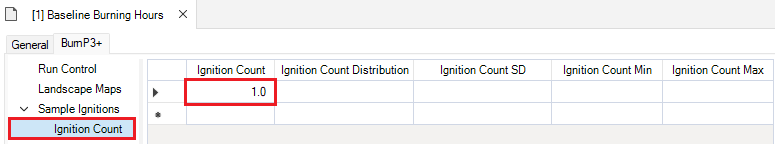

*Note: to unhide columns in this datasheet, right click anywhere in the datasheet window, and select the hidden column from the context menu. To hide a column, right click anywhere in the datasheet window and deselect the desired column from the context menu.*

&nbsp;&nbsp;&nbsp;**2.  How to set an equal probability distribution**

To set an equal probability distribution, provide multiple rows of values in the Ignition Count column. Each value in the Ignition Count column will be sampled with an equal likelihood (in this case, each value has a 25% chance of being sampled). The Ignition Count Distribution column *must* be empty (even if it is hidden).

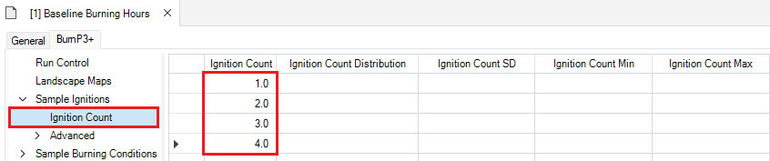

&nbsp;&nbsp;&nbsp;**3.  How to set a user-defined distribution**

To set a user-defined distribution, a distribution name must first be specified in the project <a href="burn-p3-plus#heading06">Distributions</a> datasheet under the **BurnP3+ \| Advanced** node.

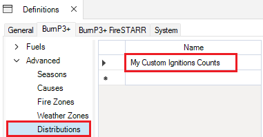

Next, add Values and Relative Frequencies for the distribution in the scenario <a href="burn-p3-plus-scenario#heading19">Distributions</a> datasheet. The Relative Frequency values are normalized by dividing by the sum of all values in the Relative Frequency column and therefore do no need to sum to one hundred. For instance, in the example below the sum of the values in the Relative Frequency column is 14, so the likelihood that a value of "4" will be sampled is 4/14, or ~29%.

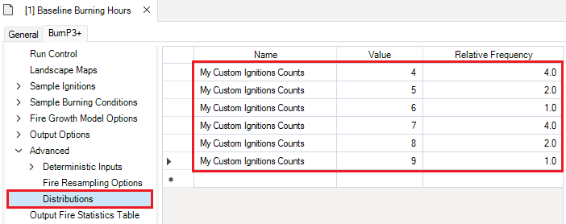

Next, in the Sample Ignitions \| Ignition Count datasheet, ensure that the Ignition Count, Ignition Count SD, Ignition Count Min, and Ignition Count Max columns are empty. Then, assign the defined Distribution in the Ignition Count Distribution column. 

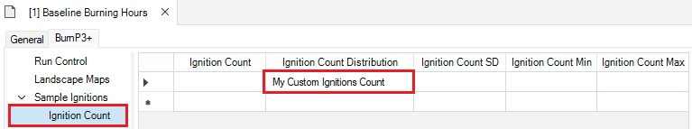

&nbsp;&nbsp;&nbsp;**4.  How to set a built-in Statistical distribution**

Users may choose between two built-in Statistical distributions: Normal or Gamma. Specify the distribution type in the Ignition Count Distribution column by choosing one of the options from the dropdown menu, and set values for Ignition Count (mean), and Ignition Count SD (otherwise, both Ignition Count, and Ignition Count SD will default to 1). Optionally, users may specify values for Ignition Count Min, and Ignition Count Max to prevent extreme values.

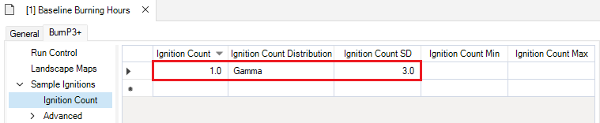

 

# **Advanced**

The **Sample Ignitions | Advanced** node groups the following scenario datasheets:

*	Ignition Location
*	Ignition Restrictions
*	Ignition Distribution

 <h2><b>Ignition Location</b></h2> 

**Datasheet internal name:** burnP3Plus_ProbabilisticIgnitionLocation

The **Ignition Location** datasheet can be found under the **Advanced** node and contains information about the location of fire ignitions.

This datasheet is an input for the *Sample Ignitions* transformer.

### **Probabilistic Ignition Grid**

**Column internal name:** IgnitionGridFileName

A raster file (.tif) input where each pixel corresponds to the relative likelihood of an ignition starting at that specific location within the study area. In SyncroSim Studio, the raster file can be selected by clicking on the yellow folder icon, removed by clicking on the trash can icon, and exported by clicking on left-turn arrow icon. If generating the model programmatically from R or Python, the value in this column should be the absolute path to the corresponding raster file.

&nbsp;&nbsp;&nbsp;&nbsp;&nbsp; *Data Type*: String

### **Season**

**Column internal name:** Season

*Optional*. Specifies the season for which this probabilistic ignition grid should be used. Use this option if the probabilistic ignition grid changes across seasons. 

Seasons are defined in the project [Seasons](burn-p3-plus#heading02) datasheet under the **Advanced** node.

&nbsp;&nbsp;&nbsp;&nbsp;&nbsp; *Data Type*: List Item

### **Cause**

**Column internal name:** Cause

*Optional*. Defines the location of fire ignitions based on a specific cause. Use this option if the probabilistic ignition grid changes by cause. 

Causes are defined in the project [Causes](burn-p3-plus#heading03) datasheet under the **Advanced** node.

&nbsp;&nbsp;&nbsp;&nbsp;&nbsp; *Data Type*: List Item

*Note: if this datasheet is left empty, ignitions will be sampled uniformly across all non-restricted cells in the landscape.*

 

 <h2><b>Ignition Restrictions</b></h2> 

**Datasheet internal name:** burnP3Plus_IgnitionRestriction

The **Ignition Restrictions** datasheet can be found under the **Advanced** node and contains information about fire ignition restrictions that define the conditions and locations where ignitions can be sampled.

This datasheet is an input for the *Sample Ignitions* transformer.

### **Fuel Type** {#ignition-restrictions-fuel-type}

**Column internal name:** FuelType

Defines the fuel type(s) in which fires cannot ignite. However, it is possible that fires ignited in non-restricted fuel types may burn into restricted fuel types if allowed by the fire growth model. 

Fuel types are defined in the project [Fuel Types](burn-p3-plus#heading01) datasheet under the **Fuels** node.

&nbsp;&nbsp;&nbsp;&nbsp;&nbsp; *Data Type*: List Item

### **Season** {#ignition-restrictions-season}

**Column internal name:** Season

*Optional*. Specifies the season for which this ignition restriction should apply. 

Seasons are defined in the project [Seasons](burn-p3-plus#heading02) datasheet under the **Advanced** node.

*Note: To fully restrict ignition sampling for a specific combination of Season, Cause, and Fire Zone, you may leave the Fuel Type column blank.*

&nbsp;&nbsp;&nbsp;&nbsp;&nbsp; *Data Type*: List Item

### **Cause**

**Column internal name:** Cause

*Optional*. Specifies the cause for which this ignition restriction should apply. 

Causes are defined in the project [Causes](burn-p3-plus#heading03) datasheet under the **Advanced** node.

*Note: To fully restrict ignition sampling for a specific combination of Season, Cause, and Fire Zone, you may leave the Fuel Type column blank.*

&nbsp;&nbsp;&nbsp;&nbsp;&nbsp; *Data Type*: List Item

### **Fire Zone**

**Column internal name:** FireZone

*Optional*. Specifies the fire zone for which this ignition restriction should apply. 

Fire zones are defined in the project [Fire Zones](burn-p3-plus#heading04) datasheet under the *Advanced* node.

*Note: To fully restrict ignition sampling for a specific combination of Season, Cause, and Fire Zone, you may leave the Fuel Type column blank.*

&nbsp;&nbsp;&nbsp;&nbsp;&nbsp; *Data Type*: List Item

### **Ignition Restrictions Examples**

&nbsp;&nbsp;&nbsp;**1.  Adding Ignition Restrictions**

The Ignition Restrictions datasheet in the **BurnP3+Prometheus** template library's *Baseline Conditions* scenario outlines how [Fuel Type](#ignition-restrictions-fuel-type), and [Season](#ignition-restrictions-season) can be used to restrict ignitions. 

Here, we can see that the ignitions cannot occur in the Matted Grass (O-1a) fuel type in the Spring, as well as in areas of Non-fuel, and Water.

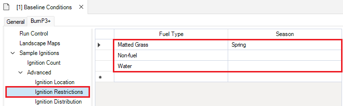

 

 <h2><b>Ignition Distribution</b></h2> 

**Datasheet internal name:** burnP3Plus_IgnitionDistribution

The **Ignition Distribution** datasheet can be found under the **Advanced** node and contains information about how ignitions should be assigned to seasons, causes, and/or fire zones. This information can then be used to stratify ignition locations, burning conditions, etc.

This datasheet is an input for the *Sample Ignitions* transformer.

### **Relative Likelihood**

**Column internal name:** RelativeLikelihood

Defines the relative likelihood used to decide what Season, Cause, Fire Zone (etc.), should be assigned to each ignition. Note that these values are normalized by dividing by the sum of all values in the Relative Likelihood column and therefore do not need to add up to one hundred.

&nbsp;&nbsp;&nbsp;&nbsp;&nbsp; *Data Type*: Double

### **Season**

**Column internal name:** Season

*Optional*. Defines the season to be assigned to the ignition. This must be associated with a value for Relative Likelihood. 

Seasons are defined in the project [Seasons](burn-p3-plus#heading02) datasheet under the **Advanced** node.

&nbsp;&nbsp;&nbsp;&nbsp;&nbsp; *Data Type*: List Item

### **Cause**

**Column internal name:** Cause

*Optional*. Defines the cause to be assigned to the ignition. This must be associated with a value for Relative Likelihood. 

Causes are defined in the project [Causes](burn-p3-plus#heading03) datasheet under the **Advanced** node.

&nbsp;&nbsp;&nbsp;&nbsp;&nbsp; *Data Type*: List Item

### **Fire Zone**

**Column internal name:** FireZone

*Optional*. Defines the fire zone to be assigned to the ignition. This must be associated with a value for Relative Likelihood.

Fire zones are defined in the project [Fire Zones](burn-p3-plus#heading04) datasheet under the **Advanced** node.

&nbsp;&nbsp;&nbsp;&nbsp;&nbsp; *Data Type*: List Item

*Note: if a variable (e.g., Cause) is not specified in any row of this datasheet, ignitions will be assigned uniformly across all valid groups for that variable.*

### **Ignition Count Distribution Examples**

&nbsp;&nbsp;&nbsp;**1.  Adding Ignition Distributions**

The Ignition Distribution datasheet in the **BurnP3+Prometheus** template library's *Baseline Conditions* scenario outlines how Season, Cause, and Fire Zone can be used to sample fire ignitions.

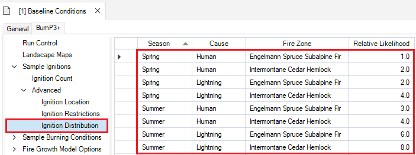

 

# **Sample Burning Conditions**

The *Sample Burning Conditions* transformer is responsible for how long each ignition should burn and the conditions under which fires will burn during this time. The results of this sampling are used to populate the Deterministic Burn Conditions datasheet. For a fully deterministic run, users can forgo running this transformer and fill the Deterministic Burn Conditions datasheet directly. Datasheets in this node are used configure this transformer.

 <h2><b>Spread Event Days</b></h2> 

**Datasheet internal name:** burnP3Plus_FireDuration

The **Spread Event Days** datasheet can be found under the **Sample Burning Conditions** node and contains information about how fire spread event days are sampled.

This datasheet is an input for the *Sample Burning Conditions* transformer.

### **Season**

**Column internal name:** Season

*Optional*. Specifies the season for which this Spread Event Day sampling record should apply. Use this option if the Spread Event Days changes across seasons. 

Seasons are defined in the project [Seasons](burn-p3-plus#heading02) datasheet under the **Advanced** node.

&nbsp;&nbsp;&nbsp;&nbsp;&nbsp; *Data Type*: List Item

### **Fire Zone**

**Column internal name:** FireZone

*Optional*. Specifies the fire zone for which this Spread Event Day sampling record should apply. 

Fire Zones are defined in the project [Fire Zones](burn-p3-plus#heading04) datasheet under the **Advanced** node.

&nbsp;&nbsp;&nbsp;&nbsp;&nbsp; *Data Type*: List Item

### **Fire Duration (Days)**

**Column internal name:** Mean

*Optional*. Defines the number of days a fire burns. To deterministically assign a Fire Duration (Days) value using this column, the Fire Duration Distribution column in this datasheet must be empty (even if hidden). If the Fire Duration (Days) column contains multiple values, and the Fire Duration Distribution column is empty, the Fire Duration (Days) rows will be sampled with equal probability.

&nbsp;&nbsp;&nbsp;&nbsp;&nbsp; *Data Type*: Double

### **Fire Duration Distribution**

**Column internal name:** DistributionType

*Optional*. Defines the distribution of days a fire burns.

To set a user-defined distribution in this datasheet, the distribution name must first be set in the project [Distributions](burn-p3-plus#heading06) datasheet. The associated Value and Relative Frequency of each user-defined distribution are defined in the scenario [Distributions](#heading19) datasheet under the **Advanced** node. When creating a user-defined distribution, all other columns in this datasheet should be ignored. Otherwise, other columns will need to be used to parameterize the distribution(s) (i.e., Normal, or Gamma).

To use a built-in statistical distribution type (i.e., Normal, or Gamma), set this column to either Normal or Gamma, and specify a value for Fire Duration (Days) (mean), and Fire Duration SD (standard deviation) (if not, the defaults will be set to 1). The Fire Duration Min and Fire Duration Max may also be specified to prevent extreme values from being sampled (by default the Min is set to 1, and the Max is set to Inf).

Note that if this column is filled, there should only be a single row for each unique combination of season, and fire zone. 

&nbsp;&nbsp;&nbsp;&nbsp;&nbsp; *Built-in*: Normal and Gamma statistical distributions
 
&nbsp;&nbsp;&nbsp;&nbsp;&nbsp; *Data Type*: List Item

### **Fire Duration SD**

**Column internal name:** DistributionSD

*Optional*. Defines the standard deviation of the fire burning duration (days) if the fire duration distribution type is set to a built-in statistical distribution.

*Note: this column is only respected for the built-in statistical distribution type.*

&nbsp;&nbsp;&nbsp;&nbsp;&nbsp; *Data Type*: Double

### **Fire Duration Min**

**Column internal name:** DistributionMin

*Optional*. Defines the minimum fire burning duration (days) to be sampled.

*Note: this column is only respected for the built-in statistical distribution type.*

&nbsp;&nbsp;&nbsp;&nbsp;&nbsp; *Data Type*: Double

### **Fire Duration Max**

**Column internal name:** DistributionMax

*Optional*. Defines the maximum fire burning duration (days) to be sampled.

*Note: this column is only respected for the built-in statistical distribution type.*

&nbsp;&nbsp;&nbsp;&nbsp;&nbsp; *Data Type*: Double

### **Fire Duration Distribution Examples**

&nbsp;&nbsp;&nbsp;**1.  How to set fixed fire duration (days)**

To deterministically set a fixed fire duration (days), provide a single value in the Fire Duration (Days) column. The Fire Duration Distribution column *must* be empty (even if it is hidden). 

For example, to tell the model to burn each fire for exactly one day, you would set up of the Fire Duration Distribution datasheet in the following way:

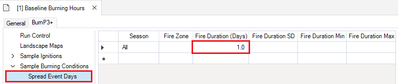

*Note: to unhide columns in this datasheet, right click anywhere in the datasheet window, and select the hidden column from the context menu. To hide a column, right click anywhere in the datasheet window and deselect the desired column from the context menu.*

&nbsp;&nbsp;&nbsp;**2.  How to set an equal probability distribution**

To set an equal probability distribution, provide multiple rows of values in the Fire Duration (Days) column. Each value in the Fire Duration (Days) column will be sampled with an equal likelihood (in this case, each value has a 25% chance of being sampled). The Fire Duration Distribution column *must* be empty (even if it is hidden). In this case, values will be sampled from the rows with equal probability. 

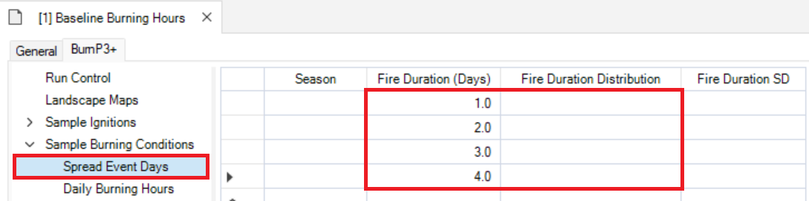

&nbsp;&nbsp;&nbsp;**3.	How to set a user-defined distribution**

To set a user-defined distribution, a distribution name must first be specified in the project [Distributions](burn-p3-plus#heading06) datasheet under the **BurnP3+ \| Advanced** node. 

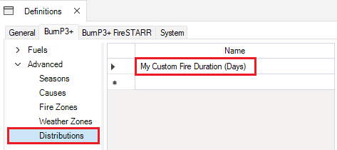

Next, add Values and Relative Frequencies for the distribution in the scenario [Distributions](#heading19) datasheet.

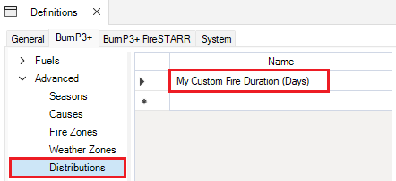

Then, assign the defined Distribution in the Fire Duration Distribution column of the Spread Event Days datasheet. Ensure that the Fire Duration (Days), Fire Duration SD, Fire Duration Min, and Fire Duration Max columns are empty.

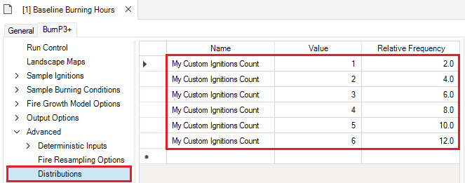

&nbsp;&nbsp;&nbsp;**4.	How to set a built-in Statistical distribution**

Users may choose between two built-in Statistical distributions: Normal or Gamma. Specify the distribution type in the Fire Duration Distribution column by choosing one of the options from the dropdown menu, and set values for Fire Duration (Days) (mean), and Fire Duration SD (otherwise, both Fire Duration (Days), and Fire Duration SD will default to 1). Optionally, users may specify values for Fire Duration Min, and Fire Duration Max to prevent extreme values.

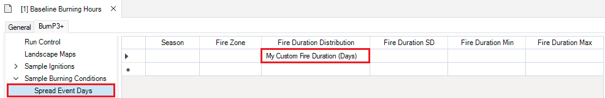

 

 <h2><b>Daily Burning Hours</b></h2> 

**Datasheet internal name:** burnP3Plus_HoursPerDayBurning

The **Daily Burning Hours** datasheet can be found under the **Sample Burning Conditions** node and contains information about how daily burning hours are sampled.

This datasheet is an input for the *Sample Burning Conditions* transformer.

*Note: if this datasheet is left completely empty, BurnP3+ will default to 4 hours of burning per burn day and log a warning to the run log.*

### **Season**

**Column internal name:** Season

Specifies the season for which this Daily Burning Hours sampling record should apply 

Seasons are defined in the project [Seasons](burn-p3-plus#heading02) datasheet under the **Advanced** node.

&nbsp;&nbsp;&nbsp;&nbsp;&nbsp; *Data Type*: List Item

### **Daily Burning Hours**

**Column internal name:** Mean

*Optional*. Defines the number of hours a fire burns in a day.

To deterministically assign a Daily Burning Hours value using this column, the Daily Burning Hours Distribution column in this datasheet must be empty (even if hidden). If the Daily Burning Hours column contains multiple values, and the Daily Burning Hours Distribution column is empty, the Daily Burning Hours rows will be sampled with equal probability.

&nbsp;&nbsp;&nbsp;&nbsp;&nbsp; *Data Type*: Double

### **Daily Burning Hours Distribution**

**Column internal name:** DistributionType

*Optional*. Defines the type of distribution used to sample daily burning hours.

To set a user-defined distribution in this datasheet, it must first be set in the project [Distributions](burn-p3-plus#heading06) datasheet. The associated Value and Relative Frequency of each user-defined distribution are defined in the scenario [Distributions](#heading19) datasheet under the **Advanced** node. When creating a user-defined distribution, all other columns in this datasheet should be ignored. 

To use a built-in statistical distribution type, set this column to either Normal or Gamma, and specify a value for Daily Burning Hours (mean), and Daily Burning Hours SD (standard deviation) (if not, the defaults will be set to 1). The Daily Burning Hours Min and Daily Burning Hours Max may also be specified to prevent extreme values from being sampled (by default the Min is set to 1, and the Max is set to Inf).

Note that if this column is filled, there should only be a single row for each unique combination of season. 

&nbsp;&nbsp;&nbsp;&nbsp;&nbsp; *Built-in*: Normal and Gamma statistical distributions
 
&nbsp;&nbsp;&nbsp;&nbsp;&nbsp; *Data Type*: List Item

### **Daily Burning Hours SD**

**Column internal name:** DistributionSD

*Optional*. Defines the standard deviation of the daily burning hours.

&nbsp;&nbsp;&nbsp;&nbsp;&nbsp; *Data Type*: Double

### **Daily Burning Hours Min**

**Column internal name:** DistributionMin

*Optional*. Defines the minimum daily burning hours to be sampled.

&nbsp;&nbsp;&nbsp;&nbsp;&nbsp; *Data Type*: Double

### **Daily Burning Hours Max**

**Column internal name:** DistributionMax

*Optional*. Defines the maximum daily burning hours to be sampled.

&nbsp;&nbsp;&nbsp;&nbsp;&nbsp; *Data Type*: Double

### **Daily Burning Hours Distribution Examples**

&nbsp;&nbsp;&nbsp;**1.  How to set fixed daily burning hours**

To deterministically set a fixed daily burning hours, provide a single value in the Daily Burning Hours column. The Daily Burning Hours Distribution column *must* be empty (even if it is hidden). In this case, the Season column must also be filled with seasons defined in the project [Seasons](burn-p3-plus#heading02) datasheet. "All" is a built-in option and is used as an explicit wild card for all seasons.

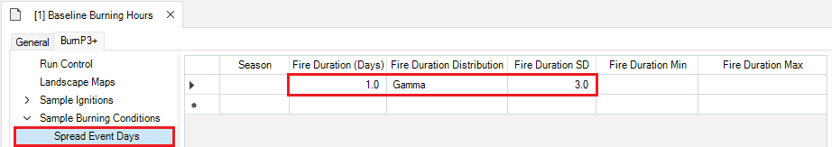

For example, to tell the model to burn each fire for exactly one day, you would set up the Daily Burning Hours Distribution datasheet in the following way:

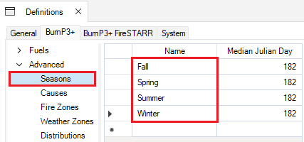

*Note: to unhide columns in this datasheet, right click anywhere in the datasheet window, and select the hidden column from the context menu. To hide a column, right click anywhere in the datasheet window and deselect the desired column from the context menu.*

&nbsp;&nbsp;&nbsp;**2.  How to set a user-defined distribution**

To set a user-defined distribution, a distribution name must first be specified in the project [Distributions](#heading06) datasheet under the **BurnP3+ \| Advanced** node. 

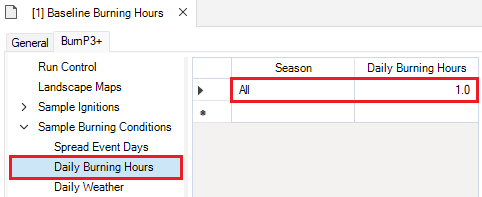

Next, add Values and Relative Frequencies for the distribution in the scenario [Distributions](#heading19) datasheet. 

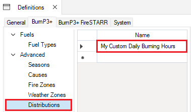

Then, assign the defined Distribution in the Daily Burning Hours Distribution column. In this case, the Season column must also be filled with season defined in the project [Seasons](burn-p3-plus#heading02) datasheet. Ensure that the Daily Burning Hours, Daily Burning Hours SD, Daily Burning Hours Min, and Daily Burning Hours Max columns are empty.

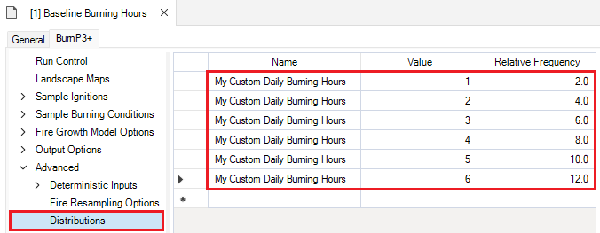

&nbsp;&nbsp;&nbsp;**3.	How to set a built-in Statistical distribution**

Users may choose between two built-in Statistical distributions: Normal or Gamma. Specify the distribution type in the Daily Burning Hours Distribution column by choosing one of the options from the dropdown menu, and set values for Daily Burning Hours (mean), and Daily Burning Hours SD (otherwise, both Daily Burning Hours, and Daily Burning Hours SD will default to 1). Optionally, users may specify values for Daily Burning Hours Min, and Daily Burning Hours Max to prevent extreme values.

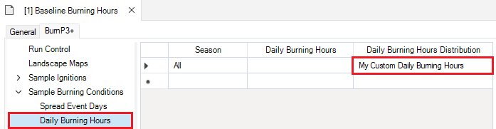

 

 <h2><b>Daily Weather</b></h2> 

**Datasheet internal name:** burnP3Plus_WeatherStream

The **Daily Weather** datasheet can be found under the **Sample Burning Conditions** node and contains information about the daily weather conditions.

This datasheet is an input for the *Sample Burning Conditions* transformer.

This datasheet may be filled with the daily noon LSTh (local standard time) weather records from weather stations, and [FWI (fire weather index) System fuel moisture codes](https://natural-resources.canada.ca/forests-forestry/wildland-fires/canada-fire-weather-index-system#FFMC){:target="_blank"}, and [fire behaviour indices](https://natural-resources.canada.ca/forests-forestry/wildland-fires/canada-fire-weather-index-system#FireBehaviourInd){:target="_blank"}. 

If the user samples weather data sequentially for a multi-day fire that exceeds the number of daily weather rows (i.e., days), the simulation will repeat the last row of weather to fill out as many days as necessary.

*Note: Daily Weather is a singular value that applies to each hour the fire burns on a particular day.*

### **Order**

**Column internal name:** Order

Defines the order in which to sample the weather records.

&nbsp;&nbsp;&nbsp;&nbsp;&nbsp; *Data Type*: Integer

### **Temperature**

**Column internal name:** Temperature

Defines the daily noon temperature (°C).

&nbsp;&nbsp;&nbsp;&nbsp;&nbsp; *Data Type*: Double

### **Relative Humidity**

**Column internal name:** RelativeHumidity

Defines the daily noon relative humidity (%).

&nbsp;&nbsp;&nbsp;&nbsp;&nbsp; *Data Type*: Double

### **Wind Speed**

**Column internal name:** WindSpeed

Defines the daily noon wind speed (km/h).

&nbsp;&nbsp;&nbsp;&nbsp;&nbsp; *Data Type*: Double

### **Wind Direction**

**Column internal name:** WindDirection

Defines the daily noon cardinal or intercardinal wind direction (° degrees). E.g., "0/360" corresponds to the cardinal direction North, "90.0" corresponds to the cardinal direction East, "180" corresponds to the cardinal direction South, and "270" corresponds to the cardinal direction West.

&nbsp;&nbsp;&nbsp;&nbsp;&nbsp; *Data Type*: Double

### **Precipitation**

**Column internal name:** Precipitation

Defines the daily noon precipitation (mm).

&nbsp;&nbsp;&nbsp;&nbsp;&nbsp; *Data Type*: Double

### **Fine Fuel Moisture Code**

**Column internal name:** FineFuelMoistureCode

Defines the Fine Fuel Moisture Code (FFMC). The FFMC represents the moisture content of fine surface fuels (e.g., litter and other cured fine fuels), and is indicative of the relative ease of ignition and flammability of fine fuels. The FFMC is calculated based on values for temperature, relative humidity, wind, and precipitation.

Although this code is unitless, it ranges from 0-101 wherein higher values indicate drier and more flammable fuels.

&nbsp;&nbsp;&nbsp;&nbsp;&nbsp; *Data Type*: Double

### **Duff Moisture Code**

**Column internal name:** DuffMoistureCode

Defines the Duff Moisture Code (DMC). The DMC represents the average moisture content of loosely compacted organic layers of moderate depth below the surface, and is indicative of fuel consumption of moderate duff layers and medium-size woody material. The DMC is calculated based on values for temperature, relative humidity, and precipitation.

Although this code is unitless, it ranges from 0 to infinity wherein higher values are indicative of drier conditions.

&nbsp;&nbsp;&nbsp;&nbsp;&nbsp; *Data Type*: Double

### **Drought Code**

**Column internal name:** DroughtCode

Defines the Drought Code (DC). The DC represents the moisture content of deep, compact organic layers, and is indicative of seasonal drought effects on forest fuels as well as the amount of smouldering in deep duff layers and large woody material (e.g., logs). The DC is calculated based on values for temperature, and precipitation.

Although this code is unitless, it ranges from 0 to infinity wherein higher values are indicative of long-term drying, and a greater potential for deeper burning.

&nbsp;&nbsp;&nbsp;&nbsp;&nbsp; *Data Type*: Double

### **Initial Spread Index**

**Column internal name:** InitialSpreadIndex

Defines the Initial Spread Index (ISI). This index represents a numerical rating of the expected rate of fire spread based on wind speed, and the Fine Fuel Moisture Code (FFMC). The ISI does not account for fuel type; actual spread rates vary between fuel types at the same ISI.

Although this index is unitless, higher values represent faster spreading fires.

&nbsp;&nbsp;&nbsp;&nbsp;&nbsp; *Data Type*: Double

### **Build Up Index**

**Column internal name:** BuildUpIndex

Defines the Build Up Index (BUI). This index represents the total fuel available for combustion based on the Duff Moisture Code (DMC), and Drought Code (DC).  

Although this index is unitless, higher values represent greater fuel availability.

&nbsp;&nbsp;&nbsp;&nbsp;&nbsp; *Data Type*: Double

### **Fire Weather Index**

**Column internal name:** FireWeatherIndex

Defines the Fire Weather Index (FWI). This index represents the overall fire intensity based on the Initial Spread Index (ISI) and Build Up Index (BUI). Generally, this index is indicative of fire danger within forested areas. 

&nbsp;&nbsp;&nbsp;&nbsp;&nbsp; *Data Type*: Double

*For more information on the Canadian Forest Fire Weather Index (FWI) System, visit this <a href="https://natural-resources.canada.ca/forests-forestry/wildland-fires/canada-fire-weather-index-system" target="_blank">link</a>.*

### **Season**

**Column internal name:** Season

*Optional*. Specifies the season for which this Daily Weather record should apply. Season may also be set to "All" to include this weather record, irrespective of the ignitions Season. 

Seasons are defined in the project [Seasons](burn-p3-plus#heading02) datasheet under the **Advanced** node.

&nbsp;&nbsp;&nbsp;&nbsp;&nbsp; *Data Type*: List Item

### **Weather Zone**

**Column internal name:** WeatherZone

*Optional*.  Specifies the weather zone for which this Daily Weather record should apply. Weather Zone may be left blank to include this record for ignitions in all Weather Zones. Internally, the value of this column is an integer referencing the ID of the corresponding Weather Zone name.

Weather Zones are defined in the project [Weather Zones](burn-p3-plus#heading05) datasheet under the **Advanced** node.

&nbsp;&nbsp;&nbsp;&nbsp;&nbsp; *Data Type*: List Item

 

# **Advanced**

The **Advanced** node contains the following datasheet:

*	Weather Sampling Options

 <h2><b>Weather Sampling Options</b></h2> 

**Datasheet internal name:** burnP3Plus_WeatherOption

The **Weather Sampling Options** datasheet can be found under the **Advanced** node and contains information regarding how the weather data will be sampled.

### **Sample Weather Sequentially**

**Column internal name:** SampleSequentially

Specifies if and how the daily weather data will be sampled for consecutive days of a multi-day fire. When sampling weather, available weather data will first be filtered by Season and Weather Zone of the current ignition.

If set to *No*, each day of burning will choose a random day of weather from the subset of relevant weather data. 

If set to *Yes*, only the first day of burning will choose a random day of weather from the subset of relevant weather data. Assuming that the order of the daily weather records represents consecutive days, the remaining days of weather will be used in sequence associated with each day of burning.

&nbsp;&nbsp;&nbsp;&nbsp;&nbsp; *Data Type*: Boolean

 

# **Fire Growth Model Options**

The *Fire Growth* transformers are responsible for simulating the spread of individual fires across a landscape using the deterministic inputs sampled by the previous two transformers. The BurnP3+ package does not include a Fire Growth transformer, but datasheets in this node are used to configure Fire Growth transformers in other packages, including BurnP3+Prometheus and BurnP3+FireSTARR.

The **Advanced** node groups the following datasheets:

*	Green Up
*	Curing
*	Wind Grid

# **Advanced**

 <h2><b>Green Up</b></h2> 

**Datasheet internal name:** burnP3Plus_GreenUp

A modifier of the Fire Behaviour Prediction (FBP) fuel types.

This datasheet is an input for the Prometheus and FireSTARR *Fire Growth* transformer.

### **Green Up**

**Column internal name:** GreenUp

Green Up settings are used to configure certain fuels in the fire growth models. It is handled differently by different fire models but generally is used to determine how seasonal fuels (such as M1/M2 and D1/D2 in the FBP system) are treated.

&nbsp;&nbsp;&nbsp;&nbsp;&nbsp; *Data Type*: Boolean
 
&nbsp;&nbsp;&nbsp;&nbsp;&nbsp; *Default*: Yes

### **Season**

**Column internal name:** Season

Specifies the season for which this Green Up record should apply. Use this option if Green Up changes across seasons. Seasons are defined in the project [Seasons](burn-p3-plus#heading02) datasheet under the **Advanced** node.

&nbsp;&nbsp;&nbsp;&nbsp;&nbsp; *Data Type*: List Item

 

 <h2><b>Curing</b></h2> 

**Datasheet internal name:** burnP3Plus_Curing

A modifier of the Fire Behaviour Prediction (FBP) fuel types.

This datasheet is an input for the Prometheus and FireSTARR *Fire Growth* transformer.

### **Curing**

**Column internal name:** Curing

Defines the percentage of grass that is dry. Grass moisture content impacts how grass fuel-types burn wherein higher values for curing represent drier grass that burns more easily.

&nbsp;&nbsp;&nbsp;&nbsp;&nbsp; *Data Type*: Integer
 
&nbsp;&nbsp;&nbsp;&nbsp;&nbsp; *Default*: 75

### **Season**

**Column internal name:** Season

Specifies the season for which this Grass Curing record should apply. Use this option if Curing changes across seasons. Seasons are defined in the project [Seasons](burn-p3-plus#heading02) datasheet under the **Advanced** node.

&nbsp;&nbsp;&nbsp;&nbsp;&nbsp; *Data Type*: List Item

 

 <h2><b>Wind Grid</b></h2> 

**Datasheet internal name:** burnP3Plus_WindGrid

Contains information about the cardinal and intercardinal wind directions, as well as prevailing wind speed.

Wind grids are used to describe how the landscape's topography influences prevailing wind to produce more complex local wind patterns. Historically, Wind Grids have been generated using <a href="https://ninjastorm.firelab.org/windninja/" target="_blank">Wind Ninja</a>. 

This datasheet contains raster files (.tif) relevant to the associated study area. In SyncroSim Studio, the raster file can be selected by clicking on the yellow folder icon, removed by clicking on the trash can icon, and exported by clicking on export icon. If generating the model programmatically from R or Python, the value in this column should be the absolute path to the corresponding raster file.

This datasheet *must* specify a value for the prevailing wind speed, as well as include *all* cardinal and intercardinal wind speed and direction grids generated under the prevailing wind. Please note that in SyncroSim Studio, users may not exit this datasheet without filling in all the necessary entries. 

*Note*: This datasheet is only used by the Prometheus *Fire Growth* transformer.

### **Prevailing Wind Speed**

**Column internal name:** WindSpeed

Defines the prevailing wind speed (km/h) used to generate the wind grids.

&nbsp;&nbsp;&nbsp;&nbsp;&nbsp; *Data Type*: Double

### **Wind Speed North**

**Column internal name:** WindSpeedNorth

A raster file (.tif) input that contains a grid of resulting wind speeds under a prevailing wind from the north. 

&nbsp;&nbsp;&nbsp;&nbsp;&nbsp; *Data Type*: String

### **Wind Speed North East**

**Column internal name:** WindSpeedNorthEast

A raster file (.tif) input that contains a grid of resulting wind speeds under a prevailing wind from the northeast.

&nbsp;&nbsp;&nbsp;&nbsp;&nbsp; *Data Type*: String

### **Wind Speed East**

**Column internal name:** WindSpeedEast

A raster file (.tif) input that contains a grid of resulting wind speeds under a prevailing wind from the east. 

&nbsp;&nbsp;&nbsp;&nbsp;&nbsp; *Data Type*: String

### **Wind Speed South East**

**Column internal name:** WindSpeedSouthEast

A raster file (.tif) input that contains a grid of resulting wind speeds under a prevailing wind from the southeast. 

&nbsp;&nbsp;&nbsp;&nbsp;&nbsp; *Data Type*: String

### **Wind Speed South**

**Column internal name:** WindSpeedSouth

A raster file (.tif) input that contains a grid of resulting wind speeds under a prevailing wind from the south. 

&nbsp;&nbsp;&nbsp;&nbsp;&nbsp; *Data Type*: String

### **Wind Speed South West**

**Column internal name:** WindSpeedSouthWest

A raster file (.tif) input that contains a grid of resulting wind speeds under a prevailing wind from the southwest. 

&nbsp;&nbsp;&nbsp;&nbsp;&nbsp; *Data Type*: String

### **Wind Speed West**

**Column internal name:** WindSpeedWest

A raster file (.tif) input that contains a grid of resulting wind speeds under a prevailing wind from the west. 

&nbsp;&nbsp;&nbsp;&nbsp;&nbsp; *Data Type*: String

### **Wind Speed North West**

**Column internal name:** WindSpeedNorthWest

A raster file (.tif) input that contains a grid of resulting wind speeds under a prevailing wind from the northwest. 

&nbsp;&nbsp;&nbsp;&nbsp;&nbsp; *Data Type*: String

### **Wind Direction North**

**Column internal name:** WindDirectionNorth

A raster file (.tif) input that contains the resulting local wind direction under a prevailing wind from the north.

&nbsp;&nbsp;&nbsp;&nbsp;&nbsp; *Data Type*: String

### **Wind Direction North East**

**Column internal name:** WindDirectionNorthEast

A raster file (.tif) input that contains the resulting local wind direction under a prevailing wind from the northeast .

&nbsp;&nbsp;&nbsp;&nbsp;&nbsp; *Data Type*: String

### **Wind Direction East**

**Column internal name:** WindDirectionEast

A raster file (.tif) input that contains the resulting local wind direction under a prevailing wind from the east. 

&nbsp;&nbsp;&nbsp;&nbsp;&nbsp; *Data Type*: String

### **Wind Direction South East**

**Column internal name:** WindDirectionSouthEast

A raster file (.tif) input that contains the resulting local wind direction under a prevailing wind from the southeast. 

&nbsp;&nbsp;&nbsp;&nbsp;&nbsp; *Data Type*: String

### **Wind Direction South**

**Column internal name:** WindDirectionSouth

A raster file (.tif) input that contains the resulting local wind direction under a prevailing wind from the south.

&nbsp;&nbsp;&nbsp;&nbsp;&nbsp; *Data Type*: String

### **Wind Direction South West**

**Column internal name:** WindDirectionSouthWest

A raster file (.tif) input that contains the resulting local wind direction under a prevailing wind from the southwest. 

&nbsp;&nbsp;&nbsp;&nbsp;&nbsp; *Data Type*: String

### **Wind Direction West**

**Column internal name:** WindDirectionWest

A raster file (.tif) input that contains the resulting local wind direction under a prevailing wind from the west. 

&nbsp;&nbsp;&nbsp;&nbsp;&nbsp; *Data Type*: String

### **Wind Direction North West**

**Column internal name:** WindDirectionNorthWest

A raster file (.tif) input that contains the resulting local wind direction under a prevailing wind from the northwest. 

&nbsp;&nbsp;&nbsp;&nbsp;&nbsp; *Data Type*: String

 

# **Output Options**

 <h2><b>Tabular</b></h2> 

**Datasheet internal name:** burnP3Plus_OutputOption

The **Tabular** datasheet can be found under the **Output Options** tab and provides the option to generate a fire statistics table of simulation outputs.

### **Fire Statistics Table**

**Column internal name:** FireStatistics

Determines whether to populate the fire statistics table. If set to *Yes*, an [Output Fire Statistics Table](#heading20) will be populated. If set to *No*, the Output Fire Statistics Table will not be populated.

This datasheet is an input and output for the *Summarize Burn Probability* transformer.

&nbsp;&nbsp;&nbsp;&nbsp;&nbsp; *Default*: Yes
 
&nbsp;&nbsp;&nbsp;&nbsp;&nbsp; *Data Type*: Boolean

 

 <h2><b>Spatial</b></h2> 

**Datasheet internal name:** burnP3Plus_OutputOptionsSpatial

The **Spatial** datasheet can be found under the **Output Options** tab and provides the option to select which spatial outputs to generate. 

### **Burn Probability Map**

**Column internal name:** BurnProbability

The absolute burn probability of each cell in the landscape summarized across all iterations. This value ranges from 0-1 and is calculated by dividing the number of iterations a cell burned in by the total number of iterations. Iterations that do not meet their sampled burn targets by way of resampling (see the [Fire Resampling Options](#heading18) datasheet) are removed from the total number of iterations, and thus not included in the burn probability calculation.

If set to *Yes* a burn probability map will be created, and if set to *No* a burn probability map will not be created.

This datasheet is an output for the *Summarize Burn Probability* transformer. More specifically, the Burn Probability map is an intermediate output for the Relative Burn Probability map.

&nbsp;&nbsp;&nbsp;&nbsp;&nbsp; *Output*: one map per run
 
&nbsp;&nbsp;&nbsp;&nbsp;&nbsp; *Default*: Yes
 
&nbsp;&nbsp;&nbsp;&nbsp;&nbsp; *Data Type*: Boolean 

### **Seasonal Burn Probability Map**

**Column internal name:** SeasonalBurnProbability

The absolute burn probability of each cell in the landscape summarized across all iterations, stratified by season. This value ranges from 0-1 and is calculated by dividing the number of iterations a cell burned in by the total number of iterations. Iterations that do not meet their sampled burn targets by way of resampling (see the [Fire Resampling Options](#heading18) datasheet) are removed from the total number of iterations, and thus not included in the burn probability calculation. 

If set to *Yes* a seasonal burn probability map will be created, and if set to *No* a seasonal burn probability map will not be created.

This datasheet is an output for the *Summarize Burn Probability* transformer. More specifically, the Seasonal Burn Probability map is an intermediate output for the Seasonal Relative Burn Probability map.

&nbsp;&nbsp;&nbsp;&nbsp;&nbsp; *Output*: one map per run and season
 
&nbsp;&nbsp;&nbsp;&nbsp;&nbsp; *Default*: Yes
 
&nbsp;&nbsp;&nbsp;&nbsp;&nbsp; *Data Type*: Boolean

### **Relative Burn Probability Map**

**Column internal name:** RelativeBurnProbability

The burn probability of each cell relative (on a linear scale) to the average burn probability of all cells in the landscape summarized across all iterations. 

For instance: a relative burn probability of 1 means it is just as likely to burn as the average, a relative burn probability of 2 means it's 2 times more likely to burn, a relative burn probability of 3 means it's 3 times more likely to burn, and so on. If a cell is less likely to burn compared to the average, the negative reciprocal of the probability over the average is used. For instance, a relative burn probability of -2 means it's half as likely to burn compared to the average cell, a relative burn probability of -3 means it's 1/3rd as likely to burn, and so on.

Values are discrete integers and a relative burn probability of zero is not possible. Any values above 10, and below -10 are truncated to 11 and -11, respectively.

If set to *Yes* a relative burn probability map will be created, and if set to *No* a relative burn probability map will not be created.

This datasheet is an output for the *Summarize Burn Probability* transformer.

&nbsp;&nbsp;&nbsp;&nbsp;&nbsp; *Output*: one map per run
 
&nbsp;&nbsp;&nbsp;&nbsp;&nbsp; *Default*: Yes
 
&nbsp;&nbsp;&nbsp;&nbsp;&nbsp; *Data Type*: Boolean

### **Seasonal Relative Burn Probability Map**

**Column internal name:** SeasonalRelativeBurnProbability

The burn probability of each cell relative (on a linear scale) to the average burn probability of all cells in the landscape summarized across all iterations, stratified by season. 

For instance: a relative burn probability of 1 means it is just as likely to burn as the average, a relative burn probability of 2 means it's 2 times more likely to burn, a relative burn probability of 3 means it's 3 times more likely to burn, and so on. If a cell is less likely to burn compared to the average, the negative reciprocal of the probability over the average is used. For instance, a relative burn probability of -2 means it's half as likely to burn compared to the average cell, a relative burn probability of -3 means it's 1/3rd as likely to burn, and so on.

Values are discrete integers and a relative burn probability of zero is not possible. Any values above 10, and below -10 are truncated to 11 and -11, respectively.

If set to *Yes* a seasonal relative burn probability map will be created, and if set to *No* a relative seasonal burn probability map will not be created.

This datasheet is an output for the *Summarize Burn Probability* transformer.

&nbsp;&nbsp;&nbsp;&nbsp;&nbsp; *Output*: one map per run per season
 
&nbsp;&nbsp;&nbsp;&nbsp;&nbsp; *Default*: Yes
 
&nbsp;&nbsp;&nbsp;&nbsp;&nbsp; *Data Type*: Boolean

### **Burn Count Map**

**Column internal name:** BurnCount

The number of times a cell burned across all iterations. This is an intermediate output to Burn Probability. If the Burn Probability Map output is chosen, but not the Burn Count Map, the Burn Count Maps will still be generated during the model run but will then be purged on run completion. Iterations that do not meet their sampled burn targets by way of resampling (see the [Fire Resampling Options](#heading18) datasheet) are removed from the total number of iterations, and thus not included in the burn count.

If set to *Yes* a burn count map will be created, and if set to *No* a burn count map will not be created.

This datasheet is an output for the *Summarize Burn Probability* transformer.

&nbsp;&nbsp;&nbsp;&nbsp;&nbsp; *Output*: one map per run
 
&nbsp;&nbsp;&nbsp;&nbsp;&nbsp; *Default*: Yes
 
&nbsp;&nbsp;&nbsp;&nbsp;&nbsp; *Data Type*: Boolean

### **Seasonal Burn Count Map**

**Column internal name:** SeasonalBurnCount

The number of times a cell burned across all iterations, stratified by season. This is an intermediate output to Seasonal Burn Probability. If the Seasonal Burn Probability Map output is chosen, but not the Seasonal Burn Count Map, the Seasonal Burn Count Maps will still be generated during the model run but will then be purged on run completion. Iterations that do not meet their sampled burn targets by way of resampling (see the [Fire Resampling Options](#heading18) datasheet) are removed from the total number of iterations, and thus not included in the burn count.

Note: the sum of all seasonal burn maps (except All) is always the same or greater than the non-seasonal burn count. This is because a single cell can be burned by multiple fires in different seasons, but a single iteration. In this case, burn count maps would count the burn(s) independently, but the non-seasonal burn count would only count the burn once.

If set to *Yes* a seasonal burn count map will be created, and if set to *No* a seasonal burn count map will not be created.

This datasheet is an output for the *Summarize Burn Probability* transformer.

&nbsp;&nbsp;&nbsp;&nbsp;&nbsp; *Output*: one map per run per season
 
&nbsp;&nbsp;&nbsp;&nbsp;&nbsp; *Default*: Yes
 
&nbsp;&nbsp;&nbsp;&nbsp;&nbsp; *Data Type*: Boolean

### **Burn Maps**

**Column internal name:** BurnMap

Describes whether or not a cell burned per iteration. Values are 1 (yes, the cell burned in any fire within the iteration), 0 (no, the cell did not burn in any fire within the iteration), or NA (the cell is masked out by the fuel map). Fires that do not meet the minimum fire size are not included in the burn map. 

If set to *Yes* a burn map will be created, and if set to *No* a burn map will not be created.

This datasheet is an output for the *Summarize Burn Probability* transformer.

&nbsp;&nbsp;&nbsp;&nbsp;&nbsp; *Output*: one map per iteration
 
&nbsp;&nbsp;&nbsp;&nbsp;&nbsp; *Default*: Yes
 
&nbsp;&nbsp;&nbsp;&nbsp;&nbsp; *Data Type*: Boolean

### **Seasonal Burn Maps**

**Column internal name:** SeasonalBurnMap

Describes whether or not a cell burned per iteration, stratified by season. Values are 1 (yes, the cell burned in any fire within the iteration), 0 (no, the cell did not burn in any fire within the iteration), or NA (the cell is masked out by the fuel map). Fires that do not meet the minimum fire size are not included in the burn map. 

If set to *Yes* a seasonal burn map will be created, and if set to *No* a seasonal burn map will not be created.

This datasheet is an output for the *Summarize Burn Probability* transformer.

&nbsp;&nbsp;&nbsp;&nbsp;&nbsp; *Output*: one map per iteration per season
 
&nbsp;&nbsp;&nbsp;&nbsp;&nbsp; *Default*: Yes
 
&nbsp;&nbsp;&nbsp;&nbsp;&nbsp; *Data Type*: Boolean

### **Burn Perimeters**

**Column internal name:** BurnPerimeter

Shapefiles containing the final burn perimeters for each fire across all iterations. 

If set to *Yes* shapefiles will be created, and if set to *No* shapefiles will not be created.

This datasheet is an output for the *Summarize Burn Probability* transformer.

&nbsp;&nbsp;&nbsp;&nbsp;&nbsp; *Output*: one map per fire
 
&nbsp;&nbsp;&nbsp;&nbsp;&nbsp; *Default*: Yes
 
&nbsp;&nbsp;&nbsp;&nbsp;&nbsp; *Data Type*: Boolean

### **Output Individual Burn Maps**

**Column internal name:** AllPerim

Raster of the burned area for each fire within each iteration. Values are 1 (yes, the cell burned in any fire), 0 (no, the cell did not burn in any fire), or NA (the cell is masked out by the fuel map).

If set to *Yes* an individual fire burn perimeter map will be created, and if set to *No* an individual fire burn perimeter map will not be created.

This datasheet is an output for the *Summarize Burn Probability* transformer.

&nbsp;&nbsp;&nbsp;&nbsp;&nbsp; *Output*: one map per iteration
 
&nbsp;&nbsp;&nbsp;&nbsp;&nbsp; *Default*: Yes
 
&nbsp;&nbsp;&nbsp;&nbsp;&nbsp; *Data Type*: Boolean

 

# **Advanced**

# **Deterministic Inputs**

The **Deterministic Inputs** node groups the following datasheets:

*	Deterministic Ignition Location
*	Deterministic Burn Conditions

Each of these datasheets are automatically populated from the first two BurnP3+ transformers (i.e., 1 – Sample Ignitions, and 2 – Sample Burning Conditions). However, users may populate these tables with their own data instead of sampling them with these transformers when creating a deterministic model (e.g., when modeling historical fires, etc.).

 <h2><b>Deterministic Ignition Location</b></h2> 

**Datasheet internal name:** burnP3Plus_DeterministicIgnitionLocation

The **Deterministic Ignition Location** datasheet can be found under the **Deterministic Inputs** node and provides information on the ignition locations in the simulation. 

This datasheet is usually populated by the *Sample Ignitions* transformer but can be filled by hand for deterministic runs.  

*Note: Each row in this datasheet corresponds to a single iteration.*

### **Iteration**

**Column internal name:** Iteration

Specifies the iteration.

&nbsp;&nbsp;&nbsp;&nbsp;&nbsp; *Data Type*: Integer

### **Fire ID**

**Column internal name:** FireID

Specifies the Fire ID.

&nbsp;&nbsp;&nbsp;&nbsp;&nbsp; *Data Type*: Integer

### **Latitude**

**Column internal name:** Latitude

Specifies the fire location's latitude in degrees following EPSG:4326. 

*Note: The CRS of the input rasters are not taken into consideration here.*

&nbsp;&nbsp;&nbsp;&nbsp;&nbsp; *Data Type*: Double

### **Longitude**

**Column internal name:** Longitude

Specifies the fire location's longitude in degrees following EPSG:4326.

*Note: The CRS of the input rasters are not taken into consideration here.*

&nbsp;&nbsp;&nbsp;&nbsp;&nbsp; *Data Type*: Double

### **Season**

**Column internal name:** Season

Specifies the fire season. 

Seasons are defined in the project [Seasons](burn-p3-plus#heading02) datasheet under the **Advanced** node.

&nbsp;&nbsp;&nbsp;&nbsp;&nbsp; *Data Type*: List Item

### **Cause**

**Column internal name:** Cause

Specifies the fire cause. 

Causes are defined in the project [Causes](burn-p3-plus#heading03) datasheet under the **Advanced** node.

&nbsp;&nbsp;&nbsp;&nbsp;&nbsp; *Data Type*: List Item

 

 <h2><b>Deterministic Burn Conditions</b></h2> 

**Datasheet internal name:** burnP3Plus_DeterministicBurnCondition

The **Deterministic Burn Conditions** datasheet can be found under the **Deterministic Inputs** node and provides information on the burn conditions experienced by each ignition for each day of burning. 

This is usually populated by the *Sample Burning Conditions* transformer but can be filled by hand for deterministic runs.  

### **Iteration**

**Column internal name:** Iteration

Specifies the iteration.

&nbsp;&nbsp;&nbsp;&nbsp;&nbsp; *Data Type*: Integer

### **Fire ID**

**Column internal name:** FireID

Specifies the Fire ID.

&nbsp;&nbsp;&nbsp;&nbsp;&nbsp; *Data Type*: Integer

### **Burn Day**

**Column internal name:** BurnDay

Specifies which day of a multi-day fire the weather in this row corresponds to.

&nbsp;&nbsp;&nbsp;&nbsp;&nbsp; *Data Type*: Integer

### **Hours Burning**

**Column internal name:** HoursBurning

Specifies the number of hours of active fire spread on the specific Burn Day.

&nbsp;&nbsp;&nbsp;&nbsp;&nbsp; *Data Type*: Integer

### **Temperature**

**Column internal name:** Temperature

Specifies the temperature (°C) the fire will be modeled under on the specific Burn Day.

&nbsp;&nbsp;&nbsp;&nbsp;&nbsp; *Data Type*: Double

### **Relative Humidity**

**Column internal name:** RelativeHumidity

Specifies the relative humidity (%) the fire will be modeled under on the specific Burn Day.

&nbsp;&nbsp;&nbsp;&nbsp;&nbsp; *Data Type*: Double

### **Wind Speed**

**Column internal name:** WindSpeed

Specifies the wind speed (km/h) the fire will be modeled under on the specific Burn Day.

&nbsp;&nbsp;&nbsp;&nbsp;&nbsp; *Data Type*: Double

### **Wind Direction**

**Column internal name:** WindDirection

Specifies the wind direction the fire will be modeled under on the specific Burn Day.

&nbsp;&nbsp;&nbsp;&nbsp;&nbsp; *Data Type*: Double

### **Precipitation**

**Column internal name:** Precipitation

Specifies the precipitation (mm) the fire will be modeled under on the specific Burn Day .

&nbsp;&nbsp;&nbsp;&nbsp;&nbsp; *Data Type*: Double

### **Fine Fuel Moisture Code**

**Column internal name:** FineFuelMoistureCode

Defines the Fine Fuel Moisture Code (<a href="https://natural-resources.canada.ca/forests-forestry/wildland-fires/canada-fire-weather-index-system" target = "_blank">FFMC</a>) the fire will be modeled under on the specific Burn Day. The FFMC represents the moisture content of fine surface fuels (e.g., litter and other cured fine fuels), and is indicative of the relative ease of ignition and flammability of fine fuels. The FFMC is calculated based on values for temperature, relative humidity, wind, and precipitation.

Although this code is unitless, it ranges from 0-101 wherein higher values indicate drier and more flammable fuels.

&nbsp;&nbsp;&nbsp;&nbsp;&nbsp; *Data Type*: Double

### **Duff Moisture Code**

**Column internal name:** DuffMoistureCode

Defines the Duff Moisture Code (<a href ="https://natural-resources.canada.ca/forests-forestry/wildland-fires/canada-fire-weather-index-system" target="_blank">DMC</a>) the fire will be modeled under on the specific Burn Day. The DMC represents the average moisture content of loosely compacted organic layers of moderate depth below the surface, and is indicative of fuel consumption of moderate duff layers and medium-size woody material. The DMC is calculated based on values for temperature, relative humidity, and precipitation.

Although this code is unitless, it ranges from 0 to infinity wherein higher values are indicative of drier conditions.

&nbsp;&nbsp;&nbsp;&nbsp;&nbsp; *Data Type*: Double

### **Drought Code**

**Column internal name:** DroughtCode

Defines the Drought Code (<a href ="https://natural-resources.canada.ca/forests-forestry/wildland-fires/canada-fire-weather-index-system" target="_blank">DC</a>) the fire will be modeled under on the specific Burn Day. The DC represents the moisture content of deep, compact organic layers, and is indicative of seasonal drought effects on forest fuels as well as the amount of smouldering in deep duff layers and large woody material (e.g., logs). The DC is calculated based on values for temperature, and precipitation.

Although this code is unitless, it ranges from 0 to infinity wherein higher values are indicative of long-term drying, and a greater potential for deeper burning.

&nbsp;&nbsp;&nbsp;&nbsp;&nbsp; *Data Type*: Double

### **Initial Spread Index**

**Column internal name:** InitialSpreadIndex

Defines the Initial Spread Index (<a href ="https://natural-resources.canada.ca/forests-forestry/wildland-fires/canada-fire-weather-index-system" target="_blank">ISI</a>) the fire will be modeled under on the specific Burn Day. This index represents a numerical rating of the expected rate of fire spread based on wind speed, and the Fine Fuel Moisture Code (FFMC). The ISI does not account for fuel type; actual spread rates vary between fuel types at the same ISI.

Although this index is unitless, higher values represent faster spreading fires.

&nbsp;&nbsp;&nbsp;&nbsp;&nbsp; *Data Type*: Double

### **Build Up Index**

**Column internal name:** BuildUpIndex

Defines the Build Up Index (<a href ="https://natural-resources.canada.ca/forests-forestry/wildland-fires/canada-fire-weather-index-system" target="_blank">BUI</a>) the fire will be modeled under on the specific Burn Day. This index represents the total fuel available for combustion based on the Duff Moisture Code (DMC), and Drought Code (DC).  

Although this index is unitless, higher values represent greater fuel availability.

&nbsp;&nbsp;&nbsp;&nbsp;&nbsp; *Data Type*: Double

### **Fire Weather Index**

**Column internal name:** FireWeatherIndex

Defines the Fire Weather Index (<a href ="https://natural-resources.canada.ca/forests-forestry/wildland-fires/canada-fire-weather-index-system" target="_blank">FWI</a>) the fire will be modeled under on the specific Burn Day. This index represents the overall fire intensity based on the Initial Spread Index (ISI) and Build Up Index (BUI). Generally, this index is indicative of fire danger within forested areas. 

&nbsp;&nbsp;&nbsp;&nbsp;&nbsp; *Data Type*: Double

*For more information on the Canadian Forest Fire Weather Index (FWI) System, visit this <a href="https://natural-resources.canada.ca/forests-forestry/wildland-fires/canada-fire-weather-index-system" target="_blank">link</a>.*

 

 <h2><b>Fire Resampling Options</b></h2> 

**Datasheet internal name:** burnP3Plus_FireResampleOption

The **Fire Resampling Options** datasheet can be found under the **Advanced** tab and provides specifications on the minimum fire size, and the proportion of extra ignitions to sample for replacing fires below the minimum fire size in the simulation. 

This datasheet is an input for the *Sample Ignitions* and *Fire Growth* transformers.

### **Minimum Fire Size (ha)**

**Column internal name:** MinimumFireSize

Specifies the minimum fire size in hectares. All fires that do not exceed the minimum size threshold will be discarded from the analysis.

&nbsp;&nbsp;&nbsp;&nbsp;&nbsp; *Default*: 0
 
&nbsp;&nbsp;&nbsp;&nbsp;&nbsp; *Data Type*: Double

### **Proportion of Extra Ignitions to Sample for Replacing Fires below Minimum Size**

**Column internal name:** ProportionExtraIgnition

Specifies the number of extra ignitions to be generated to make up for discarded fires (i.e., any fires that fall below the minimum fire size). E.g., "0.1" means that an extra 10% (rounded up) of ignitions are generated. Values above 1 are accepted but likely represents sampling far more extra ignitions than necessary.	

&nbsp;&nbsp;&nbsp;&nbsp;&nbsp; *Default*: 0
 
&nbsp;&nbsp;&nbsp;&nbsp;&nbsp; *Data Type*: Double

 

 <h2><b>Distributions</b></h2> 

**Datasheet internal name:** core_DistributionValue

The **Distributions** datasheet can be found under the **Advanced** tab and provides information on any user defined distributions.

### **Name**

**Column internal name:** Name

Specifies the name of the distribution. 

&nbsp;&nbsp;&nbsp;&nbsp;&nbsp; *Data Type*: List Item

### **Value**

**Column internal name:** Value

Defines a value in the distribution.

&nbsp;&nbsp;&nbsp;&nbsp;&nbsp; *Data Type*: Double

### **Relative Frequency**

**Column internal name:** RelativeFrequency

Defines the relative frequency of the specified value in the distribution.

&nbsp;&nbsp;&nbsp;&nbsp;&nbsp; *Data Type*: Double

### **Distribution Examples**

&nbsp;&nbsp;&nbsp;**1.  Adding Distributions**

An example of the Distribution datasheet in the **BurnP3+Prometheus** template library's *Baseline Conditions* scenario outlining Hours Burning and Spread Event Days distributions.

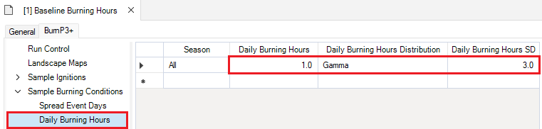

 

 <h2><b>Output Fire Statistics Table</b></h2> 

**Datasheet internal name:** burnP3Plus_OutputFireStatistic

The **OutputFireStatistic** datasheet can be found under the **Advanced** tab and provides a tabular summary of the fires burned in the simulation. This table is populated by the *Fire Growth* transformers and can be modified by the *Summary* transformer during resampling. 

### **Iteration**

**Column internal name:** Iteration

Defines the iteration number.

&nbsp;&nbsp;&nbsp;&nbsp;&nbsp; *Data Type*: Integer

### **Fire ID**

**Column internal name:** FireID

Defines the fire ID, where each Fire ID represents a single fire on the landscape.

*Note: Each Fire ID is only unique in conjunction with the iteration. This means that the first fire of every iteration is assigned a Fire ID of 1.*

&nbsp;&nbsp;&nbsp;&nbsp;&nbsp; *Data Type*: Integer

### **Latitude**

**Column internal name:** Latitude

Defines the latitude of the fire's ignition point in degrees following EPSG:4326 

*Note: The CRS of the input rasters are not taken into consideration here.*

&nbsp;&nbsp;&nbsp;&nbsp;&nbsp; *Data Type*: Double

### **Longitude**

**Column internal name:** Longitude

Defines the longitude of the fire's ignition point in degrees following EPSG:4326.

*Note: The CRS of the input rasters are not taken into consideration here.*

&nbsp;&nbsp;&nbsp;&nbsp;&nbsp; *Data Type*: Double

### **Fuel Type**

**Column internal name:** FuelType

Defines the fuel type in which a fire ignited. 

Fuel Types are defined in the project [Fuel Type](burn-p3-plus#heading01) datasheet under the **Advanced** node.

&nbsp;&nbsp;&nbsp;&nbsp;&nbsp; *Data Type*: List Item

For more information on the Canadian Fire Behaviour Prediction (FBP) System fuel type descriptions, visit this <a href="https://cwfis.cfs.nrcan.gc.ca/background/fueltypes/c1" target="_blank">link</a>.

### **Fire Duration**

**Column internal name:** FireDuration

Defines how many days of active fire spread occurred.

&nbsp;&nbsp;&nbsp;&nbsp;&nbsp; *Data Type*: Integer

### **Hours Burning**

**Column internal name:** HoursBurning

Defines how many hours of active fire spread occurred over the total duration of the fire.

&nbsp;&nbsp;&nbsp;&nbsp;&nbsp; *Data Type*: Integer

### **Area**

**Column internal name:** Area

Defines the area of a fire in hectares.

&nbsp;&nbsp;&nbsp;&nbsp;&nbsp; *Data Type*: Double

### **Resample Status**

**Column internal name:** ResampleStatus

Specifies if the fire was resampled. This column may contain one of five possible values based on the specifications set in the [Fire Resampling Options](#heading18) datasheet:

i. Kept – indicates fires that were above the minimum fire size and retained in the spatial outputs.
 
ii. Discarded – indicates fires that were below the minimum fire size and discarded from the spatial outputs.
 
iii. Reassigned – indicates extra fires that were reassigned to replace fires that were discarded (i.e., below the minimum fire size). Reassigned fires are also associated with a specific Iteration number and Fire ID, which indicate where the fire was relocated. 
 
iv.	Not Used – indicates extra fires that were not needed to replace discarded fires.
 
v. Extra – indicates all extra fires sampled by the *Sample Ignitions* transformer and burned by the *Fire Growth* transformer. All Extra fires are later classified as either Reassigned or Not Used by the *Summary* transformer.

&nbsp;&nbsp;&nbsp;&nbsp;&nbsp; *Data Type*: String

### **Season**

**Column internal name:** Season

Defines the season. 

Seasons are defined in the project [Seasons](burn-p3-plus#heading02) datasheet under the **Advanced** node.

&nbsp;&nbsp;&nbsp;&nbsp;&nbsp; *Data Type*: List Item

### **Cause**

**Column internal name:** Cause

Defines the cause of the fire event. Internally, the value of this column is an integer referencing the ID of the corresponding [Cause](burn-p3-plus#heading03) name.

Causes are defined in the project [Causes](burn-p3-plus#heading03) datasheet under the **Advanced** node.

&nbsp;&nbsp;&nbsp;&nbsp;&nbsp; *Data Type*: List Item

### **Fire Zone**

**Column internal name:** FireZone

Defines the fire zone in which a fire ignited. 

Fire Zones are defined in the project [Fire Zone](burn-p3-plus#heading04) datasheet under the **Advanced** node.

&nbsp;&nbsp;&nbsp;&nbsp;&nbsp; *Data Type*: List Item

### **Weather Zone**

**Column internal name:** WeatherZone

Defines the weather zone in which a fire ignited. 

Weather Zones are defined in the project [Weather Zones](burn-p3-plus#heading05) datasheet under the **Advanced** node.

&nbsp;&nbsp;&nbsp;&nbsp;&nbsp; *Data Type*: List Item

 

# **Fire Behaviour Prediction (FBP) System Spatial Outputs**

## **BurnP3+ Prometheus**

 <h2><b>Prometheus Fire Behaviour Prediction (FBP) Outputs</b></h2> 

**Datasheet internal name:** burnP3PlusPrometheus_OutputOptionSpatial

The **FBP Outputs** datasheet can be found under the **BurnP3+ Prometheus** tab within the **Prometheus** node and provides specifications on the spatial output maps.

### **Rate of Spread Map**

**Column internal name:** RateofSpread

Describes the predicted speed (m/min) of fire as it initially passes through the cell. The Rate of Spread (<a href="https://cwfis.cfs.nrcan.gc.ca/background/summary/fbp" target="_blank">ROS</a>) metric is based on the Fuel Type, Initial Spread Index (<a href="https://cwfis.cfs.nrcan.gc.ca/background/summary/fbp" target="_blank">ISI</a>),  Buildup Index (<a href="https://cwfis.cfs.nrcan.gc.ca/background/summary/fbp" target="_blank">BUI</a>), and other fuel-specific parameters (i.e., leafless or green in deciduous trees, crown base height in coniferous trees, and percent curing in grasses). 

If set to *Yes* a fire rate of spread map will be created, and if set to *No* a fire rate of spread map will not be created.

&nbsp;&nbsp;&nbsp;&nbsp;&nbsp; *Default*: No
 
&nbsp;&nbsp;&nbsp;&nbsp;&nbsp; *Data Type*: Boolean

### **Fire Intensity Map**

**Column internal name:** FireIntensity

Describes the predicted intensity (energy output in kW/m) of the fire as it initially passes through the cell. The Fire Intensity (FI) metric is based on the Rate of Spread (<a href="https://cwfis.cfs.nrcan.gc.ca/background/summary/fbp" target="_blank">ROS</a>), and the Total Fuel Consumption (<a href="https://cwfis.cfs.nrcan.gc.ca/background/summary/fbp" target="_blank">TFC</a>). 

If set to *Yes* a fire intensity map will be created, and if set to *No* a fire intensity map will not be created.

&nbsp;&nbsp;&nbsp;&nbsp;&nbsp; *Default*: No
 
&nbsp;&nbsp;&nbsp;&nbsp;&nbsp; *Data Type*: Boolean

### **Spread Direction Map**

**Column internal name:** SpreadDirection

Describes the predicted direction of fire spread.

If set to *Yes* a fire spread direction map will be created, and if set to *No* a fire spread direction map will not be created.

&nbsp;&nbsp;&nbsp;&nbsp;&nbsp; *Default*: No
 
&nbsp;&nbsp;&nbsp;&nbsp;&nbsp; *Data Type*: Boolean

### **Surface Fuel Consumption Map**

**Column internal name:** SurfaceFuelConsumption

Describes the predicted amount (kg/m2) of fuel consumed by the fire on the surface of the forest floor.

If set to *Yes* a surface fuel consumption map will be created, and if set to *No* a surface fuel consumption map will not be created.

&nbsp;&nbsp;&nbsp;&nbsp;&nbsp; *Default*: No
 
&nbsp;&nbsp;&nbsp;&nbsp;&nbsp; *Data Type*: Boolean

### **Crown Fraction Burned Map**

**Column internal name:** CrownFractionBurned

Describes the predicted fraction (%) of tree crowns burned by the fire. The Crown Fraction Burned (<a href="https://cwfis.cfs.nrcan.gc.ca/background/summary/fbp" target="_blank">CFB</a>) is based on the Buildup Index (BUI), foliar moisture content, surface fuel consumption, and Rate of Spread (<a href="https://cwfis.cfs.nrcan.gc.ca/background/summary/fbp" target="_blank">ROS</a>). 

If set to *Yes* a crown fraction burned map will be created, and if set to *No* a crown fraction burned map will not be created.

&nbsp;&nbsp;&nbsp;&nbsp;&nbsp; *Default*: No
 
&nbsp;&nbsp;&nbsp;&nbsp;&nbsp; *Data Type*: Boolean

### **Crown Fraction Consumed Map**

**Column internal name:** CrownFractionConsumed

Describes the predicted fraction (%) of tree crowns consumed by the fire. 

If set to *Yes* a crown fraction consumed map will be created, and if set to *No* a crown fraction consumed map will not be created.

&nbsp;&nbsp;&nbsp;&nbsp;&nbsp; *Default*: No
 
&nbsp;&nbsp;&nbsp;&nbsp;&nbsp; *Data Type*: Boolean

### **Total Fuel Consumption Map**

**Column internal name:** TotalFuelConsumption

Describes the predicted amount (kg/m2) of fuel consumed by the fire on the forest floor and in the crown. The Total Fuel Consumption (<a href="https://cwfis.cfs.nrcan.gc.ca/background/summary/fbp" target="_blank">TFC</a>) is based on foliar moisture content, surface fuel consumption, and Rate of Spread (<a href="https://cwfis.cfs.nrcan.gc.ca/background/summary/fbp" target="_blank">ROS</a>). 

If set to *Yes* a total fuel consumption map will be created, and if set to *No* a total fuel consumption map will not be created.

&nbsp;&nbsp;&nbsp;&nbsp;&nbsp; *Default*: No
 
&nbsp;&nbsp;&nbsp;&nbsp;&nbsp; *Data Type*: Boolean

 

 <h2><b>Output Rate of Spread Map</b></h2> 

**Datasheet internal name:** burnP3PlusPrometheus_OutputRateOfSpreadMap

### **Iteration**

**Column internal name:** Iteration

Specifies the map's iteration.

&nbsp;&nbsp;&nbsp;&nbsp;&nbsp; *Data Type*: Integer

### **Timestep**

**Column internal name:** Timestep

Specifies the map's timestep.

&nbsp;&nbsp;&nbsp;&nbsp;&nbsp; *Data Type*: Integer

### **FireID**

**Column internal name:** FireID

Specifies the map's ID.

&nbsp;&nbsp;&nbsp;&nbsp;&nbsp; *Data Type*: Integer

### **FileName**

**Column internal name:** FileName

Specifies the map's file name.

&nbsp;&nbsp;&nbsp;&nbsp;&nbsp; *Data Type*: String

### **Band**

**Column internal name:** Band

Specifies the map's band.

&nbsp;&nbsp;&nbsp;&nbsp;&nbsp; *Data Type*: Integer

 

 <h2><b>Output Fire Intensity Map</b></h2> 

**Datasheet internal name:** burnP3PlusPrometheus_OutputFireIntensityMap

### **Iteration**

**Column internal name:** Iteration

Specifies the map's iteration.

&nbsp;&nbsp;&nbsp;&nbsp;&nbsp; *Data Type*: Integer

### **Timestep**

**Column internal name:** Timestep

Specifies the map's timestep.

&nbsp;&nbsp;&nbsp;&nbsp;&nbsp; *Data Type*: Integer

### **FireID**

**Column internal name:** FireID

Specifies the map's ID.

&nbsp;&nbsp;&nbsp;&nbsp;&nbsp; *Data Type*: Integer

### **FileName**

**Column internal name:** FileName

Specifies the map's file name.

&nbsp;&nbsp;&nbsp;&nbsp;&nbsp; *Data Type*: String

### **Band**

**Column internal name:** Band

Specifies the map's band.

&nbsp;&nbsp;&nbsp;&nbsp;&nbsp; *Data Type*: Integer

 

 <h2><b>Output Spread Direction Map</b></h2> 

**Datasheet internal name:** burnP3PlusPrometheus_OutputSpreadDirectionMap

### **Iteration**

**Column internal name:** Iteration

Specifies the map's iteration.

&nbsp;&nbsp;&nbsp;&nbsp;&nbsp; *Data Type*: Integer

### **Timestep**

**Column internal name:** Timestep

Specifies the map's timestep.

&nbsp;&nbsp;&nbsp;&nbsp;&nbsp; *Data Type*: Integer

### **FireID**

**Column internal name:** FireID

Specifies the map's ID.

&nbsp;&nbsp;&nbsp;&nbsp;&nbsp; *Data Type*: Integer

### **FileName**

**Column internal name:** FileName

Specifies the map's file name.

&nbsp;&nbsp;&nbsp;&nbsp;&nbsp; *Data Type*: String

### **Band**

**Column internal name:** Band

Specifies the map's band.

&nbsp;&nbsp;&nbsp;&nbsp;&nbsp; *Data Type*: Integer

 

 <h2><b>Output Surface Fuel Consumption Map</b></h2> 

**Datasheet internal name:** burnP3PlusPrometheus_OutputSurfaceFuelConsumptionMap

### **Iteration**

**Column internal name:** Iteration

Specifies the map's iteration.

&nbsp;&nbsp;&nbsp;&nbsp;&nbsp; *Data Type*: Integer

### **Timestep**

**Column internal name:** Timestep

Specifies the map's timestep.

&nbsp;&nbsp;&nbsp;&nbsp;&nbsp; *Data Type*: Integer

### **FireID**

**Column internal name:** FireID

Specifies the map's ID.

&nbsp;&nbsp;&nbsp;&nbsp;&nbsp; *Data Type*: Integer

### **FileName**

**Column internal name:** FileName

Specifies the map's file name.

&nbsp;&nbsp;&nbsp;&nbsp;&nbsp; *Data Type*: String

### **Band**

**Column internal name:** Band

Specifies the map's band.

&nbsp;&nbsp;&nbsp;&nbsp;&nbsp; *Data Type*: Integer

 

 <h2><b>Output Crown Fraction Burned Map</b></h2> 

**Datasheet internal name:** burnP3PlusPrometheus_OutputCrownFractionBurnedMap

### **Iteration**

**Column internal name:** Iteration

Specifies the map's iteration.

&nbsp;&nbsp;&nbsp;&nbsp;&nbsp; *Data Type*: Integer

### **Timestep**

**Column internal name:** Timestep

Specifies the map's timestep.

&nbsp;&nbsp;&nbsp;&nbsp;&nbsp; *Data Type*: Integer

### **FireID**

**Column internal name:** FireID

Specifies the map's ID.

&nbsp;&nbsp;&nbsp;&nbsp;&nbsp; *Data Type*: Integer

### **FileName**

**Column internal name:** FileName

Specifies the map's file name.

&nbsp;&nbsp;&nbsp;&nbsp;&nbsp; *Data Type*: String

### **Band**

**Column internal name:** Band

Specifies the map's band.

&nbsp;&nbsp;&nbsp;&nbsp;&nbsp; *Data Type*: Integer

 

 <h2><b>Output Crown Fraction Consumed Map</b></h2> 

**Datasheet internal name:** burnP3PlusPrometheus_OutputCrownFractionConsumedMap

### **Iteration**

**Column internal name:** Iteration

Specifies the map's iteration.

&nbsp;&nbsp;&nbsp;&nbsp;&nbsp; *Data Type*: Integer

### **Timestep**

**Column internal name:** Timestep

Specifies the map's timestep.

&nbsp;&nbsp;&nbsp;&nbsp;&nbsp; *Data Type*: Integer

### **FireID**

**Column internal name:** FireID

Specifies the map's ID.

&nbsp;&nbsp;&nbsp;&nbsp;&nbsp; *Data Type*: Integer

### **FileName**

**Column internal name:** FileName

Specifies the map's file name.

&nbsp;&nbsp;&nbsp;&nbsp;&nbsp; *Data Type*: String

### **Band**

**Column internal name:** Band

Specifies the map's band.

&nbsp;&nbsp;&nbsp;&nbsp;&nbsp; *Data Type*: Integer

 

 <h2><b>Output Total Fuel Consumption Map</b></h2> 

**Datasheet internal name:** burnP3PlusPrometheus_OutputTotalFuelConsumptionMap

### **Iteration**

**Column internal name:** Iteration

Specifies the map's iteration.

&nbsp;&nbsp;&nbsp;&nbsp;&nbsp; *Data Type*: Integer

### **Timestep**

**Column internal name:** Timestep

Specifies the map's timestep.

&nbsp;&nbsp;&nbsp;&nbsp;&nbsp; *Data Type*: Integer

### **FireID**

**Column internal name:** FireID

Specifies the map's ID.

&nbsp;&nbsp;&nbsp;&nbsp;&nbsp; *Data Type*: Integer

### **FileName**

**Column internal name:** FileName

Specifies the map's file name.

&nbsp;&nbsp;&nbsp;&nbsp;&nbsp; *Data Type*: String

### **Band**

**Column internal name:** Band

Specifies the map's band.

&nbsp;&nbsp;&nbsp;&nbsp;&nbsp; *Data Type*: Integer

 

## **BurnP3+ FireSTARR**

 <h2><b>FireSTARR Fire Behaviour Prediction (FBP) Outputs</b></h2> 

**Datasheet internal name:** burnP3PlusFireSTARR_OutputOptionSpatial

The **FBP Outputs** datasheet can be found under the **BurnP3+ FireSTARR** tab within the **Output Options** node and provides specifications on the spatial output maps.

### **Rate of Spread Map**

**Column internal name:** RateofSpread

Describes the predicted speed (m/min) of fire as it initially passes through the cell. The Rate of Spread (<a href="https://cwfis.cfs.nrcan.gc.ca/background/summary/fbp" target="_blank">ROS</a>) metric is based on the Fuel Type, Initial Spread Index (<a href="https://cwfis.cfs.nrcan.gc.ca/background/summary/fbp" target="_blank">ISI</a>),  Buildup Index (<a href="https://cwfis.cfs.nrcan.gc.ca/background/summary/fbp" target="_blank">BUI</a>), and other fuel-specific parameters (i.e., leafless or green in deciduous trees, crown base height in coniferous trees, and percent curing in grasses). 

If set to *Yes* a fire rate of spread map will be created, and if set to *No* a fire rate of spread map will not be created.

&nbsp;&nbsp;&nbsp;&nbsp;&nbsp; *Data Type*: Boolean

### **Fire Intensity Map**

**Column internal name:** FireIntensity

Describes the predicted intensity (energy output in kW/m) of the fire as it initially passes through the cell. The Fire Intensity (FI) metric is based on the Rate of Spread (<a href="https://cwfis.cfs.nrcan.gc.ca/background/summary/fbp" target="_blank">ROS</a>), and the Total Fuel Consumption (<a href="https://cwfis.cfs.nrcan.gc.ca/background/summary/fbp" target="_blank">TFC</a>).

If set to *Yes* a fire intensity map will be created, and if set to *No* a fire intensity map will not be created.

&nbsp;&nbsp;&nbsp;&nbsp;&nbsp; *Data Type*: Boolean

### **Spread Direction Map**

**Column internal name:** SpreadDirection

Describes the predicted direction of fire spread.

If set to *Yes* a fire spread direction map will be created, and if set to *No* a fire spread direction map will not be created. 

&nbsp;&nbsp;&nbsp;&nbsp;&nbsp; *Data Type*: Boolean

 

 <h2><b>Output Rate of Spread Map</b></h2> 

**Datasheet internal name:** burnP3PlusFireSTARR_OutputRateOfSpreadMap

### **Iteration**

**Column internal name:** Iteration

Specifies the map's iteration.

&nbsp;&nbsp;&nbsp;&nbsp;&nbsp; *Data Type*: Integer

### **Timestep**

**Column internal name:** Timestep

Specifies the map's timestep.

&nbsp;&nbsp;&nbsp;&nbsp;&nbsp; *Data Type*: Integer

### **FireID**

**Column internal name:** FireID

Specifies the map's ID.

&nbsp;&nbsp;&nbsp;&nbsp;&nbsp; *Data Type*: Integer

### **FileName**

**Column internal name:** FileName

Specifies the map's file name.

&nbsp;&nbsp;&nbsp;&nbsp;&nbsp; *Data Type*: String

### **Band**

**Column internal name:** Band

Specifies the map's band.

&nbsp;&nbsp;&nbsp;&nbsp;&nbsp; *Data Type*: Integer

 

 <h2><b>Output Fire Intensity Map</b></h2> 

**Datasheet internal name:** burnP3PlusFireSTARR_OutputFireIntensityMap

### **Iteration**

**Column internal name:** Iteration

Specifies the map's iteration.

&nbsp;&nbsp;&nbsp;&nbsp;&nbsp; *Data Type*: Integer

### **Timestep**

**Column internal name:** Timestep

Specifies the map's timestep.

&nbsp;&nbsp;&nbsp;&nbsp;&nbsp; *Data Type*: Integer

### **FireID**

**Column internal name:** FireID

Specifies the map's ID.

&nbsp;&nbsp;&nbsp;&nbsp;&nbsp; *Data Type*: Integer

### **FileName**

**Column internal name:** FileName

Specifies the map's file name.

&nbsp;&nbsp;&nbsp;&nbsp;&nbsp; *Data Type*: String

### **Band**

**Column internal name:** Band

Specifies the map's band.

&nbsp;&nbsp;&nbsp;&nbsp;&nbsp; *Data Type*: Integer

 

 <h2><b>Output Spread Direction Map</b></h2> 

**Datasheet internal name:** burnP3PlusFireSTARR_OutputSpreadDirectionMap

### **Iteration**

**Column internal name:** Iteration

Specifies the map's iteration.

&nbsp;&nbsp;&nbsp;&nbsp;&nbsp; *Data Type*: Integer

### **Timestep**

**Column internal name:** Timestep

Specifies the map's timestep.

&nbsp;&nbsp;&nb