# Getting started with **BurnP3+**

## Quickstart Tutorial

This quickstart tutorial will introduce you to the basics of working with BurnP3+. The steps include:
 
* Installing BurnP3+ and an add-on package
* Creating a new BurnP3+ Library
* Configuring the BurnP3+ Library
* Viewing model inputs
* Running the model
* Analyzing the results

## **Step 1: Install BurnP3+ and add-on packages**
**BurnP3+** is a Base Package within the [SyncroSim](https://syncrosim.com/){:target="_blank"} simulation modeling framework; as such, running **BurnP3+** requires that the **SyncroSim** software be installed on your computer. Download **SyncroSim v2.4.0 or higher** [here](https://syncrosim.com/download/){:target="_blank"}. **BurnP3+** also requires R [version 4.1.0](https://www.r-project.org/){:target="_blank"} or higher and the following R packages: 
 
* tidyverse (v1.3.1)
* terra (v1.5-21)
* raster(v3.5-15)
* rgdal (v1.5-30)
* codetools (v0.2-18)
 
> **Note**: **BurnP3+** and it's add-on packages were developed against the aforementioned R package versions and may also work with later releases. **BurnP3+** can optionally be run using conda as an alternative to R. In this case, installing R and the above R packages is unnecessary. Conda, however, does not currently support a BurnP3+ add-on package, BurnP3PlusPrometheus. 

Once all required programs are installed, open **SyncroSim** and select **File -> Packages... -> Install...**, then select the **burnP3Plus** package and click OK. A diaglog box will open asking if you would like to create a new conda envrionment. Select 'No' for the purpose of this quickstart tutorial. Follow the same steps for the add-on package, **burnP3PlusCell2Fire**.

Alternatively, download the latest releases of **BurnP3+** and **burnP3PlusCell2Fire** from GitHub:
* [BurnP3+](https://github.com/BurnP3/BurnP3Plus/releases/){:target="_blank"}.
* [BurnP3+Cell2Fire](https://github.com/BurnP3/BurnP3PlusCell2Fire/releases/){:target="_blank"}. 
Open **SyncroSim** and select **File -> Packages... -> Install From File...**, then navigate to the downloaded package file with the extension *.ssimpkg*.

Additional add-on packages to **BurnP3+** are also available, including [burnP3PlusPrometheus](https://github.com/BurnP3/BurnP3PlusPrometheus/releases/){:target="_blank"}. Unlike the **Cell2Fire** fire growth model that is raster-based, **Prometheus** is vector-based and capable of executing fine-scale simulations. This degree of accuracy, however, is more computationally demanding in terms of memory use, and running a **burnP3PlusPrometheus** model requires the installation of additional software, including [Prometheus 2021.12.03](https://firegrowthmodel.ca/pages/prometheus_software_e.html){:target="_blank"}.

-add option to view run results from Promethus in a third Scenario?

## **Step 2: Create a new BurnP3+ Library**
Having installed **BurnP3+** and **burnP3PlusCell2Fire**, you are now ready to create your first SyncroSim Library. A Library is a file (with extension *.ssim*) that contains all of your model inputs and outputs. Note that the format of each Library is specific to the Package for which it was initially created. To create a new Library, choose **New Library...** from the **File** menu.
 
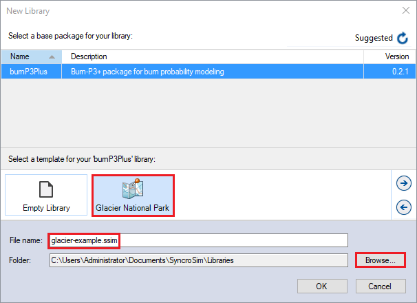
 
In this window:
 
* Select the row for ***burnP3Plus - BurnP3+ package for burn probability modeling***. Note that as you select a row, the list of **Templates** available and suggested **File name** for that base package are updated.
* Select the ***Glacier National Park*** Template as shown above.
* Optionally type in a new **File name** for the Library (or accept the default); you can also change the target **Folder** using the **Browse...** button.

When you are ready to create the Library file, click **OK**. A new Library will be created and loaded into the Library Explorer.

## **Step 3: Review library settings**
This quickstart tutorial demonstrates the fire growth model, Cell2Fire, which is already enabled as an add-on package in this template library. In the **Library Explorer** window, right-click on the **Glacier National Park** Library and select **Properties**. In the **Library: Glacier National Park** window, navigate to the **Add-ons** tab. Here you'll find that the **burnP3PlusCell2Fire** add-on package is enabled. Note that the **BurnP3+** base package is only the first step of the pipeline model and requires at least one add-on package to run a full fire growth model.
 
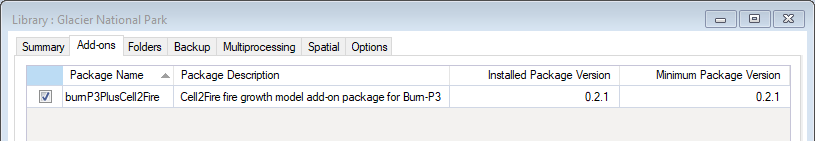
 
This tutorial is also set up to run using R. In the same **Library: Glacier National Park** window, navigate to the **Options** tab. Under the **R Configuration** node, you will find that SyncroSim has  located you're installation of the R executable automatically. 
 
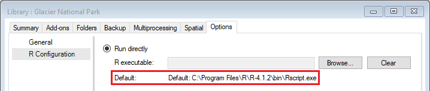
 
Next, navigate to the **General** node. Under **Model run**, you'll see the option to use conda as an alternative. 

- Review library definitions?

## **Step 4: Viewing model inputs**
The contents of your newly created Library are now displayed in the Library Explorer. Model inputs in SyncroSim are organized into Scenarios, where each Scenario consists of a suite of values, one for each of the Model's required inputs. 

In this Template Library, you'll find two Scenarios:
* 1: Generate Ignitions and Burn Conditions (containing datasheets from the BurnP3+ base package - can't be run with multiprocessing)
* 2: Run Cell2Fire and Summarize (containing datasheets from the Cell2Fire add-on package)
 
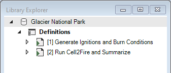
 
The first Scenario contains input maps and rules for stochastically sampling ignitions and burn conditions. The outputs of this Scenario are then passed as inputs to Scenario two, which runs the Cell2Fire fire growth model and generates final spatial and tabular outputs. 

Begin by reviewing the details of Scenario [1], **Generate Ignitions and Burn Conditions**. Right-click on this Scenario in the Library Explorer and choose **Properties**.

### Sampling the Ignitions and Burn Conditions

The first tab in this window, called **General**, contains three datasheets. The first, **Summary**, displays some general information for the Scenario. The second, **Pipeline**, allows the user to select the run order of the inputs in the model. Note that the **Generate Ignitions** Stage must always come before the **Generate Burning Conditions** Stage. The **Datafeeds** datasheet displays a list of all data sources added to the model.
 
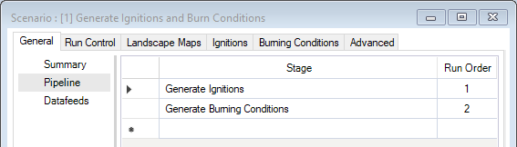
 
The second tab in the window, **Run Control**, contains parameters for running a model simulation. In this example, the Scenario will run for 100 burn seasons. 
 
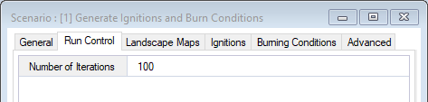
 
The remaining tabs contain input maps and rules to sample ignition locations and burn conditions:

The **Landscape Maps** tab contains rasters of fuel type and elevation (assumed to be in meters). The option of adding spatial fire and weather zone data as defined in the Library Definitions is also an option.
 
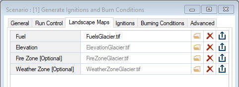
 
The **Ignitions** tab is where the fire ignitions sampling distribution is specified. This is the only input data required to run the first stage in this Scenario's Pipeline. Here, a user may choose one of the following ignitions-sampling options: 
* Under the **Ignition Count Distribution** column, choose one of the user-defined distributions. These distributions are defined under the **Advanced** tab of this Scenario. In this template library, ignition counts will be sampled from the **Ignitions per iteration** distribution.
 
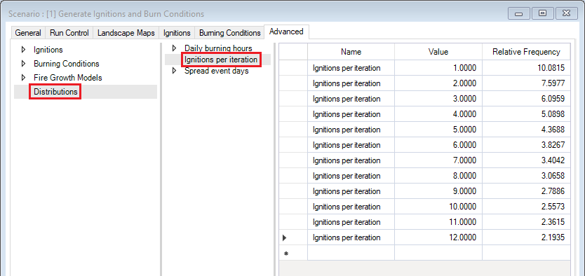
 
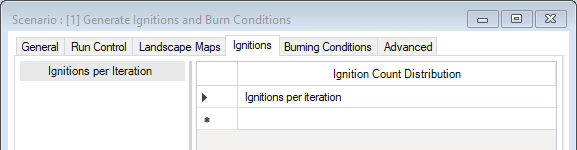
 
* From the same **Ignition Count Distribution** column, the built-in **Normal** distribution may also be chosen. This options requires specifying additional **Ignition Count** and **Ignition Count SD** values. Right-click anywhere in the Datasheet to unhide these columns.
 
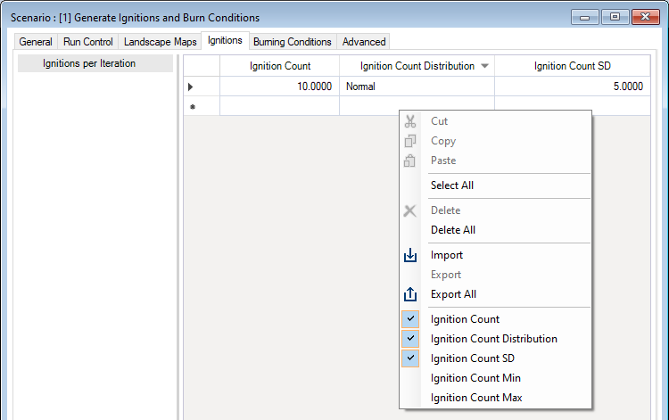
 
* Lastly, multiple ignition count values may be added under the **Ignition Count** column. This option will evenly sample the input ignition count values. 
 
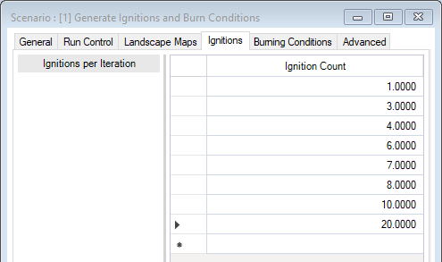
 
The next tab is where **Burning Conditions** are defined. **Spread Event Days** specifies the number of days *uncontrolled* fires are actively burning in a season. Similar to the **Ignitions** Datafeed, **Spread Event Days** can be sampled using a user-defined distribution, specified under the **Advanced** tab, using the built-in **Normal** distribution along with a **Fire Duration (Days)** and a **Fire Duration SD** value specified, or by evenly sampling from multiple rows of input **Fire Duration (Days)**. In this template library, we have chosen to stratify a user-defined distribution, *Spread event days*, by two different *Fire Zones*. 
 
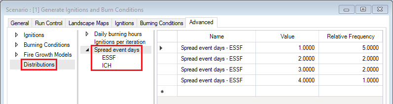
 
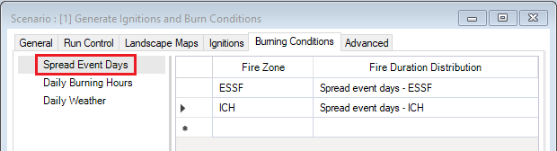
 
**Daily Burning Hours** defines the number of hours fires are actively burning per day. Choosing a distribution follows the same convention outlined for **Ignitions** and **Spread event Days**. Here, we have chosen to stratify a user-defined distribution, *Daily burning hours*, by two different *Seasons*. 
 
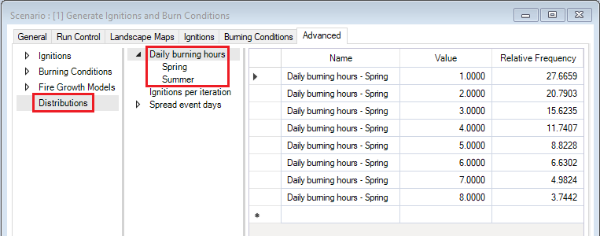
 
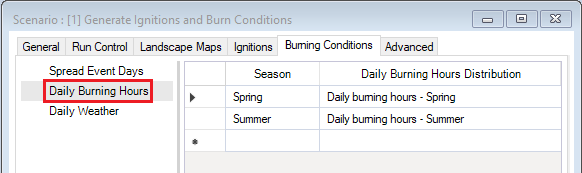
 
Lastly, the **Daily Weather** Datafeed is where weather variables for the landscape of interest are specified, where each row corresponds to one day of weather data. Key variables include daily temperature, relative humidity, wind speed and direction, and precipitation.  This Datafeed is essential for sampling burn conditions. 

Finally, the **Advanced** tab is where other optional input Datafeeds for sampling ignitions and burn conditions can be specified. Under the **Ignitions** node, ignition location probabilities can be spatially defined by adding a **Probabilistic Ignition Location** raster. This template library includes two of such rasters, one containing ignition location probabilities based on the locations of previous human-caused ignitions and the other for lightning-caused ignitions. 
 
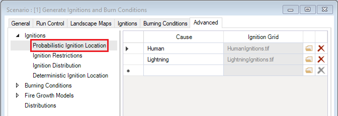
 
Ignition locations may also be restricted from specific areas based on variables such as Fuel Type, Season, Cause, or Fire Zone in the **Ignition Restrictions** Datasheet. The likelihoods of where ignitions start may also be specified in the **Ignition Distribution** Datafeed, which may also be stratified by a number of variables. 

In terms of optional **Burning Conditions**,  a user may choose whether or not to sample weather data sequentially in the **Weather Sampling Options** Datafeed.  It is good practice to sample weather sequentially if the rows in the input **Daily Weather** Datafeed represent sequentially sampled days in a burn season. 
 
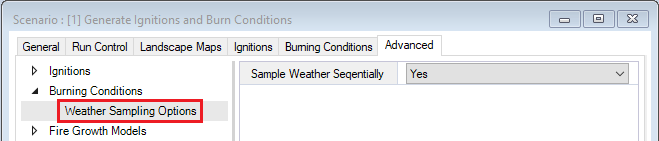
 
Lastly, **Fire Resampling Options** are available under the **Fire Growth Models** node.Downstream fire growth models can be restricted to simulate fires above a given size (we will review how to set this in the next Scenario). To do this, additional ignition locations must be sampled to replace those that generate fires under the desired size requirement. These extra ignitions are specified here as a proportion of the total number of sampled ignition locations. 

### The Fire Growth Model

The outputs of Scenario [1] will be deterministic ignition counts and locations and burn conditions, which get passed as inputs to Scenario [2]. Close the Scenario: [1] window and double-click on Scenario [2], **Run Cell2Fire and Summarize**, in the Library Explorer. In the **Scenario: [2] Run Cell2Fire and Summarize** window, navigate to the **Pipeline** node under the **General** tab. Here you'll see that Scenario [2] will first grow fires using the Cell2Fire growth model and, second, summarize the burn probability outputs. 
 
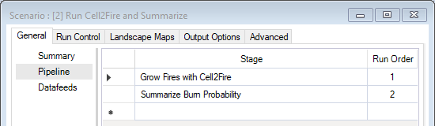
 
The **Run Control** and **Landscape Maps** tabs are identical to those in Scenario [1], as we want to simulate fires over the same number of burn seasons and the same landscape that ignitions and burn conditions were sampled from. You may alternatively run the fire growth model for fewer iterations; it is not possible, however, to grow fires for more iterations than was used to sample ignition and burn condition data.
 
The **Output Options** tab specifies which outputs will be generated after running the fire growth Scenario. The **Tabular** node is where one can set whether or not tabular fire statistics, such as burn area and duration, will be generated. The **Spatial** node is where raster outputs can be selected or deselected.
> **Note**: If all rows in the **Spatial Output Options** Datafeed are left blank, **burnP3PlusCell2Fire** will default to generating all spatial outputs. However, if some rows are set to return spatial output and others are not specified, the model will return spatial output for only those rows specified. 

Lastly, the **Advanced** tab is where minimum fire sizes (in hectares) can be specified under the **Fire Growth Models - Fire Resampling Options** node. In this template library, there is no minimum fire size set.
 
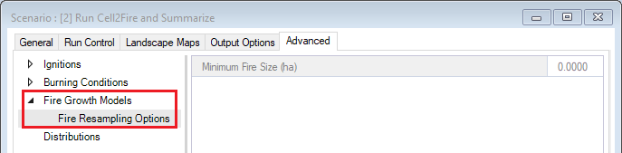
 

## **Step 5: Run the model**
Now that you have checked that SyncroSim has located the file path of your R executable and have reviewed the model inputs, you can now run the model. Running a model in SyncroSim produces **Result Scenarios**, which contain the Datafeeds added as inputs to the parent Scenario, as well as output Datafeeds. This template library contains the Result Scenarios for the two parent Scenarios that you have reviewed. To re-run these Scenarios or any fire growth models you create yourself, right-click on a Scenario and select **Run** from the context menu. If prompted to save your project, click **Yes**. If the run is successful, you will see a Status of **Done** in the **Run Monitor** window, at which point you can close the **Run Monitor** window; otherwise, click on the **Run Log** link to see a report of any problems. Make any necessary changes to your Scenario, then re-run the Scenario. 
> **Note**: Scenarios that sample ignition locations and burn conditions cannot currently be run using multiprocessing. 

 
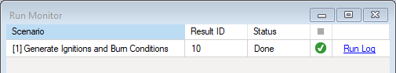
 

## **Step 6: Analyze the results**
To view tabular results from your run, move to the **Charts** tab at the bottom left of the **Library Explorer** window and double-click on **Fire Statistics** to open it. Here, you can review the tabular fire statics output from the Cell2Fire fire growth model.
 

 
Next, select the **Maps** tab from the bottom of the **Library Explorer** window (i.e. beside the **Charts** tab). Double click on **Burn Probability**. The mapping window should display simulated burn probability by default. 
 
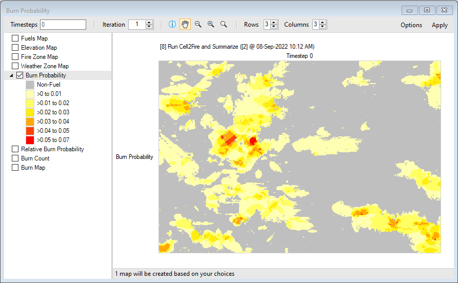
 
> **Note:** Legends can be customized by double-clicking on the bins. You can also add and remove Results Scenarios from the list of scenarios being analyzed by selecting a Scenario in the Library Explorer and then choosing either **Add to Results** or **Remove from Results** from the Scenario menu. **Scenarios** currently selected for analysis are highlighted in **bold** in the Library Explorer.
