# Getting started with **BurnP3+**

### Here we provide a guided tutorial on **BurnP3+**, an open-source package for running spatially-explicit fire growth models to explore fire risk and susceptibility across a landscape. 

**BurnP3+** was designed to update and replace [Burn-P3](https://firegrowthmodel.ca/#/burnp3_overview){:target="_blank"} ([Parisien *et al.* 2005](https://cfs.nrcan.gc.ca/publications?id=25627){:target="_blank"}) and was developed jointly by National Resources Canada (NRCan) and ApexRMS as an open-source package within the [SyncroSim](https://syncrosim.com/){:target="_blank"} software framework. Throughout the Quickstart tutorial links will be provided to the SyncroSim [online documentation](https://docs.syncrosim.com){:target="_blank"} where applicable. For more on SyncroSim, please refer to the SyncroSim [Overview](https://docs.syncrosim.com/getting_started/overview.html){:target="_blank"} and [Quickstart tutorial](https://docs.syncrosim.com/getting_started/quickstart.html){:target="_blank"}.

This tutorial was built using the following software versions:
* SyncroSim version 3.1.29
* burnP3Plus version 2.6.11
* burnP3PlusFireSTARR 1.5.7

 

## **BurnP3+** Quickstart Tutorial

This Quickstart tutorial will introduce you to the basics of working with **BurnP3+** in SyncroSim Studio. The steps include:

1. <a href="#step1"> Installing the <b>BurnP3+</b> package </a>
2. <a href="#step2"> Creating a new <b>BurnP3+</b> library </a>
3. <a href="#step3"> Configuring the <b>BurnP3+</b> library to: </a>
* <a href="#stage1"> Sample ignitions </a>
* <a href="#stage2"> Sample burn conditions </a>
* <a href="#stage3"> Grow fires </a>
* <a href="#stage4"> Summarize burn probability </a>
4. <a href="#step4"> Running the model </a>
5. <a href="#step5"> Analyzing the model results </a>

 

 <h2> <b>Step 1: Installing the BurnP3+ package</b> </h2> 

Running **BurnP3+** requires that the SyncroSim software be installed on your computer (version 3.1.0 or later). Download the latest version of SyncroSim [here](https://syncrosim.com/download/){:target="_blank"} and follow the installation prompts. 

In this Quickstart tutorial, you will run the **BurnP3+** and [BurnP3+FireSTARR](https://github.com/BurnP3/BurnP3PlusFireSTARR){:target="_blank"} SyncroSim [packages](https://docs.syncrosim.com/how_to_guides/package_overview.html){:target="_blank"}. The **BurnP3+FireSTARR** package uses the [FireSTARR](https://github.com/CWFMF/FireSTARR){:target="_blank"} fire growth model.

> An additional package to **BurnP3+** is also available: [BurnP3+Prometheus](https://github.com/BurnP3/BurnP3PlusPrometheus){:target="_blank"}.

To install the **BurnP3+** and **BurnP3+FireSTARR** packages, open SyncroSim Studio (**Start > SyncroSim Studio**) and select **File > Local Packages...**. 

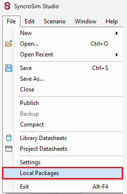

Click on the **Install from Server...** button.

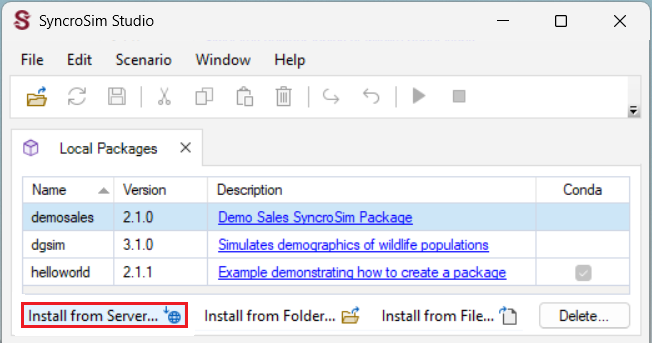 

Select the checkbox beside the **burnP3Plus** package from the list, and click **OK**.

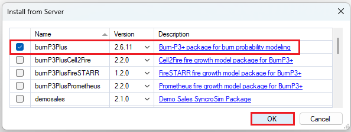

If you do not have [Miniforge](https://github.com/conda-forge/miniforge){:target="_blank"} or [Miniconda](https://docs.conda.io/en/latest/miniconda.html){:target="_blank"} installed in your computer, a dialog box will open asking if you would like to install one of these options. Select where you would like to install conda, whether you would like to install Miniforge or Miniconda, then click **Continue**. Once Miniforge or Miniconda is done installing, a dialog box will open asking if you would like to create a new conda environment. Click **Yes**.

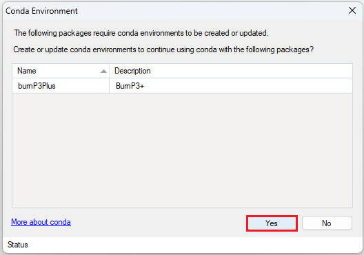

> **Miniforge** and **Miniconda** are installers for [conda](https://docs.conda.io/projects/conda/en/latest/){:target="_blank"}, a package environment management system that installs any required packages and their dependencies. By default, [**BurnP3+** uses conda](https://docs.syncrosim.com/how_to_guides/package_conda.html){:target="_blank"} to install, create, save, and load the required environment for running **BurnP3+**. The **BurnP3+** conda environment includes the required versions of R software and R packages that **BurnP3+** was built against.

The pop-up window will close after the conda environment is created, and a checkmark will appear in the Conda checkbox beside the package description. 

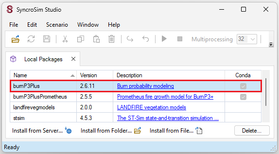

Next, click on the **Install from Server...** button again to open the packages repository. Select the **burnP3PlusFireSTARR** package from the list and click **OK**.

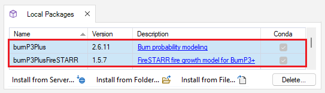

 

 <h2> <b>Step 2: Opening a BurnP3+ library</b> </h2> 

Having installed **BurnP3+** and **burnP3PlusFireSTARR**, you are now ready to create your first SyncroSim [*library*](https://docs.syncrosim.com/getting_started/overview.html#libraries){:target="_blank"}. A library is a file (with extension .ssim) that stores all the data and configurations associated with your model. 

We will start with a pre-built example library using the **BurnP3+** and **BurnP3+FireSTARR** packages. This example uses a synthetic landscape to demonstrate the basics of running **BurnP3+** using the **FireSTARR** fire growth model.

To open the **FireSTARR** template library in SyncroSim Studio:

1. Navigate to **File > New** and select **From Online Template...**

    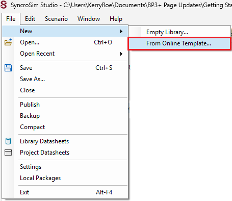

2. Select the **burnP3PlusFireSTARR** (version 1.5.7) package. Notice that the only available template is the *Glacier Example (FireSTARR)*. Select this template library, choose a folder to save it, and click **OK**.

    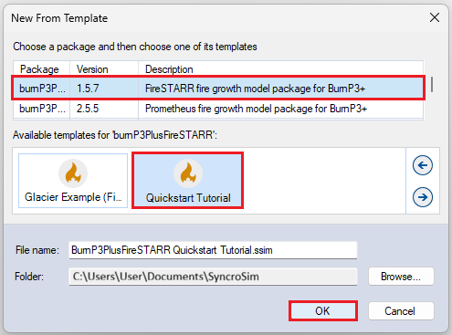

    > If prompted, update the library to the latest **core** package version. Click **Apply**.

3. The *Getting Started with BurnP3+FireSTARR* library will automatically open in the SyncroSim Studio *Explorer* window. The **Glacier Example (FireSTARR)** library contains a [*project*](https://docs.syncrosim.com/how_to_guides/library_overview.html){:target="_blank"} named **Definitions**, with one [*scenario*](https://docs.syncrosim.com/getting_started/overview.html#scenarios){:target="_blank"} named **Baseline Burning Hours**.

    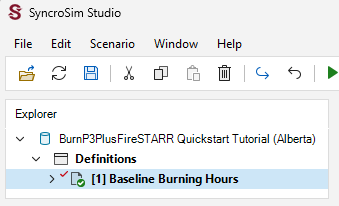

 

 <h2> <b>Step 3: Configuring the BurnP3+ library</b> </h2> 

This Quickstart tutorial demonstrates the FireSTARR fire growth model, which has already been added as a package in this template library.

This information can be found by selecting **File > Library Datasheets** and navigating to the **General** tab. Under **Packages**, you'll find that the **burnP3PlusFireSTARR** package has been added.

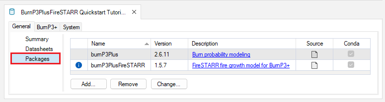

Next, in the **Library Explorer** window, double click on **Definitions**. Definitions are [*project datasheets*](https://docs.syncrosim.com/how_to_guides/library_overview.html){:target="_blank"} containing data shared across all scenarios for a project. 

Navigate to the **BurnP3+** tab, under the **Fuels** tab, click **Fuel Types**. Here, you will find a **Name** list for each of the fuel types present in the fuel grid, which the model requires as input. This example library already contains a fuel grid with two fuel types: **Boreal Spruce** and **Lodgepole Pine Slash**. Note that these names are free-form and can be arbitrary. Each **Name** is associated with an **ID** that must correspond to the labels given to each fuel type in the fuel grid loaded for each scenario. 

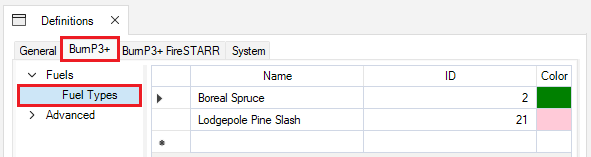

Next, under the **BurnP3+FireSTARR** tab, click on **FireSTARR Crosswalk**. Here, each fuel type listed under the **Fuel Types** tab needs to be linked to one of the fuel codes recognized by FireSTARR. In the case of these two fuel types, FireSTARR recognizes the Canadian Forest Service Fuel Codes [C2 and S1](https://cwfis.cfs.nrcan.gc.ca/background/fueltypes/c2){:target="_blank"}.

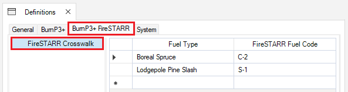

Lastly, in the **Library Explorer** window, you will see one scenario named **Baseline Conditions**. Model inputs in SyncroSim are organized into scenarios. Each scenario is associated with [*scenario datasheets*](https://docs.syncrosim.com/how_to_guides/library_overview.html){:target="_blank"} containing data that are specified for each scenario.

To view the model inputs for the scenario, double-click on **Baseline Conditions**. 

In the **General** tab, the **Pipeline** [*datasheet*](https://docs.syncrosim.com/how_to_guides/properties_overview.html){:target="_blank"} allows users to select the stages to include in the model run and their order. A full run of **BurnP3+** consists of four stages:

-	**Stage 1: Sample Ignitions**: Sample the number and locations of ignitions for each simulated burn season, or iteration;
-	**Stage 2: Sample Burning Conditions**: Sample the burning conditions for each ignition, which depend on when and where the ignitions occurred;
-	**Stage 3: Grow Fires with FireSTARR**: Simulate each fire deterministically using a fire growth model;
-	**Stage 4: Summarize Burn Probability**: Summarise the outputs of the fire growth model to calculate burn probability and other burn metrics.

Stages 1 and 2 encompass the stochastic half of the simulation — all random sampling of ignitions and burning conditions occurs here. Stages 3 and 4 are fully deterministic given those sampled inputs, and Stage 3 can be distributed across multiple threads or nodes on a computing cluster. One benefit of the modular pipeline is that these stages can be split across separate scenarios using dependencies (see the [Building a BurnP3+ model from scratch](tutorials.html) tutorial for details). This allows you to review sampling outputs before committing to the computationally expensive fire growth step, making it easier to catch configuration errors early.

In this example, we will run the full pipeline.

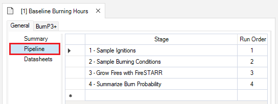

In the **BurnP3+** tab, **Run Control** allows users to specify the number of iterations or Monte Carlo realizations to run. In this example, each scenario will run for **100 iterations**. Each iteration represents a stochastic simulation of a single fire season. Typically, **BurnP3+** should be run for tens of thousands of iterations.

The **Landscape Maps** contains the pre-loaded raster files for **Fuel** and **Elevation** (although this is an optional input).

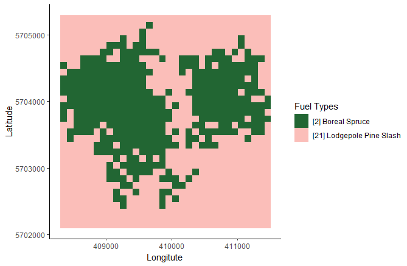

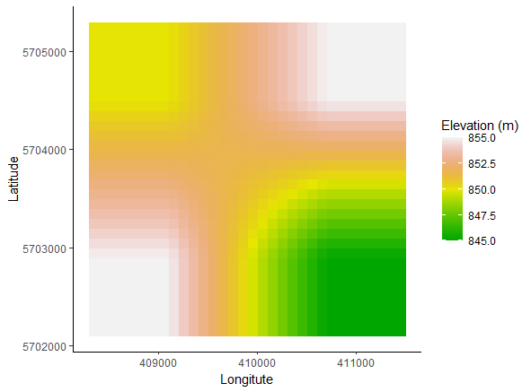

Raster files for **Fire Zone** and **Weather Zone** are optional and will not be considered in this Quickstart tutorial. These raster files allow end users to stratify the landscape and define different statistical distributions for model inputs and summarize model outputs according to these zones. For example, daily weather may vary according to **Weather Zone**.

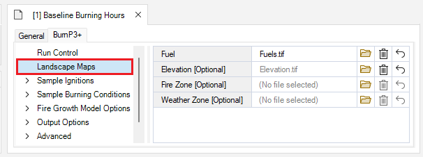

The following four tabs contain the rules for stages 1 to 4. 

 <h3> <b><i>Stage 1: Sample Ignitions</i></b> </h3> 

Expand the **Sample Ignitions** node. The **Ignition Count** *datasheet* defines the number of fires that should be ignited every iteration within a season. For the purposes of this Quickstart tutorial, **Ignition Count** was set to **1**.

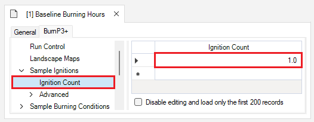

 <h3> <b><i>Stage 2: Sample Burning Conditions</i></b> </h3> 

Navigate to the next node, **Sample Burning Conditions**. The **Spread Event Days** datasheet specifies the number of days uncontrolled fires are actively burning and spreading in a season. Similarly, for the purposes of this Quickstart tutorial, **Spread Event Days** was set to **1** for all **Seasons**.

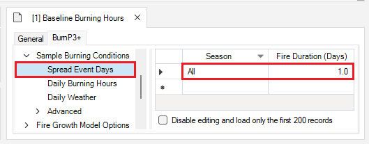

The **Daily Burning Hours** datasheet defines the number of hours fires are actively burning per day. For the **Baseline Conditions** scenario, **Daily Burning Hours** was set to **4** for all **Seasons**.

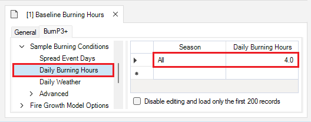

The **Daily Weather** datasheet specifies weather variables for the landscape of interest. Each row corresponds to one day of weather data for a given season. The required variables are: temperature, relative humidity, wind speed, wind direction, precipitation, fine fuel moisture code, duff moisture code, drought code, initial spread index, buildup index, and fire weather index.

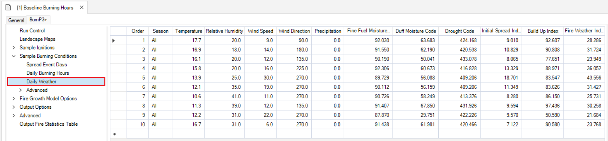

 <h3> <b><i>Stage 3: Grow Fires with FireSTARR</i></b> </h3> 

Under the **Fire Growth Model Options** tab, all settings are optional. As advanced features, they will not be covered in this Quickstart tutorial. By leaving the **Fire Growth Model Options** empty, **BurnP3+** will use the default values.

 <h3> <b><i>Stage 4: Summarize Burn Probability</i></b> </h3> 

Finally, the **Output Options** node specifies which outputs will be generated after running the scenario. The option to output the **Fire Statistics Table** in the **Tabular Output Options** datasheet is set to **Yes** (default). In the **Spatial Output Options**, **Burn Probability Map** and **Burn Maps** are set to **Yes**. This will produce a map of burn probability across the landscape and maps showing the area burned in each Monte Carlo realization.

> **Note:** If all rows in the **Spatial Output Options** datasheet are left blank, **BurnP3+** will default to generating all spatial outputs. However, if only some rows are set to return spatial outputs, the model will only return outputs for the specified rows. 

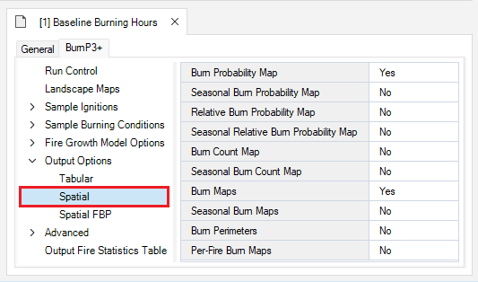

Close the window for the **Baseline Burning Hours** scenario. 

Next, you will create a new scenario to compare the effects of **Daily Burning Hours** on burn probability. While you could create a new empty scenario, instead you will copy, paste, and modify the existing scenario to save time and reuse the model inputs. To copy an existing scenario, right-click on the **Baseline Burning Hours** scenario in the **Explorer** window, and select **Copy** from the context menu.

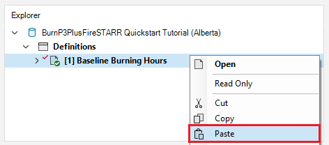

Next, right-click in the **Explorer** window and select **Paste** from the context menu.

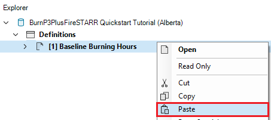

Rename the scenario by right clicking the newly created scenario, selecting **Rename…** from the context menu, and typing **Extended Burning Hours**. Next, double click on the **Extended Burning Hours** scenario and navigate to the **Sample Burning Conditions** tab. Here, you will modify the input **Daily Burning Hours** from **4** to **6**.

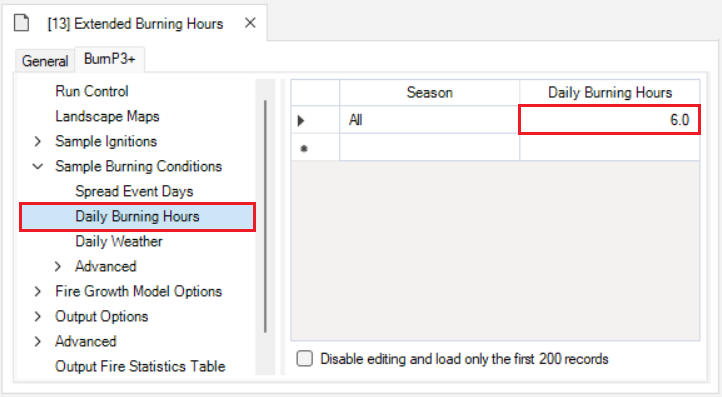

 

 <h2> <b>Step 4: Running the Model</b> </h2> 

After reviewing the model inputs and creating a new scenario, you are now ready to run the model. 

You can enable and adjust the number of **multiprocessing** jobs according to the specifications of your computer. A good rule of thumb to follow is number of logical cores minus 1.

Next, click on the **Baseline Burning Hours** scenario, and from the main tool menu select the green triangle **(Run)**. If prompted to save your project, click **Yes**.

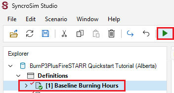

A **Run Monitor** window will appear, indicating the **Status** of the scenario as **Running**. At the bottom of the SyncroSim Studio window, an orange progress bar will provide further information during each stage of the pipeline. 

When the run has completed the **Status** will change to **Done** in the **Run Monitor** window. If an error or warning has been issued, click on the **Run Log** link to see a report of problems. Make any required changes to your scenario and re-run it.

Running a model in SyncroSim produces a [*results scenario*](https://docs.syncrosim.com/how_to_guides/modelrun_overview.html#results-scenarios){:target="_blank"}, which contain the input datasheets associated with the *parent scenario*, as well as output datasheets for the scenario run. Each results scenario inherits the parent scenario’s name and receives a unique ID.

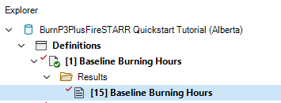

Repeat the same process to run the **Extended Burning Hours** scenario.

 

 <h2> <b>Step 5: Analyzing the Model Results</b> </h2> 

To view the tabular results from each of your runs, double-click on one of your results scenarios and navigate to the last datasheet in the **BurnP3+** tab, called **Output Fire Statistics Table**. Here, you can view the information about every fire that was run during the simulation. You can also easily export the data to a CSV or Excel file by right-clicking anywhere on the spreadsheet, and selecting **Export All** from the context menu.

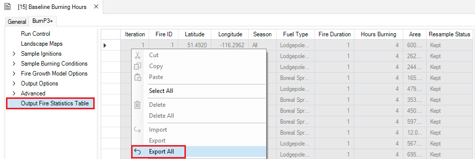

Next, move to the results panel at the bottom left of SyncroSim Studio. Under the **Charts** tab, double-click on **Burn Area by Fuel Type** to see the tabular results for area burned. 

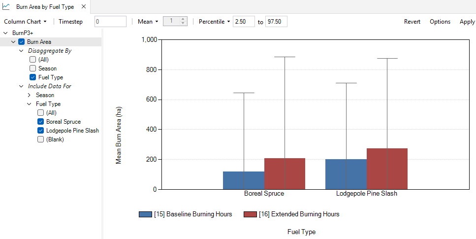

Next, navigate to the **Maps** tab and double-click on **Burn Probability**.

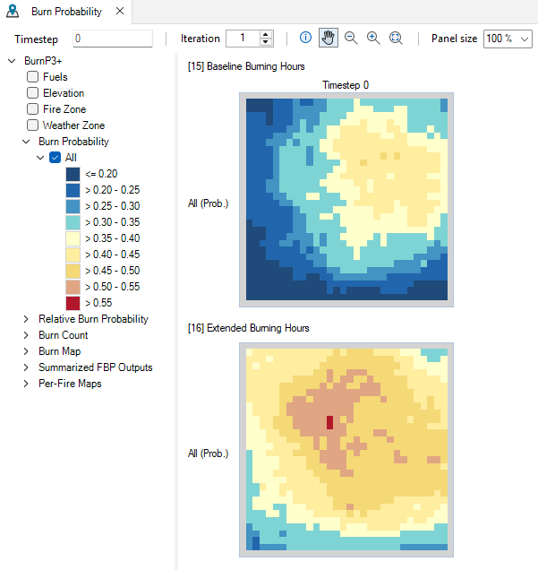

> **Note:** Map legends can be customized by double-clicking on the legend entries. Use the **Inspect** tool in the map toolbar to retrieve the exact value of any individual cell. You can also add or remove a results scenario from the charts and maps by right-clicking on the results scenario in the **Library Explorer**, then choosing either **Add to Results** or **Remove from Results** from the context menu. Scenarios with results currently selected for analysis have a red checkmark and are bolded in the **Library Explorer**.

Lastly, navigate to the **Maps** tab and double-click on **Burn Maps**. Scroll through burn maps for different iterations by changing the **Iteration** on the top tool bar in the map window.

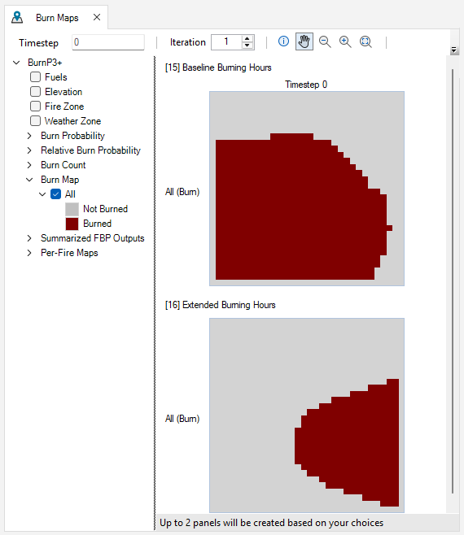
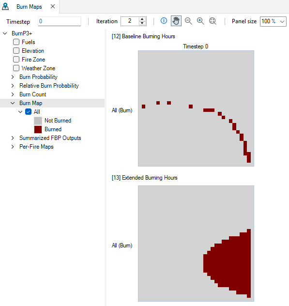

To export spatial outputs directly to disk, navigate to the **Export** tab in the results panel, select the variable of interest, and double-click to choose a destination folder.

Alternatively, the [rsyncrosim](https://syncrosim.github.io/rsyncrosim/){:target="_blank"} package for R and the [pysyncrosim](https://pysyncrosim.readthedocs.io/en/latest/index.html){:target="_blank"} package for Python allow you to read and write **BurnP3+** inputs and outputs directly in your coding environment, supporting more reproducible workflows. These packages are also the recommended starting point for developing your own add-on packages for **BurnP3+**.
