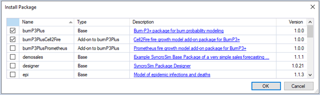
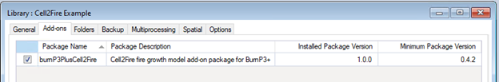
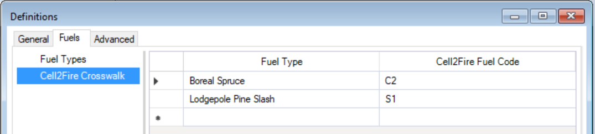
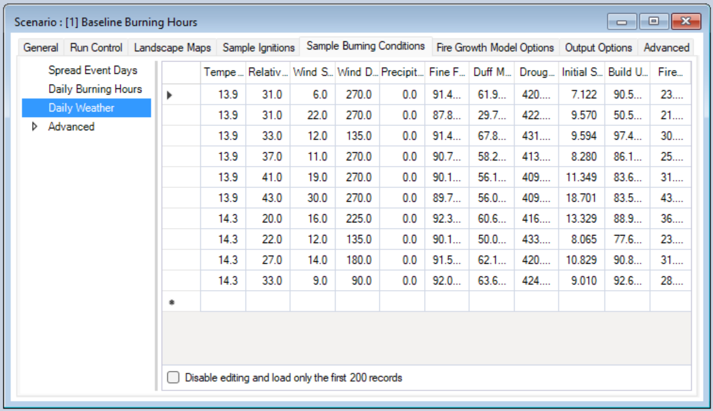
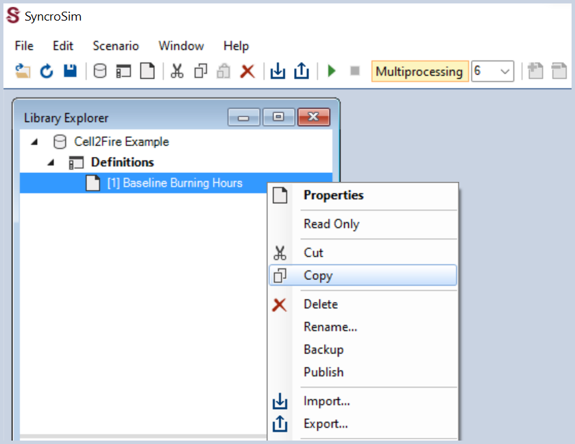

# Getting started with **BurnP3+** SyncroSim Package 

### Here we provide a guided tutorial on **BurnP3+**, an open-source package for running spatially-explicit fire growth models to explore fire risk and susceptibility across a landscape. 

**BurnP3+** extends [Burn-P3](https://firegrowthmodel.ca/pages/burnp3_overview_e.html){:target="_blank"} ([Parisien *et al.* 2005](https://cfs.nrcan.gc.ca/publications?id=25627){:target="_blank"}) by enhancing scalability, cross-compatibility, and flexibility (visit our [Home page](http://burnp3.github.io/BurnP3Plus/home) for more background information). **BurnP3+** is built as a base package for [SyncroSim](https://syncrosim.com/){:target="_blank"}, yet familiarity with SyncroSim is not required to get started with **BurnP3+**. Throughout the Quickstart tutorial, terminology associated with SyncroSim will be italicized, and whenever possible, links will be provided to the SyncroSim [online documentation](https://docs.syncrosim.com/index.html){:target="_blank"}. For more on SyncroSim, please refer to the SyncroSim [Overview](https://docs.syncrosim.com/getting_started/overview.html){:target="_blank"} and [Quickstart tutorial](https://docs.syncrosim.com/getting_started/quickstart.html){:target="_blank"}.

 

## **BurnP3+** Quickstart Tutorial

This Quickstart tutorial will introduce you to the basics of working with **BurnP3+** in the Windows User Interface (UI). The steps include:

1. Installing **BurnP3+** and required fire growth add-on packages
2. Creating a new **BurnP3+** *Library*
3. Configuring the **BurnP3+** *Library* to:
* Sample ignitions
* Sample burn conditions
* Grow fires
* Summarize burn probability
4.	Running the model
5.	Analyzing the model results

 

## **Step 1: Installing BurnP3+ and required fire growth add-on packages**

Running **BurnP3+** requires that the SyncroSim software be installed on your computer. Download the latest version of SyncroSim [here](https://syncrosim.com/download/){:target="_blank"} and follow the installation prompts. 

**BurnP3+** is a [*Base Package*](https://docs.syncrosim.com/how_to_guides/package_overview.html){:target="_blank"} within the SyncroSim simulation modeling framework. To install the **BurnP3+** *Package*, you will need to download the latest release of **BurnP3+** from GitHub. To do so, navigate to [https://github.com/BurnP3/BurnP3Plus/releases/](https://github.com/BurnP3/BurnP3Plus/releases/){:target="_blank"}, and under **Assets** for the **Latest** release, click on the file with extension **.ssimpkg**. The download should start automatically.

Next, open the SyncroSim Windows UI (**Start > Apps > SyncroSim**) and select **File > Packages...**.

Click on **Install From File...**.

Navigate to the proper folder, select the downloaded *Package* file with the extension **.ssimpkg** and click **OK**. When a dialog box opens asking if you would like to install [Miniconda](https://docs.conda.io/en/latest/miniconda.html){:target="_blank"}, click **Yes**.

> Miniconda is an installer for [conda](https://docs.conda.io/projects/conda/en/latest/){:target="_blank"}, a package environment management system that installs any required packages and their dependencies. By default, [**BurnP3+** runs conda](https://docs.syncrosim.com/how_to_guides/package_conda.html){:target="_blank"} to install, create, save, and load the required environment for running **BurnP3+**. The **BurnP3+** environment includes the R software environment and associated packages.

Once Miniconda is done installing, a dialog box will open asking if you would like to create a new conda environment. Click **Yes**.

For the purposes of this Quickstart tutorial, you will run **BurnP3+** with the [Cell2Fire](https://www.frontiersin.org/articles/10.3389/ffgc.2021.692706/full){:target="_blank"} model, which requires the [BurnP3+Cell2Fire](https://github.com/BurnP3/BurnP3PlusCell2Fire){:target="_blank"} [*Add-on Package*](https://docs.syncrosim.com/how_to_guides/package_addon.html){:target="_blank"}. To install it, download the latest release of **BurnP3+Cell2Fire** (file extension **.ssimpkg**) from GitHub at [https://github.com/BurnP3/BurnP3PlusCell2Fire/releases](https://github.com/BurnP3/BurnP3PlusCell2Fire/releases){:target="_blank"}. Follow the same process as for the *Base Package* to install this *Add-on Package* from the downloaded file.

> An additional Add-on Package to **BurnP3+** is also available: [burnP3PlusPrometheus](https://github.com/BurnP3/BurnP3PlusPrometheus/releases/){:target="_blank"}. Unlike the Cell2Fire fire growth model that is raster-based, Prometheus is vector-based and capable of executing fine-scale simulations. This degree of accuracy, however, is more computationally demanding in terms of memory use. Moreover, running a burnP3PlusPrometheus model requires the installation of [Prometheus 2021.12.03](https://firegrowthmodel.ca/pages/prometheus_software_e.html){:target="_blank"}.

 

## **Step 2: Creating a new BurnP3+ *Library***
Having installed **BurnP3+** and burnP3PlusCell2Fire, you are now ready to create your first SyncroSim *Library*. A [*Library*](https://docs.syncrosim.com/getting_started/overview.html#libraries){:target="_blank"} is a file (with extension .ssim) that contains all of your model inputs and outputs. To create a new *Library*, select **File > New Library...**.

When a new window opens, select the row for **burnP3Plus - BurnP3+ package for burn probability modeling**.

Then, select the **Cell2Fire Example** template as shown above. You can accept the default **File name** and **Folder**, or optionally type in a new file name for the *Library* and change the target folder using the **Browse...** button.

When you are ready to create the *Library* file, click **OK**. A new *Library* will be created and loaded into the **Library Explorer** window.

The *Library* **Cell2Fire Example** contains a *Project* named **Definitions**, with one *Scenario* named **Baseline Burning Hours**. This *Library* template uses a synthetic landscape to demonstrate the basics of running **BurnP3+** using the Cell2Fire model as the fire growth model, and to assess the effects of burning conditions on fire risk across the landscape.

 

## **Step 3: Configuring the BurnP3+ *Library***

This Quickstart tutorial demonstrates the Cell2Fire fire growth model, which is already enabled as an *Add-on Package* in this template *Library*.

This information can be found by selecting **File > Library Properties** and navigating to the **Add-ons** tab. Here you'll find that the burnP3PlusCell2Fire add-on package is enabled.

Next, on the **Library Explorer** window, double click on **Definitions**. Definitions are [*Project Datafeeds*](https://docs.syncrosim.com/how_to_guides/library_overview.html){:target="_blank"} containing data shared across all *Scenarios* for a *Project*. 

Navigate to the **Fuel Types** tab, where you will find a **Name** list for each of the fuel types present in the fuel grid, which the model requires as input. For the purposes of this Quickstart tutorial, the *Library* template was pre-loaded with a fuel grid with two fuel types: **Boreal Spruce** and **Lodgepole Pine Slash**. Each **Name** is associated with an **ID** that must correspond to the labels given to each fuel type in the fuel grid loaded for each scenario. 

Next, navigate to the **Add-Ons** tab. Under **Cell2Fire fire growth model add-on > Cell2Fire Fuel Code Crosswalk**, each fuel type listed under the **Fuel Types** tab needs to be linked to the fuel codes recognized by Cell2Fire.

Lastly, on the **Library Explorer** window, you will see one *Scenario* named **Baseline Burning Hours**. Model inputs in SyncroSim are organized into *Scenarios*. Each *Scenario* is associated with [*Scenario Datafeeds*](https://docs.syncrosim.com/how_to_guides/library_overview.html){:target="_blank"} containing data that are specified for each *Scenario*.

To view the model inputs for the *Scenario*, double-click on **Baseline Burning Hours**. 

On the **General** tab, the **Pipeline** [*Datasheet*](https://docs.syncrosim.com/how_to_guides/properties_overview.html){:target="_blank"} allows users to select the stages to include in the model run and their order. A full run of **BurnP3+** consists of four stages: (1) Sample the number and locations of ignitions for each simulated burn season, or iteration; (2) Sample the burning conditions for each ignitions, which depend on when and where the ignitions occurred; (3) Simulate each fire deterministically using a fire growth model; and (4) Summarise the outputs of the fire growth model to calculate burn probability and other burn metrics. In this example, we will run the full pipeline:

-	Stage 1: Sample ignitions
-	Stage 2: Sample burn conditions
-	Stage 3: Grow fires
-	Stage 4: Summarize burn probability

The second tab, **Run Control**, allows users to specify the number of iterations or Monte Carlo realizations to run. In this example, each *Scenario* will run for **100 Iterations**. Each iteration represents a stochastic simulation of a single fire season. Typically, **BurnP3+** should be run for tens of thousands of iterations.

The **Landscape Maps** tab contains the pre-loaded raster files for **Fuel** and **Elevation**.

Raster files for **Fire Zone** and **Weather Zone** are optional and will not be considered in this Quickstart tutorial. These raster files allow end users to stratify the landscape and define different statistical distributions for model inputs and summarize model outputs according to these zones. For example, **Daily Weather** (see below) may vary according to **Weather Zone**.

The remaining tabs contain the rules for stages 1 to 4. 

***Stage 1: Sample Ignitions***

Under the **Sample Ignitions** tab, the **Ignition Count** *Datasheet* defines the number of fires that should be ignited every iteration within a season. For the purposes of this Quickstart tutorial, **Ignition Count** was set to **1**.

***Stage 2: Sample burn conditions***

Navigate to the next tab, **Sample Burning Conditions**. The **Spread Event Days** *Datasheet* specifies the number of days uncontrolled fires are actively burning and spreading in a season. Similarly, for the purposes of this Quickstart tutorial, **Spread Event Days** was set to **1**.

The **Daily Burning Hours** *Datasheet* defines the number of hours fires are actively burning per day. For the **Baseline Burning Hours** *Scenario*, **Daily Burning Hours** was set to **4**.

The **Daily Weather** *Datafeed* is where weather variables for the landscape of interest are specified, where each row corresponds to one day of weather data. The required variables are: temperature, relative humidity, wind speed, wind direction, precipitation, fine fuel moisture code, duff moisture code, drought code, initial spread index, buildup index, and fire weather index.

***Stage 3: Grow fires***

Under the **Fire Growth Model Options** tab, all settings are optional and as advanced features will not be covered in this Quickstart tutorial.By leaving the **Fire Growth Model Options** empty, **BurnP3+** will use the default values.

***Stage 4: Summarize burn probability***

Finally, the **Output Options** tab specifies which outputs will be generated after running the Scenario. All **Tabular** and **Spatial** output options are set to **Yes**. The only exception is **Spatial > Burn Perimeters**, which is not provided by Cell2Fire.

> **Note:** If all rows in the **Spatial Output Options** Datafeed are left blank, burnP3PlusCell2Fire will default to generating all spatial outputs. However, if some rows are set to return spatial outputs and others are not specified, the model will return spatial output for only those rows specified. 

Close the window for the *Scenario* **Baseline Burning Hours**. 

Next, you will create a new *Scenario* to compare the effects of **Daily Burning Hours** on fire risk. While you could create a new empty *Scenario*, instead you will copy, paste, and modify the existing *Scenario* to save time and reuse the model inputs. To do so, on the **Library Explorer** window right-click on the current *Scenario*, **Baseline Burning Hours**, and select **Copy** and **Paste** from the context menu.

Rename the *Scenario* by right clicking the newly created *Scenario*, selecting **Rename…** from the context menu, and typing **Extended Burning Hours**. Next, double click on the *Scenario* **Extended Burning Hours** and navigate to the **Sample Burning Conditions** tab. Here, you will modify the input **Daily Burning Hours** from **4** to **6** for this *Scenario*.

 

## **Step 4: Running the model**

After reviewing the model inputs and creating a new *Scenario*, you are now ready to run the model. 

**Multiprocessing** is enabled to run 6 jobs in parallel. You can adjust the number of multiprocessing jobs according to the specifications of your computer. A good rule of thumb to follow is number of logical cores minus 1.

Next, right-click on the *Scenario* **Baseline Burning Hours**, and from the context menu select **Run**. If prompted to save your project, click **Yes**.

A **Run Monitor** window will appear, indicating the **Status** of the *Scenario* as **Running**. At the bottom of the SyncroSim Windows UI, an orange progress bar will provide further information during each stage of the pipeline. 

When and if the run is successful, you will see the **Status** of **Done** in the **Run Monitor**. If an error or warning has been issued, click on the **Run Log** link to see a report of problems. Make any required changes to your *Scenario* and re-run it. If necessary, see **Key Links** on the [Home page](http://burnp3.github.io/BurnP3Plus/home) for support.

Running a model in SyncroSim produces *Scenario Results*, which contain the input *Datafeeds* associated with the parent *Scenario*, as well as output *Datafeeds* for the *Scenario* run. Each *Scenario Result* inherits the parent *Scenario*’s name and receives a unique ID.

Repeat the same process to run the *Scenario* **Extended Burning Hours**.

 

## **Step 6: Analyzing the model results**

To view the tabular results from each of your runs, double-click on one of your *Scenario Results* and navigate to the last tab, **Output Fire Statistics**. Here, you can view the results and have the option to export the data by right-clicking anywhere on the spreadsheet, and selecting **Export All** from the context menu.

Next, move to the results panel at the bottom left of the **Library Explorer** window. Under the **Charts** tab, double-click on **Burn Area by Fuel Type** to see the tabular results for area burned. 

Next, navigate to the **Maps** tab and double-click on **Burn Probability Maps**.

Lastly, under the **Maps** tab you can also find the **Input Maps** for fuel type and elevation.

> **Note:** Map legends can be customized by double-clicking on the bins. You can also add and remove Scenario Results being charted or mapped by selecting a Scenario Result in the **Library Explorer** and then choosing either **Add to Results** or **Remove from Results** from context menu. Scenarios with results currently selected for analysis are highlighted in bold in the **Library Explorer**.
