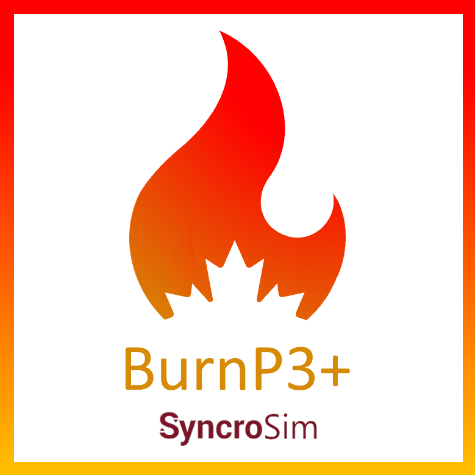

# **BurnP3+** SyncroSim Package

    <a href="https://github.com/BurnP3/BurnP3+">
 
## Explore fire risk using fire growth models
### Burn-P3+ is an open-source [SyncroSim](https://syncrosim.com/){:target="_blank"} Base Package that facilitates sampling spatially-explicit fire growth models to explore fire risk across a landscape.

**BurnP3+** uses a pipeline approach, where input maps and rules are first used to sample ignition locations and burn conditions of a landscape. These data are then passed as inputs to an external fire growth model, which is provided as an add-on package to Burn-P3+. Available add-on packages include [BurnP3+Cell2Fire](https://github.com/cell2fire/Cell2Fire){:target="_blank"}, a wrapper for the [Cell2Fire](https://github.com/cell2fire/Cell2Fire){:target="_blank"} fire growth model, and [BurnP3+Prometheus](https://github.com/BurnP3/BurnP3PlusPrometheus){:target="_blank"}, a wrapper for the [Prometheus](https://firegrowthmodel.ca/pages/prometheus_overview_e.html){:target="_blank"} fire growth model. Users also have the option to develop their own fire growth models and add-on packages. The output of these models collected across realizations can then be summarized and visualized within SyncroSim. Model outputs may also be exported to plain text tabular formats and GDAL-compliant geospatial formats for more complex analyses using other tools.

## Requirements

This package requires the following software: 
SyncroSim [v2.4.0](https://syncrosim.com/download/){:target="_blank"} or higher.
 
R [version 4.1.0](https://www.r-project.org/){:target="_blank"} or higher.
 
rsyncrosim [version 1.4](){:target="_blank"} or higher.
The following R packages (available on CRAN):
tidyverse v1.3.1
terra v1.5-21
raster v3.5-15
rgdal v1.5-30
codetools v0.2-18
 
> Note that BurnP3+ was developed against these versions of the required software and may also work with later versions. 
> BurnP3+ may also be run using conda. In this case, the installation of R and listed R packages is not necessary. Note, however, that conda does not support the use of the add-on package, BurnP3+Prometheus. 

## How to Install

For installation instructions, see the **Install BurnP3+** section on the [Getting Started](https://burnp3.github.io/BurnP3+/getting_started.html) page.

## Getting Started

For more information on **BurnP3+**, including a Quickstart Tutorial, see the [Getting Started](https://burnp3.github.io/BurnP3+/getting_started.html) page.

## Links

Browse source code at
[http://github.com/BurnP3/BurnP3+/](http://github.com/BurnP3/BurnP3+/){:target="_blank"}
 
Report a bug at
[http://github.com/BurnP3/BurnP3+/issues](http://github.com/BurnP3/BurnP3+/issues){:target="_blank"}

## Developers

Brett Moore (Author, maintainer) 
 
Shreeram Senthivasan (Author)
 
