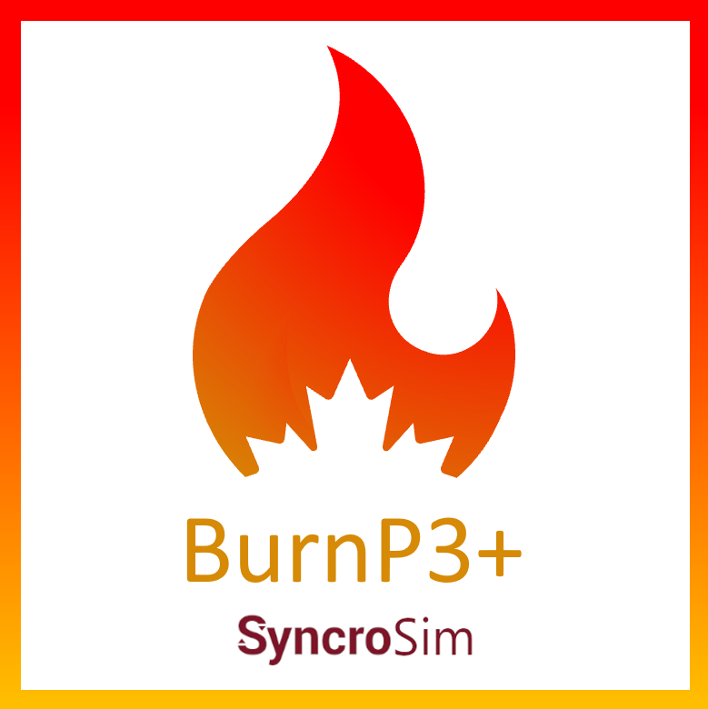

# **BurnP3+** SyncroSim Package

    <a href="https://github.com/BurnP3/BurnP3Plus">  

### **BurnP3+** is an open-source [SyncroSim](https://syncrosim.com/){:target="_blank"} package for running spatially-explicit fire growth models to explore fire risk and susceptibility across a landscape. **BurnP3+** is funded, developed and maintained by the [Canadian Forest Service](https://www.nrcan.gc.ca/our-natural-resources/forests-forestry/the-canadian-forest-service/about-canadian-forest-service/17545){:target="_blank"}.  

 

## Background

[**BurnP3+**](https://firegrowthmodel.ca/#/burnp3plus_overview){:target="_blank"} was designed to update and replace [Burn-P3](https://firegrowthmodel.ca/pages/burnp3_overview_e.html){:target="_blank"}, a software application originally developed in 2005 by the Canadian Forest Service ([Parisien *et al.* 2005](https://ostrnrcan-dostrncan.canada.ca/entities/publication/18cdf7dd-2488-4df4-8cc7-62fb1eebf9ed){:target="_blank"}). **BurnP3+** (probability, prediction, and planning) allows users to produce estimates of wildfire susceptibility and risk across a landscape. Using a Monte Carlo simulation modelling approach, **BurnP3+** combines stochastic draws of fire ignition, weather, and other burning conditions with a deterministic fire growth model. The outputs of a model run include raster grids of burn probability and burn count estimates, relative likelihood of burning, simulated fire perimeters, and metrics associated with the [Fire Behaviour Prediction system](https://natural-resources.canada.ca/forests-forestry/wildland-fires/canada-fire-behaviour-prediction-system){:target="_blank"} such as rates of spread, fire intensity, and fuel consumption. Alternative scenarios can be contrasted to evaluate the response or sensitivity of these outputs to changes in input variables or conditions of interest, such as different weather conditions, fuel treatments, changes in ignition locations, or alternative land management practices.  

**BurnP3+** was developed to improve scalability to larger landscapes and number of scenarios, allow for cross-compatibility among platforms (Windows and Linux) and interfaces (SyncroSim Studio, command line, R and Python), and increase flexibility in model structure through the implementation of modules. With these enhancements, **BurnP3+** extends the success of Burn-P3 as a decision-support tool in land management and a framework for scientific inquiry ([Parisien *et al.* 2019](https://www.fs.usda.gov/research/treesearch/60727){:target="_blank"}).

Burn-P3 utilized a single deterministic fire growth model called [Prometheus](https://firegrowthmodel.ca/#/prometheus_overview){:target="_blank"}. **BurnP3+** now provides three fire growth models: 

* [BurnP3+Prometheus](https://github.com/BurnP3/BurnP3PlusPrometheus){:target="_blank"} enables users to grow fires with [Prometheus](https://firegrowthmodel.ca/#/prometheus_overview){:target="_blank"}
* [BurnP3+FireSTARR](https://github.com/BurnP3/BurnP3PlusFireSTARR){:target="_blank"} enables users to grow fires with [FireSTARR](https://github.com/CWFMF/FireSTARR){:target="_blank"}
* [BurnP3+Cell2Fire](https://github.com/BurnP3/BurnP3PlusCell2Fire){:target="_blank"} enables users to grow fires with [Cell2Fire](https://doi.org/10.3389/ffgc.2021.692706){:target="_blank"} NOTE: cell2fire is being deprecated

The Canadian Forest Service plans to develop additional fire growth packages for **BurnP3+**. Alternatively, users also have the option to develop their own fire growth models as SyncroSim packages.  

**BurnP3+** users can load model inputs, export model outputs and view spatial and graphical result summaries via various SyncroSim interfaces, including SyncroSim Studio, the [rsyncrosim](https://syncrosim.github.io/rsyncrosim/){:target="_blank"} package for [R](https://www.r-project.org/){:target="_blank"} and the [pysyncrosim](https://pysyncrosim.readthedocs.io/en/latest/index.html){:target="_blank"} package for [Python](https://www.python.org/){:target="_blank"}.  

 

## Requirements

The **BurnP3+ SyncroSim Package** requires the SyncroSim software, [version 3.0.9](https://syncrosim.com/download/){:target="_blank"}.  

If using the Cell2Fire fire growth model, you will also need to install [BurnP3+Cell2Fire](https://github.com/BurnP3/BurnP3PlusCell2Fire){:target="_blank"}.  

If using the Prometheus fire growth model, you will need to install both [Prometheus](https://firegrowthmodel.ca/#/prometheus_software){:target="_blank"} (version 2021.12.03) and [BurnP3+Prometheus](https://github.com/BurnP3/BurnP3PlusPrometheus){:target="_blank"}.  

> Instructions for installing the above requirements for **BurnP3+** are provided on the [Getting Started](https://burnp3.github.io/BurnP3Plus/getting_started.html) page.  

 

## Getting Started

For a guided tutorial on **BurnP3+**, including installation, set up, model run, and output visualization, see [Getting Started](https://burnp3.github.io/BurnP3Plus/getting_started.html).  

The **BurnP3+** training manual and materials from the most recent in-person training session are available upon request. For access, please contact info@burnp3plus.ca.

 

## Tutorials

To see **BurnP3+** in action, watch this [video tutorial](https://youtu.be/iDaHoUEM3Rw){:target="_blank"}.  

 

## Key Links

Browse source code for **BurnP3+** at
[http://github.com/BurnP3/BurnP3Plus/](http://github.com/BurnP3/BurnP3Plus/){:target="_blank"}.  
Report a bug with **BurnP3+** or contribute an idea at
[http://github.com/BurnP3/BurnP3Plus/issues](http://github.com/BurnP3/BurnP3Plus/issues){:target="_blank"}.  
Cell2Fire model at [https://doi.org/10.3389/ffgc.2021.692706](https://doi.org/10.3389/ffgc.2021.692706){:target="_blank"}.  
Cell2Fire package for **BurnP3+** at [https://github.com/BurnP3/BurnP3PlusCell2Fire](https://github.com/BurnP3/BurnP3PlusCell2Fire){:target="_blank"}.  
Prometheus model at [https://firegrowthmodel.ca/#/prometheus_software](https://firegrowthmodel.ca/#/prometheus_software){:target="_blank"}.  
Prometheus package for **BurnP3+** at [https://github.com/BurnP3/BurnP3PlusPrometheus](https://github.com/BurnP3/BurnP3PlusPrometheus){:target="_blank"}.  
FireSTARR model at [https://github.com/CWFMF/FireSTARR](https://github.com/CWFMF/FireSTARR){:target="_blank"}.  
FireSTARR package for **BurnP3+** at [https://github.com/BurnP3/BurnP3PlusFireSTARR](https://github.com/BurnP3/BurnP3PlusFireSTARR){:target="_blank"}.  
Burn-P3 software at [https://firegrowthmodel.ca/pages/burnp3_overview_e.html](https://firegrowthmodel.ca/#/burnp3_software){:target="_blank"}.  
Burn-P3 documentation at [https://ostrnrcan-dostrncan.canada.ca/entities/publication/18cdf7dd-2488-4df4-8cc7-62fb1eebf9ed](https://ostrnrcan-dostrncan.canada.ca/entities/publication/18cdf7dd-2488-4df4-8cc7-62fb1eebf9ed){:target="_blank"}.  
**BurnP3+** discord channel at [https://discord.gg/76QzY8eAYr](https://discord.gg/76QzY8eAYr){:target="_blank"}.  

 

## Developers

Chris Stockdale (Author) 
 
Shreeram Senthivasan (Author) 
 
Brett Moore (Author, Maintainer) 
 
Colin Daniel (Author) 
 
Katie Birchard (Author) 
 
Peter Englefield (Author)
 
Quinn Barber (Author) 
 
Denys Yemshanov (Author) 
 
Leonardo Frid (Author) 
 

## Citation 

