# Building a **BurnP3+** model from scratch 

This tutorial will guide you throuh the process of building a **BurnP3+** library from scratch in SyncroSim Studio. It covers how to configure a new library, define input data requirements, and partition data analysis by setting dependencies and pipelines. The tutorial also demonstrates how to visualize model outputs by creating customized charts and maps.

The study area for this tutorial is **Revelstoke, British Columbia**. The input data used in this example is the same as that used in the **BurnP3+** [Fire Risk (Revelstoke, British Columbia)](https://cloud.syncrosim.com/katie-birchard/Fire%20Risk%20(Revelstoke,%20British%20Columbia)/map/6?variable=burnP3Plus_BurnProbability-320&timestep=0&scenario=9){:target="_blank"} SyncroSim Cloud library.

It covers the following steps:

1. <a href="#step-1">Creating an empty BurnP3+ library</a>
2. <a href="#step-2">Set project definitions</a>
3. <a href="#step-3">Create an Ignition and Burn Conditions dependency scenario</a>
4. <a href="#step-4">Create a Baseline Fire Risk scenario</a>
<!--5. <a href="#step-5">Create an Urban Fire Suppression scenario</a>
6. <a href="#step-6">Create a Fire Break scenario</a>
7. <a href="#step-7">Create an Urban Fire Suppression scenario</a>-->
8. <a href="#step-8">Visualizing model outputs - Charts</a>
9. <a href="#step-9">Visualizing model outputs - Maps</a>

 

 <h3><b>Step 1. Creating an empty BurnP3+ library</b></h3> 

First, we will start with an empty SyncroSim library. All the necessary inputs for the models can be found [here](linkToGitHub){:target="_blank"}, where all *.tif* files are located within the *Spatial* folder, and all *.csv* files are located within the *Tabular* folder.

1\. Under the File menu, select **New... | Empty Library...**. This will prompt you to name your new SyncroSim library.

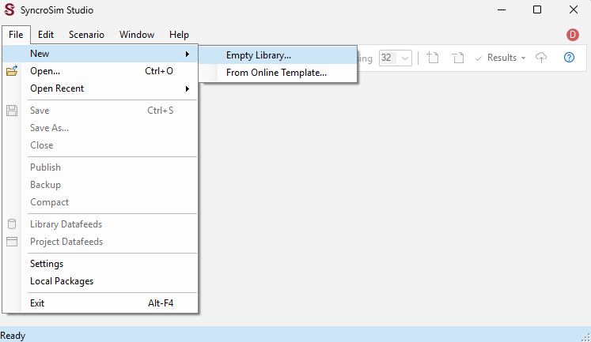

2\. In the File name field, rename the library to **Fire Risk (Revelstoke, British Columbia).ssim**, and select a desired folder as the destination. Click **OK**.

3\. The library will open in the SyncroSim library *Explorer*, with the name *Fire Risk (Revelstoke, British Columbia)*, containing one project, named *Definitions*, and one scenario, named *New Scenario*.

4\. Select **File | Library Datafeeds**. Under the **General** tab, navigate to **Packages** node on the left menu, and **Add…** the burnP3Plus (version 2.1.3) and burnP3PlusFireSTARR (version 1.0.8) packages.

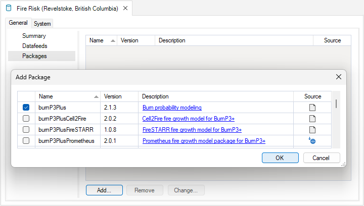

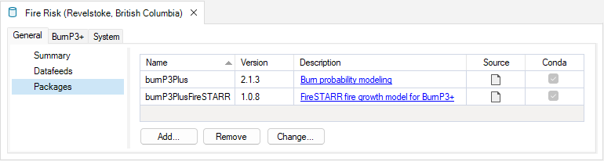

5\. Navigate to the **System** tab. Expand the **Multiprocessing** node and click on **General**. Check the box for *Enable multiprocessing*. This will allow you to run your models across multiple processors, decreasing the overall simulation time. Set the *Maximum number of jobs* to one less than the number of processors available on your machine. For instance, if you have 8 processors available, then you can set it to 7. 

> **Note:** To find the number of processors available on your computer, search for Task Manager in the Windows search bar, or press and hold the Ctrl, Shift, Esc buttons on your keyboard to automatically open the Task Manager window. Navigate to the Performance tab and make sure that CPU is selected in left menu. You will find the number of Logical processors at the bottom center of the window. 

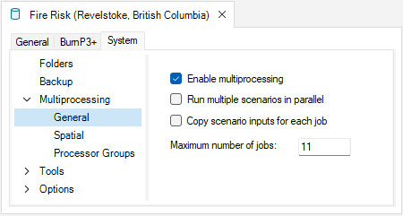

6. Expand the **Options** node and click on **General**. 

7. If you previously installed Miniconda and created the **BurnP3+** conda environment, then check the box to *Use conda*. 

 

> **Note:** If you were unable to install conda:  
> a\. Deselect *Use conda* and open the **Tools | R** window.  

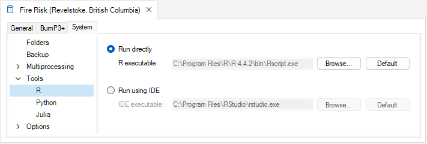

> b\. Ensure that the *Run directly* option is selected. SyncroSim will automatically search for your R installation in the default installation folder, listed in the Default field. However, if you have installed R in another directory, use the Browse button to search for the installation on your machine (start by searching in your AppData folder; e.g., C:\Users\user\AppData\Local\Programs\R\R-4.4.0\bin).  
> c\. If you have multiple R installations, make sure to select the one where you installed the necessary packages listed in the BurnP3+ training setup instructions section.  

8. Deselect the *Append run date/time to result scenarios* option. By deselecting this option, result scenarios will not include the date and time it is completed in its name.

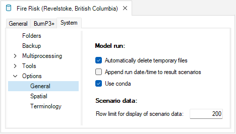

9. Close the library properties and **Save**.

 

 <h3><b>Step 2. Set project definitions</b></h3> 

Project properties define high-level variables and parameters that can be used across scenarios within that project. Any categorical variables defined at the project level become available for use in its scenarios. Additionally, internal validation in SyncroSim checks if the variable names match between project- and scenario-scoped datasheets to prevent errors from hampering your analyses. We will begin by defining the parameters used by the BurnP3+ and FireSTARR packages.

1. Open the project (**Definitions**) properties and click on the **BurnP3+** tab.

2. Expand the **Fuels** node and open the **Fuel Types** window.

3. Right-click anywhere in the **Fuel Types** window and select **Import** from the context menu.

4. Navigate to the **Fuel Types.csv** file included in the <!-- Add specific folder location when link is available --> Tabular tutorial materials folder to load the fuel types definitions as below.

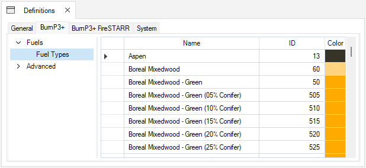

5. Click on the **BurnP3+ FireSTARR** tab and open the FireSTARR Crosswalk. Import the *Fuel Code Crosswalk.csv* file from the Tabular tutorial materials folder.

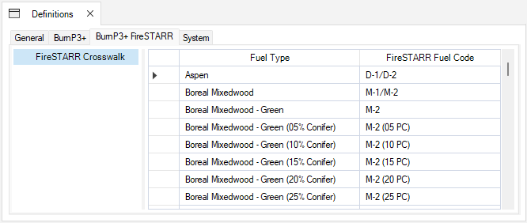

6. In the **BurnP3+** tab, expand the **Advanced** node. In this section, you can define the categories that will be used to stratify the data.

7. In **Seasons**, type *Spring* and *Summer*.

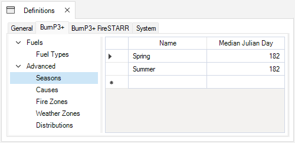

8. For **Causes**, type *Human* and *Lightning*.

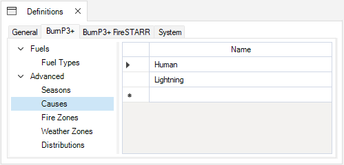

9. For **Fire Zones**, type *Wildlands*, *Wild-Urban Interface*, and *Urban* with ID values *1*, *2*, and *3*, respectively. 

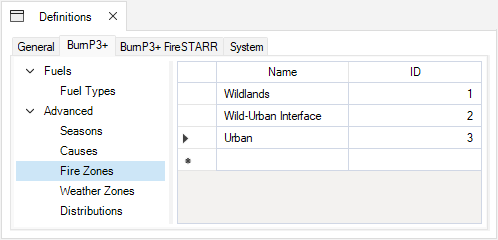

10. For **Weather Zones**, type *ESSF* and *ICH* with ID values *1*, and *2*, respectively. 

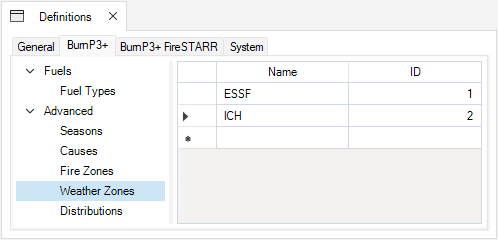

The **Fire Zones** and **Weather Zones** rasters will be supplied as scenario inputs below, however here we are defining which values (*ID*) are associated with each class (*Name*) in the rasters. 

For a more detailed explanation about how **Fire Zones** and **Weather Zones** are used in the context of mapping wildfire susceptibility, refer to [Parisien et al. (2005)](https://ostrnrcan-dostrncan.canada.ca/entities/publication/18cdf7dd-2488-4df4-8cc7-62fb1eebf9ed){:target="_blank"}. 

11. We will use the **Distributions** datasheet to define the names of the probablistic distributions of burning hours in the spring and summer seasons, the number of ignitions, as well as spread event days in each weather zone, and the urban fire zone. Each entry in the project-level **Distributions** datasheet will result in a corresponding scenario-level distribution (stored in the **Distributions** datasheet), in which you can add values to create custom distributions for the model to sample from at runtime.

    Enter the following values into the datasheet:
    * *Daily burning hours - Spring*
    * *Daily burning hours - Summer*
    * *Ignitions per iteration*
    * *Spread event days - ESSF*
    * *Spread event days - ICH*
    * *Spread event days - Urban*

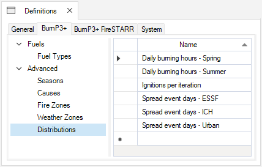

12. Close the project properties and **Save**.

 

 <h3><b>Step 3. Create Ignition and Burn Conditions dependency scenarios</b></h3> 

SyncroSim offers the ability to partition a model into its pipeline stages and run them separately using dependencies to add the results from one stage as the inputs to another stage. 

This feature is useful for setting the same baseline parameters to be used across alternative scenarios. We will use this functionality to create a single scenario that generates the ignitions and burn conditions, ensuring that all fire growth scenarios created in the following steps share a common starting point.

<!-- Insert section describing creating a new Setup folder for the dependency here or keep in Step 4? -->

1. Right-click on the **New Scenario** node nested under the **Definitions** and select **Rename...**. Rename it to **Ignitions and Burn Conditions - Baseline Fire Risk**.

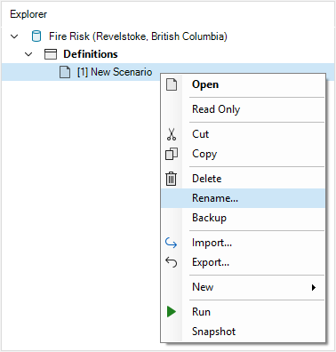

This scenario will serve as a dependency for scenarios that do not incorporate fuel breaks (*i.e.*, **Baseline Fire Risk**, and **Urban Fire Suppression**).

2. Open the **Ignitions and Burn Conditions - Baseline Fire Risk** scenario properties (**Scenario | Open**). Under the **General** tab, navigate to **Pipeline** in the left menu. 
    Click on the empty row under *Stage* in the table and you will notice that four pipeline stages are shown: *Sample Ignitions*, *Sample Burning Conditions*, *Grow Fires with FireSTARR*, and *Summarize Burn Probability*. The first, second, and fourth stages are provided by the **BurnP3+** package, and the third stage is provided by the **BurnP3+FireSTARR** package.

3. Add a row for each of the first two stages, *Sample Ignitions* and *Sample Burning Conditions*.

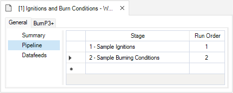

4. Notice that by selecting these two stages, the number of tabs in the window is reduced to only the ones that require inputs. In this case, the **System** tab has disappeared.

5. Move to the **BurnP3+** tab. In the **Run Control** window, set the *Number of Iterations* to *10*. 

> **Note:** Decreasing the *Number of Iterations* can result in faster model runtimes. The *Number of Iterations* can also be chosen strategically based on the number of multiprocessing jobs, since iterations are split and run separately across jobs. For example, running a model on a machine with 32GB of RAM and 4 multiprocessing jobs takes 6 minutes and 40 seconds, but reducing the *Number of Iterations* to 8 would result in a 1/3 decrease in runtime (approximately 4 minutes and 30 seconds).

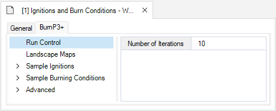

6. Next, open the **Landscape Maps** window. Note that all rasters entered in the subsequent steps must be predefined to use the same resolution and extent.

7. Click on the folder icon in the *Fuel* row to open the *Folder Browser*. Navigate to the **Spatial** subfolder within the tutorial materials folder. Select the *fbpFuelsGlacier.tif*. This file specifies an integer value corresponding to a fuel type of each cell.

8. For *Elevation*, select the *elevationGlacier.tif* file. This file specifies the elevation in meters for each cell on the landscape.

9. For the optional *Fire Zone*, select the *fireZonesGlacierWithUrban.tif* file. This file specifies an integer value for each cell on the landscape.

10. For the optional *Weather Zone*, select the *weatherZonesGlacier.tif* file. This file also specifies an integer value for each cell on the landscape.

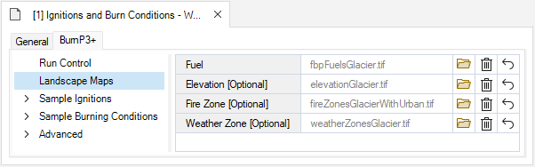

11. Click on the **Sample Ignitions** node to expand it. Here, we are going to use a discrete distribution of ignition counts, and a modifier to stratify the ignitions by season, cause and fire zone.

12. Right-click anywhere in the **Ignition Count** window and select *Ignition Count Distribution* from the context window to add this column to the datasheet. 

13. Right-click and deselect (hide) the *Ignition Count* column from the context menu to remove this column from the datasheet.

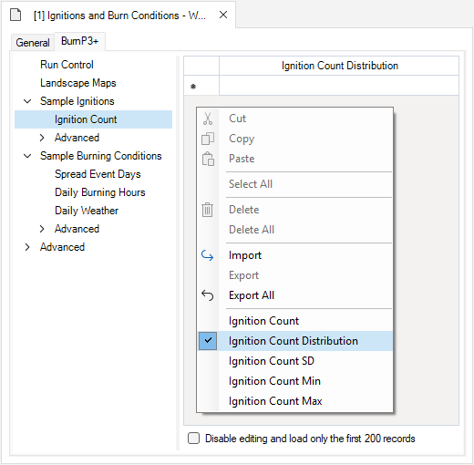

14. Click on the row under *Ignition Count Distribution* and select *Ignitions per iteration* from the drop-down menu. 

> **Note:** Only one row may be added to the **Ignition Count** datasheet. Adding more rows will result in an error. 

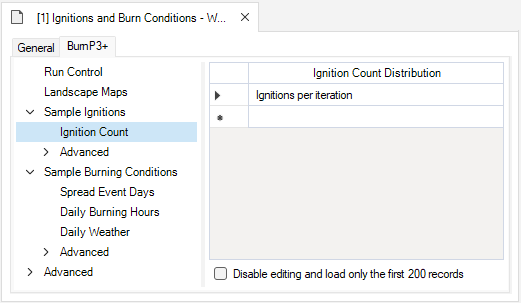

15. Expand the **Advanced** node on the left menu.

16. Open the **Ignition Location** datasheet. Right-click anywhere in the **Ignition Location** window and select *Cause* from the context window. Here, we will add *Probabilistic Ignition Grids* for the two ignition *Causes* defined earlier in the project properties: *Human* and *Lightning*. Each of these grids specify the relative probability of a particular cell being selected as an ignition location for each cause.

> **Note:** even though we will not be doing so for tutorial, ignition location rasters can also be stratified by season.

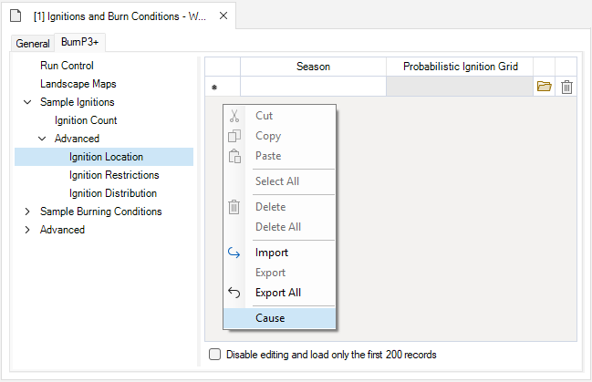

17. Click on the row under the *Cause* column and select *Human* from the drop-down menu. 

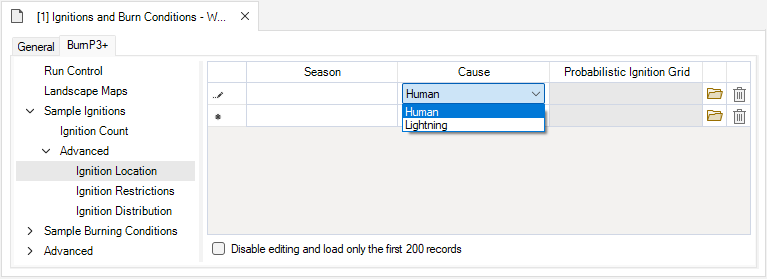

18. Click on the folder icon to select the *Probabilistic Ignition Grid*. Navigate to the Spatial tutorial materials folder and select the *humanIgnitions.tif* file.

19. In the next row, add *Lightning* to the *Cause* column and choose the *lightningIgnitions.tif* file as the Probabilistic Ignition Grid.

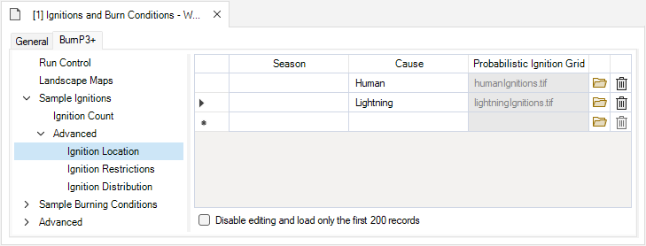

20. Open the **Ignition Restrictions** datasheet. Here, we define non-burning fuel types and/or other restrictions related to *Season*, and *Fire Zone* (optional columns). The Tabular tutorial materials folder contains an *Ignition Restrictions.csv* with all the necessary information. 

> **Note:** Any datasheets in SyncroSim can be created using a spreadsheet editor and imported as a .csv file. The names of the columns must match the names expected by SyncroSim and the SyncroSim packages being used, which are not necessarily equal to the names being displayed in the user interface. Use Excel to open the *Ignition Restrictions.csv* file below and notice that its column names are slightly different from the ones displayed in the user interface.

21. Right-click and select **Import** from the context menu. 

22. Using the *File Browser*, select the *Ignition Restrictions.csv* file to load the values into your library. Note that each row represents Fuel Types by optional strata (Season,and Fire Zone) where ignitions will be restricted from occurring in the model.

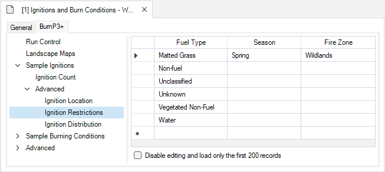

> **Note:**: The above datasheet is telling **BurnP3+** that no ignitions are allowed to start in areas of *Matted Grass* during the *Spring* Season, and in the *Wildlands* Fire Zone. Restricting ignitions for *Matted Grass* in the *Spring*, and **Wildlands* is an example of how ignition restrictions can be specified using a combination of variables. Ignition restrictions are sometimes also used to simulate that a fire is easier to extinguish, and do not necessarily indicate that an ignition will never occur in the specified Fuel Type/Season/Fire Zone.

23. Open the **Ignition Distribution** datasheet. Here, we can specify the *Relative Likelihood* of an ignition event given predictors such as *Season*, *Cause*, and *Fire Zone*. Again, the tutorial Tabular matrials folder contains a *.csv* file with the data already defined.

24. Right-click and select **Import** from the context menu. 

25. Select the *Ignition Distribution.csv* file from the Tabular tutorial materials folder.

26. This will result in the following table. In this example the likelihoods are expressed in percentages, but you can also supply an absolute number of fires to occur in each row, not necessarily adding to 100. 

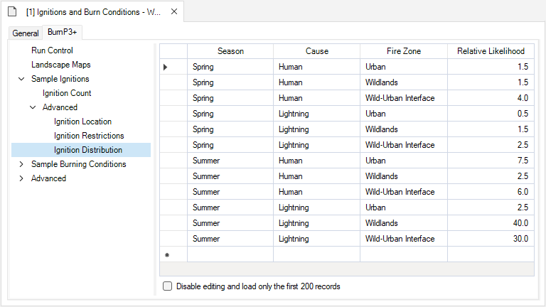

> **Note:** This is different from the **Distribution** we will specify in the **Advanced | Distributions** datasheet.

27. Select the **Sample Burning Conditions** node. In this collection of datasheets, we will tell SyncroSim how to sample the various burning conditions and which distributions to sample from. In BurnP3+, sampling distributions can be created in one of three ways:
 * A fixed value;
 * A user-supplied probabilistic distribution (like the **Ignition Distribution** from the previous step); or 
 * A built-in statistical distribution (BurnP3+ has two built-in statistical distributions, Normal and Gamma).

> **Note:** Additional user defined discrete distributions can be supplied using the project-level **Distributions** datasheet.

Here, we will be drawing from the user-supplied discrete distributions to sample burning conditions.

28. Expand the **Sample Burning Conditions** node and select **Spread Event Days** from the left menu. This datasheet tells the fire growth model the number of days that a fire will burn. It will use the fire duration distribution created in the project properties. The values for the distribution will be specified later in the **Advanced | Distributions** datasheet.

29. Right-click and select *Fire Zone*, as well as *Fire Duration Distribution* from the context menu to add these columns to the datasheet.

30. Right-click and deselect *Fire Duration (Days)* from the context menu to remove this column from the datasheet.

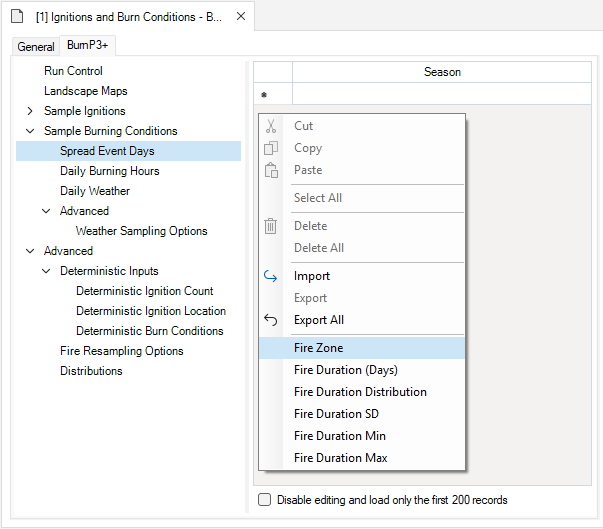

31. Under the *Fire Zone* column, add *Urban*, *Wildlands*, and *Wild-Urban Interface* in that order to the datasheet.

32. Under the *Fire Duration Distribution* column, add *Spread event days - Urban*, *Spread event days - ESSF*, and *Spread event days - ICH* in that order to the datasheet.

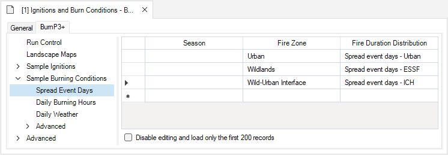

33. Select the **Daily Burning Hours** datasheet. This datasheet will use the *Spring* and *Summer* daily burning hours distributions identified in the project properties. The values in these distributions will be specified later in the **Advanced | Distributions** datasheet.

34. Right-click and select *Daily Burning Hours Distribution* from the context menu to add this columns to the datasheet.

35. Right-click and deselect the *Daily Burning Hours* from the context menu to remove this column from the datasheet.

36. Click on the first cell in the *Season* column and select *Spring*. 

37. Click on the first cell in the *Daily Burning Hours Distribution* column and select *Daily burning hours - Spring*. 

38. Repeat this process in the next row to set the *Summer* season, and respective *Daily burning hours - Summer* distribution.

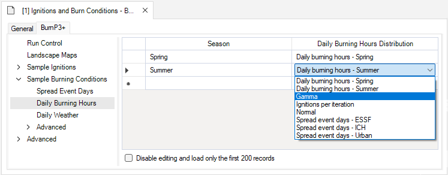

39. Open the **Daily Weather** datasheet **Import* the *Daily Weather.csv* from the Tabular tutorial materials folder.

40. Under **Advanced | Weather Sampling Options**, the default is to sample the data sequentially. All the initial fires will have their weather conditions drawn randomly from this table on their first day, and this option will ensure that subsequent days of burning have non-random weather conditions. Leave this option as *Yes*.

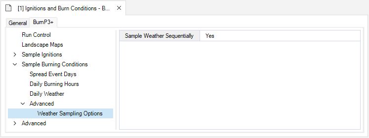

41. Next, we will create the distributions defined in the project-level **Distribution** datasheet. Click on the **Advanced** node, and select the **Distributions** datasheet.

42. Right-click anywhere in the **Distributions** window to **Import* the *Distributions.csv* file from the tutorial material Tabular folder. 

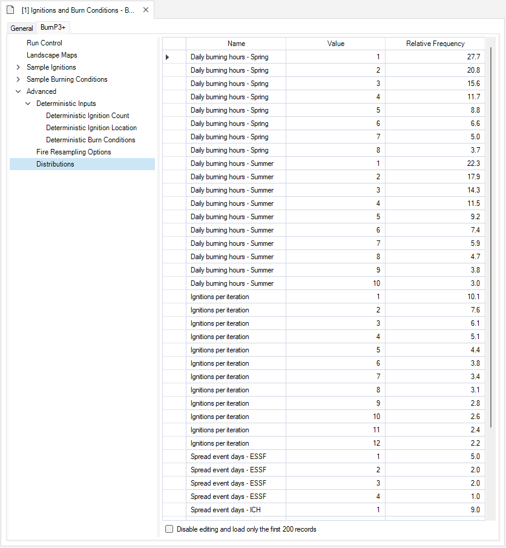

43. Here, we can see that in *Spring*, it is most common for fires to burn for only 1 hour per day, with decreasing frequency for additional daily burning hours. 

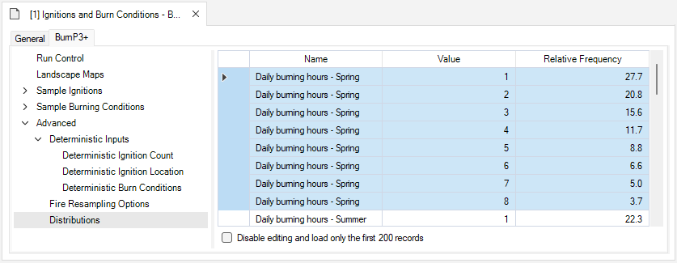

44. Scrolling down in the datasheet, you will notice that the distributions for **Daily burning hours - Summer*, *Ignitions per iteration*, *Spread event days - ESSF*, and *Spread event days - ICH* have also been populated with the data from the *Distributions.csv* file.

45. From the *Ignitions per iteration* distribution, it is most common for a single ignition to occur per iteration with a decreasing frequency for an increasing number of ignitions.

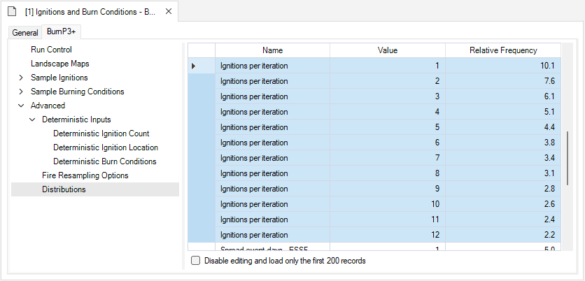

46. From the *Spread event days -ESSF*, *Spread event days - ICH*, and *Spread events days - Urban* distributions, it is most common for a single spread event day to occur in each *Weather Zone* and *Fire Zone* with a decreasing frequency for an increasing number of spread event days in each distribution.

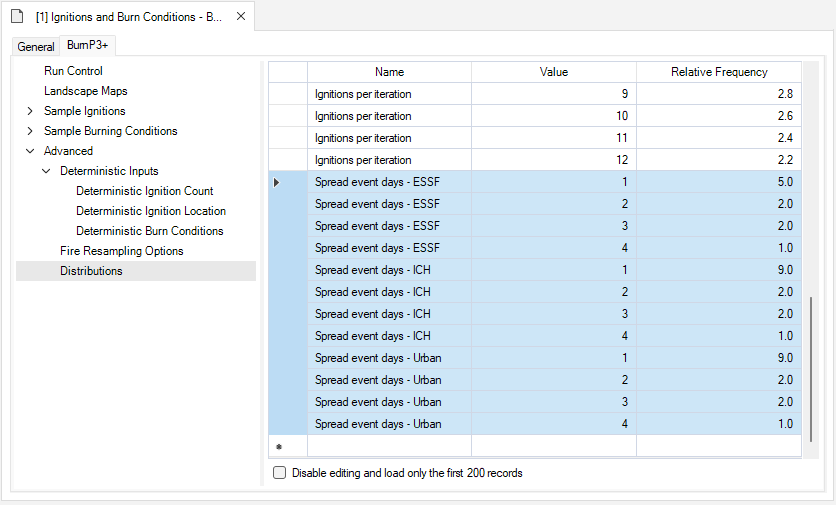

47. Click on **Advanced | Fire Resampling Options**. Set the *Minimum Fire Size (ha)* to 5.0 ha, and the *Proportion of Extra Ignitions to Sample for Replacing Fires Below Minimum Fire Size* to 0.35.

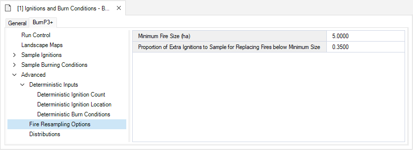

The *Minimum Fire Size (ha)* is the area that a fire needs to cover to be included in the model. The value of 5.0 indicates that all fires that fail to reach the minimum fire size of 5 hectares will be discarded from the model. A larger minimum fire size means more fires discarded from the model. 
The *Proportion of Extra Ignitions to Sample for Replacing Fires below Minimum Size* determines the number of extra ignitions to be generated to make up for discarded fires. The value of 0.35 means that an extra 35% of ignitions are generated at each iteration rounded up to the nearest whole number. 

48. Close the scenario properties and **Save**.

49. Right-click on the scenario and select **Run**.

50. Once the run has completed, you can click on the **Run Log** in the *Run Monitor* window to check the run details. 

 

<!-- add other dependency scenarios? -->

<!-- Ignitions and Burn Conditons - Urban Fire Suppression - copy of Ignitions and Burn Conditions - Baseline Fire Risk but replace the Ignition Distribution datasheet>-->

<!-- Ignitions and Burn Conditons - Fire Break - copy of Ignitions and Burn Conditions - Baseline Fire Risk but replace the Landscape map Fuel Type file>-->

<!-- Ignitions and Burn Conditons - Urban Fire Suppression with Fire Break - copy of Ignitions and Burn Conditions - Fire Break but replace the Landscape map Fuel Type file>-->

 

 <h3><b>Step 4. Create a Baseline Fire Risk scenario</b></h3> 

Now, we will explore the use of pipelines and dependencies to partitionthe data analysis steps. Here, we will create a scenario that uses the output from the **Ignitions and Burn Conditions - Baseline Fire Risk** scenario, and grows fires with **FireSTARR** to simulate the baseline fire risk in and around Revelstoke with no additional fire management measures taken.

Pipelines allow the output generated by one stage to be used as input to another stage. Dependencies allow scenarios to inherit the datasheets of other scenarios. 

The **Ignitions and Burn Conditions - Baseline Fire Risk** scenario in the previous step ran two preliminary stages that generated ignitions across the landscape and sampled the burning conditions in these locations. We will now use these results as input for the **FireSTARR** model. 

1. Expand the node beside the **Ignitions and Burn Conditions - Baseline Fire Risk** scenario in the *Explorer* to reveal its results. Double-click on the results scenario to open its properties. 

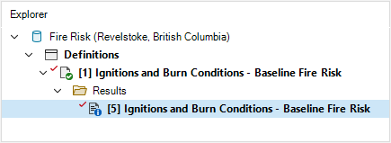

2. The first two stages in the pipeline generated results that can be found in the **BurnP3+** tab, under **Advanced | Deterministic Inputs**. The following datasheets now contain results: **Deterministic Ignition Count**, **Deterministic Ignition Location**, and **Deterministic Burn Conditions**.

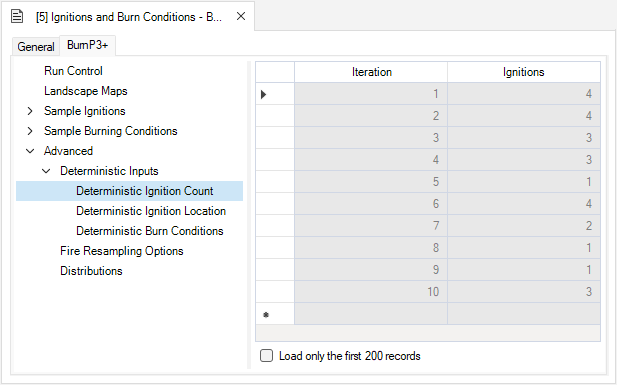

3. Close the results scenario properties.

Next, we will create a folder to store our “setup” scenario. Folders can be used to organize scenarios in a SyncroSim library. The setup folder we will create  will be used to contain all dependency scenarios that generate inputs for the fire growth models.

4. Right-click on the **Definitions** and select **New | Folder…** from the context menu. 

5. Name the folder **Setup**.

6. Drag the **Ignitions and Burn Conditions - Baseline Fire Risk** scenario into this new **Setup** folder. 

Now, we will create a new scenario and add the **Ignitions and Burn Conditions - Baseline Fire Risk** scenario as a dependency.

7. Right-click on the project (**Definitions**) and select **New | Scenario…**.

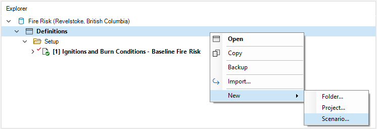

8. Name the new scenario **Baseline Fire Risk**. Press **OK**.

9. Open the scenario properties and navigate to **General | Pipeline**.

10. In the first row under *Stage* select *3 - Grow Fires with FireSTARR*.

11. In the second row under *Stage* select *4 - Summarize Burn Probability*.

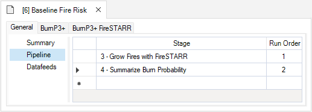

12. You should see two new nodes under the **BurnP3+** tab, **Fire Growth Model Options** and **Output Fire Statistics Table**, appear after you add the *Grow Fires with FireSTARR* stage to the pipeline.

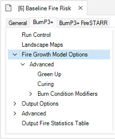

13. To create the dependency structure, select **Ignitions and Burn Conditions - Baseline Fire Risk** from within the **Setup** folder and drag it onto the **Baseline Fire Risk** scenario.

14. Expand the new node beside the scenario name to reveal the **Dependencies** folder. This folder contains the dependency scenario, **Ignitions and Burn Conditions - Baseline Fire Risk**.

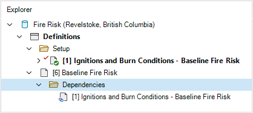

15. In the **Baseline Fire Risk** scenario properties, navigate to **General | Datafeeds**. Notice that some datasheets already contain data, listing the results scenario from the dependency as the *Source Scenario*. 

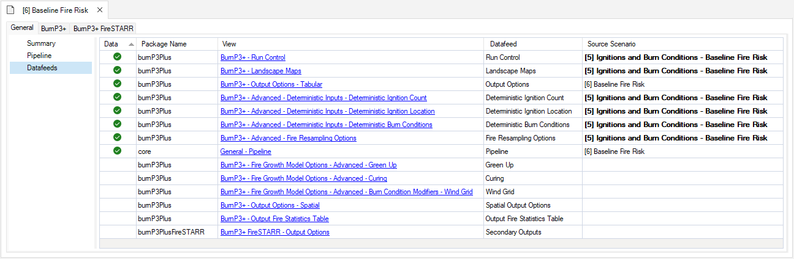

16. Navigate to the **BurnP3+** tab and expand the **Output Options** node. In the **Tabular** window, set the *Fire Statistics Table* to *Yes*. This ensures that the **Output Fire Statistics Table** will be filled with the results from the fire model.

> **Note:** If this value is left blank, the default is still to create the **Output Fire Statistics Table** at runtime. 

17. Click on **Spatial**. Set all map output options to *Yes* **except** the **Burn Perimeters**, and **Output Individual Burn Maps** which should be set to *No*.

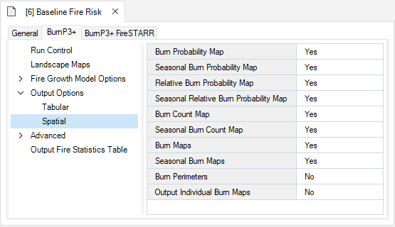

18. Close the scenario properties and **Save**.

19. Select the appropriate number of **Multiprocessing** jobs in the top toolbar for your machine (usually one less than the total number of cores available).

20. Select the **Baseline Fire Risk** scenario and **Run**.

21. Once the model has finished running, open the **Run Log** from the *Run Monitor* window. The **Run Log** contains important information summarizing the performance of the fire growth model. At the end of the **Run Log**, under *Burn Summary*, you can see:

a.	The total number of fires burned;   
b.	How many fires were discarded because they didn’t reach the minimum fire size;  
c.	The percentage of fires that were above the minimum fire size; and  
d.	The percentage of extra simulated fires that were used to make up for the discarded fires. 

<!--

 

 <h3><b>Step 5. Create an Urban Fire Suppression scenario</b></h3> 

<!-- Copy of Baseline Fire Risk with Ignitions and Burn Conditions - Urban Fire Suppression dependency-->

 

 <h3><b>Step 6. Create a Fire Break scenario</b></h3> 

<!-- Copy of Baseline Fire Risk with Ignitions and Burn Conditions - Fire Break dependency-->

 

 <h3><b>Step 7. Create an Urban Fire Suppression scenario</b></h3> 

<!-- Copy of Baseline Fire Risk with Ignitions and Burn Conditions - Urban Fire Suppression with Fire Break dependency-->

 

 <h3><b>Step 8. Visualizing model outputs - Charts</b></h3> 

Now that we have finished running the **Baseline Fire Risk** scenario, we can visualize the output using SyncroSim Studio’s chart viewer.

1. In the *Explorer*, notice that the **Baseline Fire Risk** scenario is bolded and has a red checkmark. This indicates that the results from this scenario are selected and will be visible in the results viewer.

2. Since we only want to visualize the final **Baseline Fire Risk** scenario and not the setup scenario, we need to remove the **Ignitions and Conditions - Baseline Fire Risk** scenario from the results.

3. Right-click on the **Ignitions and Conditions - Baseline Fire Risk** scenario and select **Remove from Results** from the context menu, or select the scenario and press the *Remove* button on the toolbar.

<!---->

4. From the **Charts** tab in the results viewer, click on the blank page icon to create a new chart. 

<!---->

5. Name the new chart **Mean Burn Area by Ignition Fuel Type**.

6. A blank *Line Chart* window will open. 

<!---->

7. On the top left of the menu bar, change the type of chart to *Column Chart*.

<!---->

8. Expand the **BurnP3+** node and check the box next to **Burn Area**.

9. Expand the **Burn Area** node, then expand the **Disaggregate by** node, and select **Fuel Type**. Disaggregating results in separate columns created for each value in the chosen variable (in this case, the values are the Fuel Types).

10. Expand the **Include Data For** node, then expand the **Fuel Type** node, and select **Aspen**, **Boreal Mixedwood**, **Boreal Spruce**, **Matted Grass**, and **Red and White Pine**. Selecting these specific values removes unwanted columns from the chart (in this case, any other Fuel Types).

<!---->

11. Press **Apply** on the top right of the menu bar.

12. You will now see a chart that displays the mean *Burn Area* for the selected *Fuel Types* using the **Baseline Fire Risk FireSTARR** model.

<!---->

13. Create another *Column chart* called **Mean Burn Area by Season**.

14. **Disaggregate** by **Season**, and **Include Data For** the **Spring** and **Summer** seasons only.

15. You will see a chart that displays the mean *Burn Area* for the selected *Seasons* using the **Baseline Fire Risk FireSTARR** model

<!---->

 

 <h3><b>Step 9. Visualizing model outputs - Maps</b></h3> 

<!-- Map legends are customized in the Fire Risk (Revelstoke, British Columbia) Cloud library - should we leave the legend colours as is for the tutorial? Can suggest the user change the legend numbers to match the cloud library but they can choose their own colours?>

<!--Burn Probability-->

<!--Elevation-->

<!--Fuels-->

<!--Relative Burn Probability-->