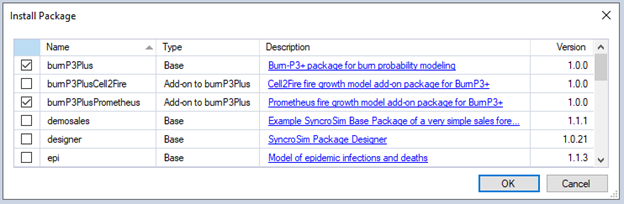

# **BurnP3+** tutorials

## Configuring models in **BurnP3+**

This video tutorial covers how to configure models in the **BurnP3+** SyncroSim *Package*. 

To follow along, this tutorial requires:
* the SyncroSim software, version 2.4.10 or higher;
* the **BurnP3+** SyncroSim *Package*; and
* the burnP3PlusPrometheus *Add-on Package*

Download the latest version of SyncroSim [here](https://syncrosim.com/download/){:target="_blank"} and follow the installation prompts.

To install the **BurnP3+** SyncroSim *Package* and the burnP3PlusPrometheus *Add-on Package*, open the SyncroSim Windows UI (**Start > Apps > SyncroSim**) and select **File > Packages...**.

Click on the **Install...** button.

Mark the checkboxes beside **burnP3Plus** and **burnP3PlusPrometheus**, and click **OK**.

Next, you will create a SyncroSim *Library* from a remote template. To do so, select **File > New...** and choose **burnP3Plus** from the list of packages and the **Glacier Example** as the template *Library*. You can edit the **File name** and use the **Browse** button to select where you would like to save the *Library*. When you are ready, click **OK**.

Now you are all set to follow along with the tutorial. This video will provide:

* An introduction to **BurnP3+** in SyncroSim
* An overview of the structure of **BurnP3+**
* Instructions on how to sample from distributions in **BurnP3+** 
* Options for how to configure the fire growth model
* Instructions on how to run **BurnP3+** and vizualize outputs

<iframe width="600" height="378" src="https://www.youtube.com/embed/iDaHoUEM3Rw" title="YouTube video player" frameborder="0" allow="accelerometer; autoplay; clipboard-write; encrypted-media; gyroscope; picture-in-picture" allowfullscreen></iframe>
